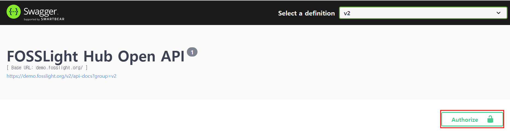
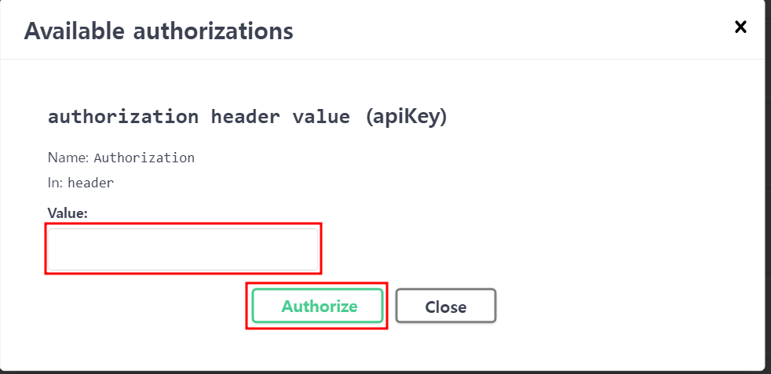
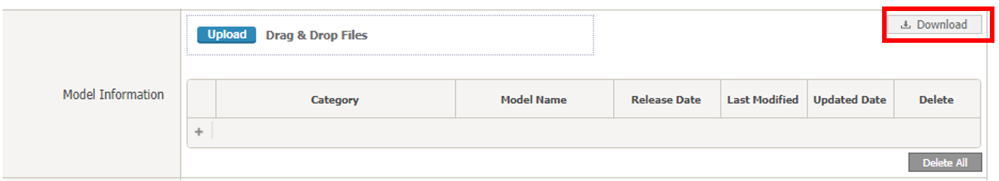

# REST API v2
FOSSLight Hub의 기능을 REST API로 호출할 수 있습니다.
  

## 시작하기  
{: .left-bar-title }
REST API를 호출하기 위해서는 **TOKEN**을 발급이 필요합니다.   
Token은 Admin 계정에서만 발급 가능하며, 일반 사용자는 Admin에게 발급 요청 후 사용하실 수 있습니다.  
### Admin
{: .specific-title }  
1. **Admin 계정**으로 로그인합니다.    
2. **System > User Management** 탭에서 각 **User**별로 **Token**을 발급할 수 있습니다.    

### 일반 사용자
{: .specific-title }  
1. Admin에게 Token 발급을 요청합니다.  
2. 발급된 Token은 [User Settings](https://fosslight.org/hub-guide/tips/5_etc/1_user_settings.html)에서 확인할 수 있습니다.   

   

## REST API 종류  
{: .left-bar-title }  
API 동작 확인은 하기 링크에서 가능합니다.  
- Demo 서비스용 : <a href="https://demo.fosslight.org/swagger-ui/index.html?urls.primaryName=v2" target="_blank">https://demo.fosslight.orgswagger-ui/index.html?urls.primaryName=v2</a> (연동 서버 : <a href="https://demo.fosslight.org/" target="_blank">https://demo.fosslight.org</a>)   
- 운영 서비스용(LGE Only) : <a href="https://osc.lge.com/swagger-ui/index.html?urls.primaryName=v2" target="_blank">https://osc.lge.com/swagger-ui/index.html?urls.primaryName=v2</a> (연동 서버 : <a href="http://osc.lge.com" target="_blank">http://osc.lge.com</a>)  
- 테스트용(LGE Only) : <a href="http://osc-dev.lge.com/swagger-ui/index.html?urls.primaryName=v2" target="_blank">http://osc-dev.lge.com/swagger-ui/index.html?urls.primaryName=v2</a> (연동 서버 : <a href="http://osc-dev.lge.com" target="_blank">http://osc-dev.lge.com</a>)  
 
### 0. Header  
{: .specific-title }    
Swagger UI 사용 시 Token 입력은 인증을 편리하게 하기 위해 제공되는 기능으로, Curl이나 별도의 API 테스트를 진행할 경우 API마다 token 정보를 header에 포함해야 합니다.   

<table>
    <tr>
        <th style="font-weight: bold; padding: 10px;">Key</th>
        <th style="font-weight: bold; padding: 10px;">Required</th>
        <th style="font-weight: bold; padding: 10px;">Type</th>
        <th style="font-weight: bold; padding: 10px;">Value</th>
    </tr>
    <tr>
        <td style="padding: 10px;">Authorization</td>
        <td style="padding: 10px; text-align: center;">O</td>
        <td style="padding: 10px;">String</td>
        <td style="padding: 10px;">발급받은 토큰 정보</td>
    </tr>
</table>  
  
- **Swagger UI 사용 시 Token 입력 방법**  
    - Authorize 버튼을 클릭합니다.    
    {: style="width:500px; height:150px;" .styled-image}      
    - 팝업에서 Value에 token 정보를 입력한 후, Authorize 버튼을 클릭합니다.  
    {:  style="width:500px; height:250px;" .styled-image}   

### 1. OSS & License 정보 조회
{: .specific-title } 

<table>
    <thead>
        <tr style="background-color: #F0F0F0; color: black; font-weight: bold;">
            <th scope="col" style="width: 250px; padding: 5px;">API</th>
            <th scope="col" style="width: 80px; text-align: center; white-space: nowrap; padding: 5px;">응답 형식</th>
            <th scope="col" style="width: 700px; text-align: center; padding: 5px;">설명</th>
        </tr>
    </thead>
    <tbody>
        <tr style="background-color: white;">
            <td><a href="https://demo.fosslight.org/swagger-ui/index.html?urls.primaryName=v2#/1.%20OSS%20&%20License/getLicenseInfoUsingGET_1">
            GET /api/v2/license</a></td>
            <td style="text-align: center;">JSON</td>
            <td>
                License 정보를 조회합니다.  
                <ul class="description-list">
                    <li><strong class="highlight-black">licenseName</strong>: 조회할 라이선스 이름</li>
                    <li><strong class="highlight-black">licenseNameExact</strong>: true로 설정하면 정확히 일치하는 라이선스만 조회 (default=Y)</li>
                    <li><strong class="highlight-black">couterPerPage</strong>: 한 번에 조회할 아이템의 개수 (default = 10000)</li>
                    <li><strong class="highlight-black">page</strong>: 조회할 페이지 번호 (default = 1)</li>
                </ul>
            </td>
        </tr>
        <tr style="background-color: white;">
            <td><a href="https://demo.fosslight.org/swagger-ui/index.html?urls.primaryName=v2#/1.%20OSS%20&%20License/getOssInfoUsingGET_1">GET /api/v2/oss</a></td>
            <td style="text-align: center;">JSON</td>
            <td>
                Open Source 정보를 조회합니다.  
                <ul class="description-list">
                    <li><strong class="highlight-black">downloadLocation</strong>: 조회할 download location 값</li>
                    <li><strong class="highlight-black">downloadLocationExact</strong>: true로 설정하면 정확히 일치하는 Open Source만 조회 (default = Y)</li>
                    <li><strong class="highlight-black">ossName</strong>: 조회할 Open Source 이름</li>
                    <li><strong class="highlight-black">ossNameExact</strong>: true로 설정하면 정확히 일치하는 Open Source만 조회 (default = Y)</li>
                    <li><strong class="highlight-black">ossVersion</strong>: 조회할 오Open Source 버전</li>
                    <li><strong class="highlight-black">couterPerPage</strong>: 한 번에 조회할 아이템의 개수 (default = 10000)</li>
                    <li><strong class="highlight-black">page</strong>: 조회할 페이지 번호 (default = 1)</li>
                </ul>
            </td>
        </tr>
        <tr style="background-color: white;"> 
            <td><a href="https://demo.fosslight.org/swagger-ui/index.html?urls.primaryName=v2#/1.%20OSS%20&%20License/registerOssUsingPOST_1">POST /api/v2/oss</a></td>
            <td style="text-align: center;">JSON</td>
            <td>
                 (Admin only) Open Source를 등록합니다.  
                <ul class="description-list">
                    <li>ossMaster포맷에 맞춰 데이터 입력</li>
                </ul>
            </td>
        </tr>
        <tr style="background-color: white;">
            <td><a href="https://demo.fosslight.org/swagger-ui/index.html?urls.primaryName=v2#/1.%20OSS%20&%20License/refineOssDownloadLocationUsingGET_1">GET /api/v2/refine-download-location</a></td>
            <td style="text-align: center;">JSON</td>
            <td>
                (Admin only) OSS 정보를 정제합니다.  
                <ul class="description-list">
                    <li><strong class="highlight-black">UPDATE DOWNLOAD LOCATION FORMAT</strong>: Download location을 업데이트</li>
                    <li><strong class="highlight-black">REMOVE DUPLICATED DOWNLOAD LOCATION</strong>: 중복 제거</li>
                    <li><strong class="highlight-black">PUT PURL</strong>: PURL 업데이트</li>
                    <li><strong class="highlight-black">REMOVE DUPLICATED PURL</strong>: 중복된 PURL 삭제</li>
                    <li><strong class="highlight-black">REORDER GITHUB PRIORITY</strong>: "github.com" 포함된 download location 우선순위 변경</li>
                    <li><strong class="highlight-black">REFINE ALL</strong>: 위 사항을 순서대로 실행</li>
                </ul>
            </td>
        </tr>
    </tbody>
</table>

### 2. 3rd Party 정보 조회
{: .specific-title } 

<table>
    <thead>
        <tr style="background-color: #F0F0F0; color: black; font-weight: bold;">
            <th scope="col" style="width: 250px; padding: 5px;">API</th>
            <th scope="col" style="width: 80px; text-align: center; white-space: nowrap; padding: 5px;">응답 형식</th>
            <th scope="col" style="width: 700px; text-align: center; padding: 5px;">설명</th>
        </tr>
    </thead>
    <tbody>
        <tr style="background-color: white;">
            <td><a href="https://demo.fosslight.org/swagger-ui/index.html?urls.primaryName=v2#/2.%203rd%20Party/getPartnersUsingGET">GET /api/v2/partners</a></td>
            <td style="text-align: center;">JSON</td>
            <td>
                3rd Party의 정보를 조회합니다.  
                <ul class="description-list">
                    <li><strong class="highlight-black">createDate</strong>: 3rd party 생성 날짜 기준으로 조회 (fromDate-toDate)</li>
                    <li><strong class="highlight-black">creator</strong>: 3rd party 생성자 정보 기준으로 조회</li>
                    <li><strong class="highlight-black">division</strong>: division 정보 기준으로 조회</li>
                    <li><strong class="highlight-black">partnerIdList</strong>: 3rd party ID 기준으로 조회. 리스트 형태로 여러 개 입력 가능</li>
                    <li><strong class="highlight-black">status</strong>: 3rd party의 상태 기준으로 조회</li>
                    <li><strong class="highlight-black">updateDate</strong>: 3rd party 수정 날짜 기준으로 조회 (fromDate-toDate)</li>
                    <li><strong class="highlight-black">couterPerPage</strong>: 한 번에 조회할 아이템의 개수 (default = 1000)</li>
                    <li><strong class="highlight-black">page</strong>: 조회할 페이지 번호 (default = 1)</li>
                </ul>
            </td>
        </tr>
        <tr style="background-color: white;"> 
            <td><a href="https://demo.fosslight.org/swagger-ui/index.html?urls.primaryName=v2#/2.%203rd%20Party/get3rdDownloadUsingGET">GET /api/v2/partners/{id}/bom/file</a></td>
            <td style="text-align: center;">FILE</td>
            <td>
                3rd party BOM export - 파일 형태로 다운로드  
                <ul class="description-list">
                    <li><strong class="highlight-black">(required) format</strong>: 추출할 파일 포맷</li>
                    <li><strong class="highlight-black">(required) id</strong>: 조회할 대상인 3rd party ID</li>
                </ul>
            </td>
        </tr>
        <tr style="background-color: white;"> 
            <td><a href="https://demo.fosslight.org/swagger-ui/index.html?urls.primaryName=v2#/2.%203rd%20Party/get3rdAsJsonUsingGET">GET ​/api​/v2​/partners​/{id}​/bom/json-data</a></td>
            <td style="text-align: center;">JSON</td>
            <td>
                3rd party BOM export - JSON 형태로 받음  
                <ul class="description-list">
                    <li><strong class="highlight-black">(required) id</strong>: 대상 3rd party ID</li>
                </ul>
            </td>
        </tr>
        <tr style="background-color: white;">
            <td><a href="https://demo.fosslight.org/swagger-ui/index.html?urls.primaryName=v2#/2.%203rd%20Party/addPrjEditorUsingPOST">POST /api/v2/partners/{id}/editors</a></td>
            <td style="text-align: center;">JSON</td>
            <td>
                3rd party에 editor를 추가함  
                <ul class="description-list">
                    <li><strong class="highlight-black">(required) emailList</strong>: 추가할 editor의 이메일 정보</li>
                    <li><strong class="highlight-black">(required) id</strong>: 대상 3rd party ID</li>
                </ul>
            </td>
        </tr>
    </tbody>
</table>

###  3. Project 정보 조회, 생성, FOSSLight Report 등록, Packaging 파일 업로드, BOM Export, Project 비교  
{: .specific-title }  

<table>
    <thead>
        <tr style="background-color: #F0F0F0; color: black; font-weight: bold;">
            <th scope="col" style="width: 250px; padding: 5px;">API</th>
            <th scope="col" style="width: 80px; text-align: center; white-space: nowrap; padding: 5px;">응답 형식</th>
            <th scope="col" style="width: 700px; text-align: center; padding: 5px;">설명</th>
        </tr>
    </thead>
    <tbody>
        <tr style="background-color: white;">
            <td><a href="https://demo.fosslight.org/swagger-ui/index.html?urls.primaryName=v2#/3.%20Project/selectProjectListUsingGET_1">GET /api/v2/projects</a></td>
            <td style="text-align: center;">JSON</td>  
            <td>
                아래 항목을 포함한 Project의 정보를 조회합니다.  
                <ul class="description-list">
                    <li><strong class="highlight-black">createDate</strong>: Project 생성한 날짜 기준으로 조회 (fromDate-toDate)</li>
                    <li><strong class="highlight-black">creator</strong>: 생성한 사람 정보 기준으로 조회</li>
                    <li><strong class="highlight-black">division</strong>: division 정보 기준으로 조회</li>
                    <li><strong class="highlight-black">modelName</strong>: model 이름 기준으로 조회</li>
                    <li><strong class="highlight-black">modelNameExactYn</strong>: true로 설정하면 model name에 입력한 값과 정확히 일치하는 프로젝트만 조회</li>
                    <li><strong class="highlight-black">prjIdList</strong>: project ID 기준으로 조회. list형태로 여러개 입력 가능</li>
                    <li><strong class="highlight-black">prjName</strong>: project 이름 기준으로 조회</li>
                    <li><strong class="highlight-black">prjNameExactYn</strong>: true로 설정하면 project name에 입력한 값과 정확히 일치하는 프로젝트만 조회</li>
                    <li><strong class="highlight-black">status</strong>: Project의 status기준으로 조회</li>
                    <li><strong class="highlight-black">updateDate</strong>: Project의 수정한 날짜 기준으로 조회 (fromDate-toDate)</li>
                    <li><strong class="highlight-black">couterPerPage</strong>: 한 번에 조회할 아이템의 개수 (default = 1000, max = 1000)</li>
                    <li><strong class="highlight-black">page</strong>: 조회할 페이지 번호 (default = 1)</li>
                </ul>
            </td>
        </tr>
        <tr style="background-color: white;">
            <td><a href="https://demo.fosslight.org/swagger-ui/index.html?urls.primaryName=v2#/3.%20Project/createProjectUsingPOST">POST /api/v2/projects</a></td>
            <td style="text-align: center;">JSON</td>
            <td>
                Project 생성을 위한 API. 생성된 project ID가 리턴됨  
                <ul class="description-list">
                    <li><strong class="highlight-black">additional Information</strong>: 프로젝트의 추가 정보</li>
                    <li><strong class="highlight-black">distributionSite</strong>: 배포 사이트 선택 (/api/v2/codes 값으로 입력)</li>
                    <li><strong class="highlight-black">distributionType</strong>: 배포 타입 선택 (/api/v2/codes 값으로 입력)</li>
                    <li><strong class="highlight-black">networkServerType</strong>: 네트워크 서버 여부 선택</li>
                    <li><strong class="highlight-black">noticeType</strong>: 고지문 타입 선택 (/api/v2/codes 값으로 입력)</li>
                    <li><strong class="highlight-black">noticeTypeEtc</strong>: Platform-generate인 경우 타입 선택 (/api/v2/codes 값으로 입력)</li>
                    <li><strong class="highlight-black">(required) osType</strong>: OS 타입 선택 (/api/v2/codes 값으로 입력)</li>
                    <li><strong class="highlight-black">osTypeEtc</strong>: 추가적인 OS 타입 정보 </li>
                    <li><strong class="highlight-black">priority</strong>: 프로젝트의 긴급 여부에 따라 우선순위 선택 (/api/v2/codes 값으로 입력)</li>
                    <li><strong class="highlight-black">(required) prjName</strong>: 프로젝트 이름</li>
                    <li><strong class="highlight-black">prjVersion</strong>: 프로젝트 버전</li>
                    <li><strong class="highlight-black">publicYn</strong>: View Permission 정보 (Y: Everyone, N: Creator & Editor) (default = Y)</li>
                    <li><strong class="highlight-black">userComment</strong>: 유저 커맨트</li>
                </ul>
            </td>
        </tr>
        <tr style="background-color: white;">
            <td><a href="https://demo.fosslight.org/swagger-ui/index.html?urls.primaryName=v2#/3.%20Project/selectModelListUsingGET_1">GET /api/v2/projects/models</a></td>
            <td style="text-align: center;">>JSON</td>
            <td>
                Project의 모델 정보 조회  
                <ul class="description-list">
                    <li><strong class="highlight-black">(required) prjIdList</strong>: 조회할 대상인 project ID 정보. list형태로 입력 가능</li>
                </ul>
            </td>
        </tr>
        <tr style="background-color: white;">
            <td><a href="https://demo.fosslight.org/swagger-ui/index.html?urls.primaryName=v2#/3.%20Project/deleteProjectUsingDELETE">DELETE /api/v2/projects/{id}</a></td>
            <td style="text-align: center;">JSON</td>
            <td>
                Project를 삭제함 (Distribution 진행되지 않은 프로젝트만 삭제 가능)  
                <ul class="description-list">
                    <li><strong class="highlight-black">(required) id</strong>: 기준 project ID</li>
                </ul>
            </td>
        </tr>
        <tr style="background-color: white;">
            <td><a href="https://demo.fosslight.org/swagger-ui/index.html?urls.primaryName=v2#/3.%20Project/getPrjBomCompareUsingGET_1">GET /api/v2/projects/{id}/bom/compare-with/{compareId}</a></td>
            <td style="text-align: center;">JSON</td>
            <td>
                Project BOM Compare  
                <ul class="description-list">
                    <li><strong class="highlight-black">(required) compareId</strong>: 비교할 project ID</li>
                    <li><strong class="highlight-black">(required) id</strong>: 기준 project ID</li>
                </ul>
            </td>
        </tr>
        <tr style="background-color: white;">
            <td><a href="https://demo.fosslight.org/swagger-ui/index.html?urls.primaryName=v2#/3.%20Project/getPrjBomDownloadUsingGET">GET /api/v2/projects/{id}/bom/file</a></td>
            <td style="text-align: center;">JSON</td>
            <td>
                Project BOM export - 파일 형태로 다운로드  
                <ul class="description-list">
                    <li><strong class="highlight-black">(required) format</strong>: 추출할 파일 포맷</li>
                    <li><strong class="highlight-black">(required) id</strong>: 대상 project ID</li>
                    <li><strong class="highlight-black"> saveFlag</strong>: API 실행 시점의 정보로, BOM을 최신화 할지 여부 선택 (default = Y)</li>
                </ul>
            </td>
        </tr>
        <tr style="background-color: white;">
            <td><a href="https://demo.fosslight.org/swagger-ui/index.html?urls.primaryName=v2#/3.%20Project/getPrjBomAsJsonUsingGET">GET /api/v2/projects/{id}/bom/json-data</a></td>
            <td style="text-align: center;">JSON</td>
            <td>
                Project BOM export - JSON 형태로 받음  
                <ul class="description-list">
                    <li><strong class="highlight-black">(required) id</strong>: 대상 project ID</li>
                    <li><strong class="highlight-black">saveFlag</strong>: API 실행 시점의 정보로, BOM을 최신화 할지 여부 선택 (default = Y)</li>
                </ul>
            </td>
        </tr>
        <tr style="background-color: white;">
            <td><a href="https://demo.fosslight.org/swagger-ui/index.html?urls.primaryName=v2#/3.%20Project/addPrjEditorUsingPOST_1">POST /api/v2/projects/{id}/editors</a></td>
            <td style="text-align: center;">JSON</td>
            <td>
                Project에 editor를 추가함  
                <ul class="description-list">
                    <li><strong class="highlight-black">(required) emailList</strong>: 추가할 editor의 이메일 정보</li>
                    <li><strong class="highlight-black">(required) id</strong>: 대상 project ID</li>
                </ul>
            </td>
        </tr>
        <tr style="background-color: white;">
            <td><a href="https://demo.fosslight.org/swagger-ui/index.html?urls.primaryName=v2#/3.%20Project/updateModelListUsingPOST_1">POST /api/v2/projects/{id}/models</a></td>
            <td style="text-align: center;">JSON</td>
            <td>
                Model 정보 문자열 목록을 통해 Project의 Model 정보를 업데이트합니다. 
                (단, Model을 추가할 뿐 Distribute 되지는 않습니다. Model 정보를 추가 후 Distribute가 필요한 경우 Distribution탭으로 이동 후 Distribute 진행해주시기 바랍니다.)  
                <ul class="description-list">
                    <li><strong class="highlight-black">(required) id</strong>: 대상 project ID</li>
                    <li><strong class="highlight-black">(required) modelListToUpdate</strong>: Model 정보 문자열 목록 (format: MODEL_NAME|Category|Release Date) - ex. MODEL_NAME|ETC > Etc|20220428</li>
                </ul>
            </td>
        </tr>
        <tr style="background-color: white;">
            <td><a href="https://demo.fosslight.org/swagger-ui/index.html?urls.primaryName=v2#/3.%20Project/updateModelListUploadFileUsingPOST_1">POST ​/api​/v2​/projects​/{id}​/models​/upload</a></td>
            <td style="text-align: center;">JSON</td>
            <td>
                Model List 엑셀 파일을 통해 Project의 Model 정보를 업데이트합니다.  
                (단, Model을 추가할 뿐 Distribute 되지는 않습니다. Model 정보를 추가 후 Distribute가 필요한 경우 Distribution탭으로 이동 후 Distribute 진행해주시기 바랍니다.)  
                <ul class="description-list">
                    <li><strong class="highlight-black">(required) id</strong>: 대상 project ID</li>
                    <li><strong class="highlight-black">(required) modelReport</strong>: Model List의 엑셀 파일 : Project > Project Information 탭 > Download 버튼 클릭</li>
                </ul>
                
            </td>
        </tr>
        <tr style="background-color: white;">
            <td><a href="https://demo.fosslight.org/swagger-ui/index.html?urls.primaryName=v2#/3.%20Project/getProjectNoticeUsingGET">GET /api/v2/projects/{id}/notice</a></td>
            <td style="text-align: center;">JSON</td>
            <td>
                Notice 파일을 받을 project ID  
                <ul class="description-list">
                    <li><strong class="highlight-black">(required) id</strong>: 대상 project ID</li>
                </ul>
            </td>
        </tr>
        <tr style="background-color: white;">
            <td><a href="https://demo.fosslight.org/swagger-ui/index.html?urls.primaryName=v2#/3.%20Project/ossUploadPackageUsingPOST">POST /api/v2/projects/{id}/packages</a></td>
            <td style="text-align: center;">JSON</td>
            <td>
                Project에 package 파일 업로드  
                <ul class="description-list">
                    <li><strong class="highlight-black">packageFile</strong>: 업로드할 패키지 파일</li>
                    <li><strong class="highlight-black">(required) id</strong>: 대상 project ID</li>
                    <li><strong class="highlight-black">verifyFlag</strong>: 업로드 한 파일에 대해 verify 진행 여부 (default = N)</li>
                </ul>
            </td>
        </tr>
        <tr style="background-color: white;">
            <td><a href="https://osc.lge.com/swagger-ui/index.html?urls.primaryName=v2#/3.%20Project/setSecurityMailUsingPOST">POST /api/v2/projects/{id}/security-mail</a></td>
            <td style="text-align: center;">-</td>
            <td>
                해당 프로젝트에 대한 Vulnerability 메일 수신 여부를 업데이트 합니다.  
                <ul class="description-list">
                    <li><strong class="highlight-black">(required) id</strong>: 대상 project ID</li>
                    <li><strong class="highlight-black">(required) secMailYn</strong>: Security Enable (Y: Enable, N: Disable)</li>
                    <li><strong class="highlight-black">secMailDesc</strong>: Disable로 설정하는 사유 (secMailYn이 N일때 필수 입력)</li>
                </ul>
            </td>
        </tr>
        <tr style="background-color: white;">
            <td><a href="https://osc.lge.com/swagger-ui/index.html?urls.primaryName=v2#/3.%20Project/addSecurityPersonUsingPOST">POST /api/v2/projects/{id}/security-person</a></td>
            <td style="text-align: center;">-</td>
            <td>
                 Creator, Editor와 함께 FOSSLight Hub에서 발송되는 Security 메일을 받을 사람을 업데이트 합니다. 
                (LGE Only) PSMS에서 생성되는 이슈의 assignee를 업데이트 합니다.  
                <ul class="description-list">
                    <li><strong class="highlight-black">(required) id</strong>: 대상 project ID</li>
                    <li><strong class="highlight-black">(required) userId</strong>: 대상 담당자 ID (FOSSLight Hub에 등록된 사람에 한하여 입력 가능함)</li>
                </ul>
            </td>
        </tr>
        <tr style="background-color: white;">
            <td><a href="https://osc.lge.com/swagger-ui/index.html?urls.primaryName=v2#/3.%20Project/getPrjSecurityExportJsonUsingGET_1">GET /api/v2/projects/{id}/security/json-data</a></td>
            <td style="text-align: center;">JSON</td>
            <td>
                Project에서 검출된 보안취약점 정보를 JSON 형태로 받음  
                <ul class="description-list">
                    <li><strong class="highlight-black">(required) id</strong>: 대상 project ID</li>
                </ul>
            </td>
        </tr>
        <tr style="background-color: white;">
            <td><a href="https://demo.fosslight.org/swagger-ui/index.html?urls.primaryName=v2#/3.%20Project/ossLoadUsingPOST">POST /api/v2/projects/{id}/{tab_name}/oss-load</a></td>
            <td style="text-align: center;">-</td>
            <td>
                Project에 이전 프로젝트에서 리뷰된 Open Source 정보를 로드함 (Identification confirm 된 프로젝트만 로드 가능)  
                <ul class="description-list">
                    <li><strong class="highlight-black">(required) id</strong>: 대상 project ID</li>
                    <li><strong class="highlight-black">prjToLoad</strong>: 로드할 프로젝트 ID (search condition이 id인 경우 입력)</li>
                    <li><strong class="highlight-black">prjNameToLoad</strong>: 로드할 프로젝트 이름 (search condition이 name인 경우 입력)</li>
                    <li><strong class="highlight-black">prjVersionToLoad</strong>: 로드할 프로젝트 버전 (search condition이 name인 경우 입력)</li>
                    <li><strong class="highlight-black">resetFlag</strong>: 로드 할 때, 기존 입력된 정보들을 Reset할지 여부 (default = Y)</li>
                    <li><strong class="highlight-black">(required) searchCondition</strong>: 로드할 프로젝트를 검색하는 기준</li>
                    <li><strong class="highlight-black">(required) tab_name</strong>: 대상 탭 이름 (bin/dep/src)</li>
                </ul>
            </td>
        </tr>
        <tr style="background-color: white;">
            <td><a href="https://demo.fosslight.org/swagger-ui/index.html?urls.primaryName=v2#/3.%20Project/ossReportAllUsingPOST">POST /api/v2/projects/{id}/{tab_name}/reports</a></td>
            <td style="text-align: center;">-</td>
            <td>
                Project에 Open Source 분석된 리포트 파일을 업로드함  
                <ul class="description-list">
                    <li><strong class="highlight-black">ossReport</strong>: 업로드할 리포트 파일</li>
                    <li><strong class="highlight-black">bomSave</strong>: BOM탭 Save 여부</li>
                    <li><strong class="highlight-black">comment</strong>: 사용자 comment</li>
                    <li><strong class="highlight-black">(required) id</strong>: 대상 project ID</li>
                    <li><strong class="highlight-black">resetFlag</strong>: 파일 업로드 시, 기존 입력된 정보들을 Reset할지 여부 (default = Y)</li>
                    <li><strong class="highlight-black">sheetNames</strong>: 업로드할 리포트 파일에서 특정 sheet name을 업데이트 하고자 하는 경우 입력. 입력하지 않는 경우 기본으로 DEP, SRC, BIN prefix에 맞춰서 정보를 불러옴. , 로 구분하여 여러 Sheet를 입력 가능</li>
                    <li><strong class="highlight-black">(required) tab_name</strong>: 대상 탭 이름</li>
                </ul>
            </td>
        </tr>
        <tr style="background-color: white;">
            <td><a href="https://demo.fosslight.org/swagger-ui/index.html?urls.primaryName=v2#/3.%20Project/identificationResetUsingPOST">POST /api/v2/projects/{id}/{tab_name}/reset</a></td>
            <td style="text-align: center;">-</td>
            <td>
                Project > Identification에서 선택한 탭을 reset함  
                <ul class="description-list">
                    <li><strong class="highlight-black">(required) id</strong>: 대상 project ID</li>
                    <li><strong class="highlight-black">(required) tab_name</strong>: 대상 탭 이름</li>
                </ul>
            </td>
        </tr>
    </tbody>
</table>

### 4. Vulnerability 정보 조회  
{: .specific-title }    

<table>
    <thead>
        <tr style="background-color: #F0F0F0; color: black; font-weight: bold;">
            <th scope="col" style="width: 250px; padding: 5px;">API</th>
            <th scope="col" style="width: 80px; text-align: center; white-space: nowrap; padding: 5px;">응답 형식</th>
            <th scope="col" style="width: 700px; text-align: center; padding: 5px;">설명</th>
        </tr>
    </thead>
    <tbody>
        <tr style="background-color: white;">
            <td><a href="https://demo.fosslight.org/swagger-ui/index.html?urls.primaryName=v2#/4.%20Vulnerability/getVulnerabilityMaxDataUsingGET_1">GET /api/v2/max-vulnerabilities</a></td>
            <td style="text-align: center;">JSON</td>
            <td>
                OSS Name, Version별 max score와 CVE ID를 확인할 링크 조회  
                <ul class="description-list">
                    <li><strong class="highlight-black">(required) OSS Name</strong>: 조회할 Open Source 이름</li>
                    <li><strong class="highlight-black">OSS Version</strong>: 조회할 Open Source 버전</li>
                </ul>
            </td>
        </tr>
        <tr style="background-color: white;">
            <td><a href="https://demo.fosslight.org/swagger-ui/index.html?urls.primaryName=v2#/4.%20Vulnerability/getVulnerabilityDataUsingGET_4">GET /api/v2/vulnerabilities</a></td>
            <td style="text-align: center;">JSON</td>
            <td>
                CVE ID별 또는 OSS Name, Version별 CVE ID, CVSS Score, CVE ID Link, OSS 정보(OSS name, OSS version, Nickname)를 조회합니다.  
                <ul class="description-list">
                    <li><strong class="highlight-black">cveId</strong>: 조회할 CVE ID</li>
                    <li><strong class="highlight-black">ossName</strong>: 조회할 Open Source 이름</li>
                    <li><strong class="highlight-black">ossVersion</strong>: 조회할 Open Source 버전</li>
                </ul>
            </td>
        </tr>
    </tbody>
</table>

### 5. Self-Check 생성, FOSSLight Report 등록  
{: .specific-title }   

<table>
    <thead>
        <tr style="background-color: #F0F0F0; color: black; font-weight: bold;">
            <th scope="col" style="width: 250px; padding: 5px;">API</th>
            <th scope="col" style="width: 80px; text-align: center; white-space: nowrap; padding: 5px;">응답 형식</th>
            <th scope="col" style="width: 700px; text-align: center; padding: 5px;">설명</th>
        </tr>
    </thead>
    <tbody>
        <tr style="background-color: white;">
            <td><a href="https://demo.fosslight.org/swagger-ui/index.html?urls.primaryName=v2#/5.%20SelfCheck/createSelfCheckUsingPOST">POST /api/v2/selfchecks</a></td>
            <td style="text-align: center;">JSON</td>
            <td>
                Self-Check Project를 생성하고, 생성된 Self-Check ID를 return 받음  
                <ul class="description-list">
                    <li><strong class="highlight-black">(required) prjName</strong>: Self check project 이름</li>
                    <li><strong class="highlight-black">prjVersion</strong>: Self check project 버전</li>
                </ul>
            </td>
        </tr>
        <tr style="background-color: white;">
            <td><a href="https://demo.fosslight.org/swagger-ui/index.html?urls.primaryName=v2#/5.%20SelfCheck/getSelfcheckUsingGET">GET /api/v2/selfchecks/{id}</a></td>
            <td style="text-align: center;">JSON</td>
            <td>
                Self-Check project 조회  
                <ul class="description-list">
                    <li><strong class="highlight-black">(required) id</strong>: 조회할 self check project ID</li>
                </ul>
            </td>
        </tr>
        <tr style="background-color: white;">
            <td><a href="https://demo.fosslight.org/swagger-ui/index.html?urls.primaryName=v2#/5.%20SelfCheck/selfCheckBomDownloadUsingGET">GET /api/v2/selfchecks/{id}/bom/file</a></td>
            <td style="text-align: center;">FILE</td>
            <td>
                Self-Check에서 Export한 결과 파일을 다운로드  
                <ul class="description-list">
                    <li><strong class="highlight-black">(required) id</strong>: 조회할 self check project ID</li>
                </ul>
            </td>
        </tr>
        <tr style="background-color: white;">
            <td><a href="https://demo.fosslight.org/swagger-ui/index.html?urls.primaryName=v2#/5.%20SelfCheck/addPrjEditorUsingPOST_2">POST /api/v2/selfchecks/{id}/editors</a></td>
            <td style="text-align: center;">-</td>
            <td>
                Self-Check에 Editor를 추가  
                <ul class="description-list">
                    <li><strong class="highlight-black">(required) emailList</strong>: 추가할 editor의 이메일 정보</li>
                    <li><strong class="highlight-black">(required) id</strong>: 대상 project ID</li>
                </ul>
            </td>
        </tr>
        <tr style="background-color: white;">
            <td><a href="https://demo.fosslight.org/swagger-ui/index.html?urls.primaryName=v2#/5.%20SelfCheck/ossReportSelfCheckUsingPOST_1">POST /api/v2/selfchecks/{id}/report</a></td>
            <td style="text-align: center;">-</td>
            <td>
                Self-Check에 Open Source 분석된 리포트 파일을 업로드함  
                <ul class="description-list">
                    <li><strong class="highlight-black">ossReport</strong>: 업로드할 리포트 파일</li>
                    <li><strong class="highlight-black">(required) id</strong>: 대상 self check project ID</li>
                    <li><strong class="highlight-black">resetFlag</strong>: 파일 업로드 시, 기존 입력된 정보들을 Reset할지 여부. N - 기존 OSS Table에 입력된 사항을 유지한 채 append (default = Y)</li>
                    <li><strong class="highlight-black">sheetNames</strong>: 업로드할 리포트 파일에서 특정 sheet name을 업데이트 하고자 하는 경우 입력. 입력하지 않는 경우 기본으로 DEP, SRC, BIN prefix에 맞춰서 정보를 불러옴. ,로 구분하여 여러 Sheet를 입력 가능</li>
                </ul>
            </td>
        </tr>
    </tbody>
</table>

###  6. API 활용시, Code 값 확인  
{: .specific-title }  

<table>
    <thead>
        <tr style="background-color: #F0F0F0; color: black; font-weight: bold;">
            <th scope="col" style="width: 250px; padding: 5px;">API</th>
            <th scope="col" style="width: 80px; text-align: center; white-space: nowrap; padding: 5px;">응답 형식</th>
            <th scope="col" style="width: 700px; text-align: center; padding: 5px;">설명</th>
        </tr>
    </thead>
    <tbody>
        <tr style="background-color: white;">
            <td><a href="https://demo.fosslight.org/swagger-ui/index.html?urls.primaryName=v2#/6.%20Code%20v2/getVulnerabilityDataUsingGET_3">GET /api/v2/codes</a></td>
            <td style="text-align: center;">JSON</td>
            <td>
                Project, 3rd Party 조회, Project 생성 시 사용할 Parameter의 값 List를 조회합니다.  
                <ul class="description-list">
                    <li><strong class="highlight-black">(required) codeType</strong>: 코드를 조회하고 싶은 카테고리에 대해 약어로 입력합니다.</li>
                    <ul>
                        <li>Division: DIV</li>
                        <li>OS Type: OS</li>
                        <li>Distribution Type: DSTT</li>
                        <li>Distribution Site: DSTS</li>
                        <li>Notice Type: NOTI</li>
                        <li>Notice Platform: NP</li>
                        <li>Priority: PRI</li>
                    </ul>
                    <li><strong class="highlight-black">detailValue</strong>: codeType에 입력한 category 내의 상세값 입력</li>
                </ul>
            </td>
        </tr>
    </tbody>
</table>

### 7. Binary DB 정보 조회  
{: .specific-title }  

<table>
    <thead>
        <tr style="background-color: #F0F0F0; color: black; font-weight: bold;">
            <th scope="col" style="width: 250px; padding: 5px;">API</th>
            <th scope="col" style="width: 80px; text-align: center; white-space: nowrap; padding: 5px;">응답 형식</th>
            <th scope="col" style="width: 700px; text-align: center; padding: 5px;">설명</th>
        </tr>
    </thead>
    <tbody>
        <tr style="background-color: white;">
            <td><a href="https://demo.fosslight.org/swagger-ui/index.html?urls.primaryName=v2#/7.%20Binary/getBinaryInfoUsingGET_1">GET /api/v2/binaries</a></td>
            <td style="text-align: center;">JSON</td>
            <td>
                Binary DB에서 하기 정보를 기준으로 조회합니다.  
                <ul class="description-list">
                    <li><strong class="highlight-black">Binary Name</strong></li>
                    <li><strong class="highlight-black">Checksum</strong></li>
                    <li><strong class="highlight-black">TLSH</strong></li>
                    <li><strong class="highlight-black">License</strong></li>
                    <li><strong class="highlight-black">Download Location</strong></li>
                    <li><strong class="highlight-black">OSS Name</strong></li>
                    <li><strong class="highlight-black">OSS Version</strong></li>
                    <li><strong class="highlight-black">Project Name</strong></li>
                </ul>
            </td>
        </tr>
    </tbody>
</table>

### 8. Compliance Status  
{: .specific-title }  

<table>
    <thead>
        <tr style="background-color: #F0F0F0; color: black; font-weight: bold;">
            <th scope="col" style="width: 250px; padding: 5px;">API</th>
            <th scope="col" style="width: 80px; text-align: center; white-space: nowrap; padding: 5px;">응답 형식</th>
            <th scope="col" style="width: 700px; text-align: center; padding: 5px;">설명</th>
        </tr>
    </thead>
    <tbody>
        <tr style="background-color: white;">
            <td>(LGE only)POST /api/v2/compliance/3rdparty-status</td>
            <td style="text-align: center;">JSON</td>
            <td>
                Compliance Status > 3rd Party Status 검색 기능으로 3rd Party 생성 날짜와 Division으로 조회합니다.  
                <ul class="description-list">
                    <li><strong class="highlight-black">division</strong>: (/api/v2/codes 값으로 입력)</li>
                    <li><strong class="highlight-black">schEndDate</strong>: 검색할 범위 (생성날짜 기준)</li>
                    <li><strong class="highlight-black">schStartDate</strong>: 검색할 범위 (생성날짜 기준)</li>
                </ul>
            </td>
        </tr>
        <tr style="background-color: white;">
            <td>(LGE only)POST /api/v2/compliance/product-status</td>
            <td style="text-align: center;">JSON</td>
            <td>
                Compliance Status > Product Status 검색 기능으로 Project 생성 날짜, Model release date와 Division으로 조회합니다.  
                <ul class="description-list">
                    <li><strong class="highlight-black">division</strong>: (/api/v2/codes 값으로 입력)</li>
                    <li><strong class="highlight-black">modelDistributedEndDate</strong>: 검색할 범위 (배포 날짜 기준)</li>
                    <li><strong class="highlight-black">modelDistributedStartDate</strong>: 검색할 범위 (배포 날짜 기준)</li>
                    <li><strong class="highlight-black">modelListInfo</strong>: 검색할 모델 정보</li>
                    <li><strong class="highlight-black">schEndDate</strong>: 검색할 범위 (생성날짜 기준)</li>
                    <li><strong class="highlight-black">schStartDate</strong>: 검색할 범위 (생성날짜 기준)</li>
                </ul>
            </td>
        </tr>
    </tbody>
</table>
   

## 오류코드
{: .left-bar-title }  
Error 발생 시 HTTP Response Code가 2xx 이외의 값이 리턴 됩니다.
