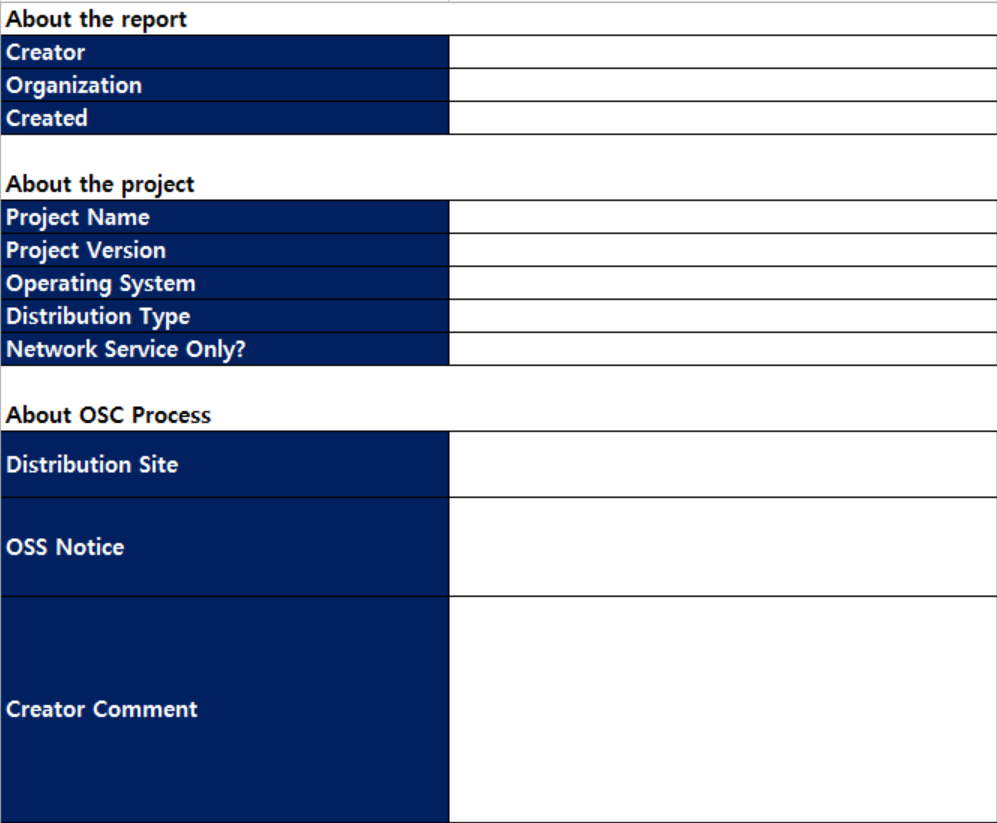
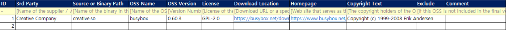
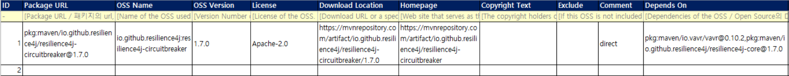
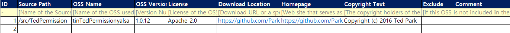
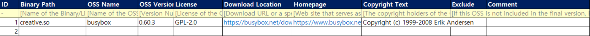
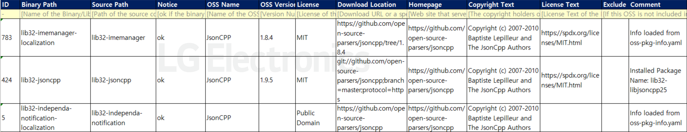
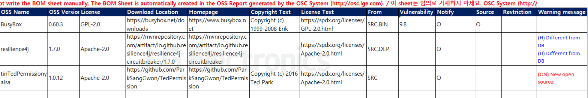

# FOSSLight Report  
- FOSSLight Report는 FOSSLight Hub와 FOSSLight Scanner에서 사용되는 템플릿으로, 프로젝트별 Open Source 사용 현황을 파악하기 위해 작성되며, 'OSS 보고서'라는 용어로도 사용됩니다.  
- 3.3 버전 : [Fosslight_Report.xlsx](https://github.com/fosslight/fosslight/raw/main/src/main/resources/template/ProjectReport.xlsx)

## Sheet 구성 
{: .left-bar-title }  

### Project Info Sheet
{: .specific-title}  
- Project 정보를 작성합니다.  
  
  

### 3rd Party Sheet  
{: .specific-title}   
- 배포하는 Project에 3rd Party로부터 제공받은 Software가 포함되어 있는 경우, 해당 3rd party로부터 OSS Checklist를 입수하여 사용된 Open Source 현황을 파악해야 합니다. (참고 : [3rd Party OSS Checklist](https://raw.githubusercontent.com/fosslight/fosslight/develop/src/main/resources/static/sample/LGE-OSS-Checklist-for-3rdParty_Kor_2.0.xlsx))     
- 파악된 Open Source 정보는 FOSSLight Hub의 [3rd Party](../menu/5_third-party.md) 메뉴에 등록하며, 해당 정보는 Project > Identification > [3rd Party 탭](../tutorial/1_project/2_Identification/1_3rd_Party_Tab.md)에서 취합됩니다.     
- FOSSLight Hub > Project > Identification에서 FOSSLight Report를 Export하면, [3rd Party 탭](../tutorial/1_project/2_Identification/1_3rd_Party_Tab.md)에 등록된 정보가 자동으로 "3rd party" sheet에 채워집니다. 따라서, "3rd party" sheet는 임의로 작성하지 않습니다.      
  

### DEP Sheet
{: .specific-title}
- Dependency 분석 결과를 업로드합니다.  
  
   - [FOSSLight Dependency Scanner](https://fosslight.org/fosslight-guide/scanner/3_dependency.html)를 이용하면 "DEP" sheet를 자동으로 생성할 수 있습니다.  

### SRC Sheet
{: .specific-title}
- Source Code 별로 포함되는 Open Source 정보를 작성합니다.   
  
   - [FOSSLight Source Scanner](https://fosslight.org/fosslight-guide/scanner/2_source.html)를 이용하면 "SRC" sheet를 자동으로 생성할 수 있습니다.  

### BIN Sheet
{: .specific-title}
- Binary 별로 포함되는 Open Source 정보를 작성합니다.   
  
   - [FOSSLight Binary Scanner](https://fosslight.org/fosslight-guide/scanner/4_binary.html)를 이용하면 "BIN" sheet를 자동으로 생성할 수 있습니다.  

   
### BIN(Android) Sheet
{: .specific-title}
- Android Platform Project 및 Yocto Project의 Open Source 정보를 작성합니다.  
 
   - [FOSSLight Android Scanner](https://fosslight.org/fosslight-guide/scanner/6_android.html) 및 [FOSSLight Yocto Scanner](https://fosslight.org/fosslight-guide/scanner/5_yocto.html)를 이용하면 "BIN(Android)" or "BIN(Yocto)" sheet를 자동으로 생성할 수 있습니다. 
   - Android Platform 및 Yocto 기반 모델(Phone, TV 등)의 경우, DEP / SRC / BIN sheet를 작성하지 않아도 됩니다.  

### BOM Sheet
{: .specific-title}
- BOM(Bill of Materials)은 FOSSLight Report에 작성된 각 Sheet의 Open Source 내역을 취합하여 생성됩니다.  
- BOM은 FOSSLight Hub의 Project에서 Export한 FOSSLight Report에 자동으로 채워지므로 수동으로 작성하지 않습니다.  

## Sheet 내용 작성
{: .left-bar-title }  
FOSSLight Scanner를 이용하여 sheet가 자동으로 생성되지만, 누락되거나 부정확한 정보에 대해서는 직접 확인하고 보완해야 합니다.  

### 공통 
{: .specific-title}  

<table border="1" cellspacing="0" cellpadding="8" style="border-collapse: collapse; width: 100%;">
  <thead>
    <tr>
      <th style="padding: 12px;">Column Name</th>
      <th style="padding: 12px;">Description</th>
    </tr>
  </thead>
  <tbody>
    <tr>
      <td style="padding: 12px;">OSS Name</td>
      <td style="padding: 12px;">
         • Open Source를 다운로드한 Website에서 명시한 이름을 기준으로 OSS Name을 작성합니다. 
         • <a href="../tips/1_common/2_pre_review/">Pre-Review</a> 기능을 이용하면 Download Location 정보를 통해 OSS Name을 확인할 수 있습니다. 
         • License Text는 존재하지만, Open Source의 이름이나 출처가 불명확한 경우, OSS Name은 하이픈("-")으로 작성합니다. 
         

            – License, Copyright 등 다른 정보는 모두 작성합니다. 
            – 단, 이는 License가 Permissive License인 경우에만 해당됩니다. GPL, LGPL 등 Copyleft License의 경우, Source Code 공개 범위를 판단하기 위해 OSS Name과 출처를 정확히 확인해야 합니다.
         

         • Open Source를 전혀 사용하지 않은 경우, OSS Name란에 하이픈("-")을 작성합니다.
      </td>
    </tr>
    <tr>
      <td style="padding: 12px;">OSS Version</td>
      <td style="padding: 12px;">• 사용한 Open Source의 버전을 작성합니다.</td>
    </tr>
    <tr>
      <td style="padding: 12px;">License</td>
      <td style="padding: 12px;">
        • 하나의 Open Source에 여러 License가 적용된 경우, OSS License를 콤마(",")로 구분하여 작성합니다. 
        • Open Source를 전혀 사용하지 않은 경우, OSS License는  
        "LGE Proprietary License"로 작성하되, 3rd Party가 자체 개발한 경우에는 "Other Proprietary License"로 작성합니다.
      </td>
    </tr>
    <tr>
      <td style="padding: 12px;">Download Location</td>
      <td style="padding: 12px;">• 기입된 OSS Version의 Open Source를 다운로드할 수 있는 주소를 작성합니다.</td>
    </tr>
    <tr>
      <td style="padding: 12px;">Homepage</td>
      <td style="padding: 12px;">• Open Source 프로젝트의 공식 website 정보를 작성합니다.</td>
    </tr>
    <tr>
      <td style="padding: 12px;">Copyright Text</td>
      <td style="padding: 12px;">• Open Source의 Copyright 정보를 작성합니다.</td>
    </tr>
    <tr>
      <td style="padding: 12px;">License Text</td>
      <td style="padding: 12px;">• FOSSLight Hub에 등록되지 않은 OSS License인 경우, License 원문을 알 수 있는 Link 또는 License text를 작성합니다.</td>
    </tr>
    <tr>
      <td style="padding: 12px;">Exclude</td>
      <td style="padding: 12px;">• 배포하는 Software(제품 포함)에 Open Source가 포함되지 않은 경우, 해당 항목을 체크합니다.</td>
    </tr>
  </tbody>
</table>

### Sheet 별 내용 작성
{: .specific-title}
#### Project Info Sheet
   - **About the report** : 작성자/부서, 작성일을 작성합니다.
   - **About the project** : 개발 Project에 대한 정보를 작성합니다.  

  
세부 작성 방법

  <table border="1" cellspacing="0" cellpadding="8" style="border-collapse: collapse; width: 100%; margin-top: 10px;">
    <thead>
      <tr>
        <th style="padding: 12px;">Item</th>
        <th style="padding: 12px;">Description</th>
      </tr>
    </thead>
    <tbody>
      <tr>
        <td style="padding: 12px;">Project Name</td>
        <td style="padding: 12px;">
          • Project의 이름을 작성합니다. (모델명과 Project명이 동일할 경우, 모델명을 작성합니다.)
        </td>
      </tr>
      <tr>
        <td style="padding: 12px;">Project Version</td>
        <td style="padding: 12px;">
          • Project의 Version을 작성합니다. Version 구분이 없는 경우, 공란으로 둡니다.
        </td>
      </tr>
      <tr>
        <td style="padding: 12px;">Operating System</td>
        <td style="padding: 12px;">
          • Project의 Operating System을 선택합니다. (예: Android 7.0, webOS 3.0, Linux 3.4, iOS Application)
        </td>
      </tr>
      <tr>
        <td style="padding: 12px;">Distribution Type</td>
        <td style="padding: 12px;">
          • Project의 배포 유형을 선택합니다. 
          

            • General Model : 일반적인 B2C 모델일 경우 선택 
            • Transfer in-house : 사내 이관하는 경우 선택 
            • B2B : B2B 모델일 경우 선택 
            • Preceding Software : 선행 개발을 위한 개발로서, 배포가 예정되지 않은 경우 선택 
            • Self-Check : 외부 배포 목적이 아닌 내부 검토 및 사전 점검하는 경우 선택
          

        </td>
      </tr>
      <tr>
        <td style="padding: 12px;">Network Service Only?</td>
        <td style="padding: 12px;">
          • Network Service 형태(ex, Web Service)의 프로젝트인 경우 'Yes'를 선택합니다.
        </td>
      </tr>
    </tbody>
  </table>

   - **About OSC Process** : Open Source Compliance(OSC) Process에 대한 정보를 작성합니다.  

  
세부 작성 방법

  <table border="1" cellspacing="0" cellpadding="8" style="border-collapse: collapse; width: 100%;">
    <thead>
      <tr>
        <th style="padding: 12px;">Item</th>
        <th style="padding: 12px;">Description</th>
      </tr>
    </thead>
    <tbody>
      <tr>
        <td style="padding: 12px;">Distribution Site</td>
        <td style="padding: 12px;">
          • OSS 고지문을 등록할 Open Source 배포 사이트를 선택합니다. 
          (참고: <a href="https://opensource.lge.com" target="_blank">LG Open Source 사이트</a>) 
          • 배포 사이트에 배포하지 않는 경우만 N/A 처리합니다.
        </td>
      </tr>
      <tr>
        <td style="padding: 12px;">OSS Notice</td>
        <td style="padding: 12px;">
          • OSS 고지문의 유형을 선택합니다. 
          (참고: <a href="../tips/2_project/4_oss_notice/" target="_blank">OSS 고지문</a>) 
          • 대부분의 경우, "General"을 선택합니다. 
          • Project의 개발 Platform에서 자체적으로 OSS 고지문이 생성되는 경우 "Platform-generated"를 선택합니다.
        </td>
      </tr>
    </tbody>
  </table>

#### BIN sheet
- 하나의 Binary에 여러 Open Source가 사용된 경우, Open Source 별로 별도의 행을 추가하여 작성합니다.  

#### BIN(Android) sheet
- **Source Path** : Binary의 Source Code 경로를 작성합니다. Source Path 확인이 어려운 경우에는, Comment란에 사유를 작성합니다.  
- **NOTICE** : [FOSSLight Android Scanner](https://fosslight.org/fosslight-guide/scanner/6_android.html) 결과(result.txt)를 따르며, 임의로 수정하지 않습니다.  
- 하나의 Binary에 여러 Open Source가 사용된 경우, Open Source 별로 별도의 행을 추가하여 작성합니다.   

