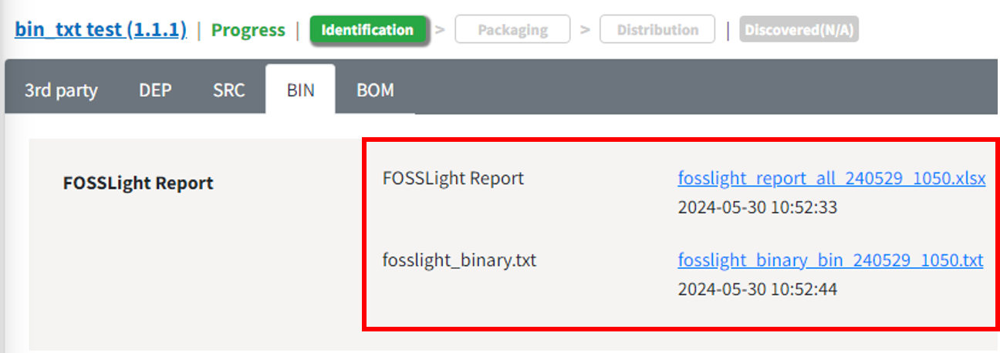
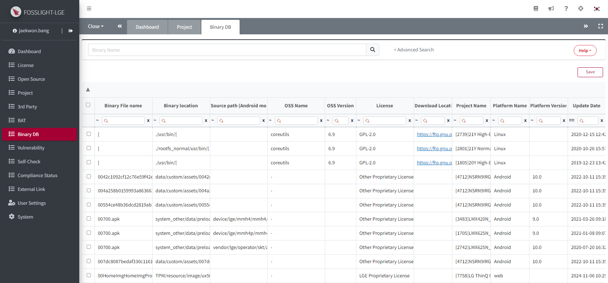

# Binary DB
이미 분석이 완료된 Base Model의 Binary 정보를 Database화(Binary DB) 하고, 이를 활용하여 파생 Model의 Binary 분석을 자동화할 수 있습니다.
  

## Binary 분석 자동화 방법
{: .left-bar-title }  
- **Binary 분석 결과(FOSSLight Report)**를 Upload한 후 Save 버튼을 클릭하면, Binary DB와 비교하여 동일하거나 유사한 Binary의 OSS Name, OSS Version, License 등의 정보를 자동으로 채워줍니다.  
    - 적용 메뉴 
        - **Project > Identification > [BIN](https://fosslight.org/hub-guide/tutorial/1_project/2_Identification/4_BIN_Tab.html), BIN(Android\|Yocto) tab** 
        - **3rd Party > Identification > 3rd party tab**
    - Binary DB 축적을 위하여 [FOSSLight Binary Scanner v4.1.30](https://github.com/fosslight/fosslight_binary_scanner/) 이후 버전 사용을 권장합니다.   
    {: .styled-image}   

- Binary Name 하단에서는 Binary DB 내의 Binary와 동일(또는 유사)한지 여부에 대한 정보를 Warning message로 보여줍니다.    
    - Warning Message 상세 내용은, [OSS Table Warning Message](https://fosslight.org/hub-guide/tips/1_common/5_warning_message/#bin-binandroid-tab)을 참고하시기 바랍니다.
{: .styled-image}  
  

- **Binary DB 내 Binary와 일치 여부 확인 방법**
    - Binary DB 내의 Binary와 일치하는지 여부는 다음 두 가지 data를 통해 확인합니다.  
        1. Binary 이름과 checksum 값이 일치하면 동일한 것으로 간주합니다.   
        2. 또는, Binary 이름이 동일하고 두 Binary간의 [TLSH(Trend Micro Locality Sensitive Hash)](https://github.com/trendmicro/tlsh) distance가 120이하면 유사한 것으로 간주합니다.   
   

##  Binary DB에 Data Insert 과정
{: .left-bar-title } 
- 3rd Party, Project의 Identification 단계 Confirm 시, Identification > BIN, BIN(Android\|Yocto), 3rd Party에 기재한 Binary 정보들은 Binary DB에 저장(insert) 되는데, [FOSSLight Binary Scanner v4.1.30](https://github.com/fosslight/fosslight_binary_scanner/) 이후 버전 사용시에만 적용됩니다.    

  

    
Data Insert 시, 상세 내용

    <ul style="margin-top: 8px;">
      <li><strong>OSS Name</strong>이 공백인 경우, 하이픈 "-" 으로 등록됩니다.</li>
      <li><strong>TLSH</strong> 값이 공백인 경우, 0으로 등록됩니다.</li>
      <li><strong>Binary Name</strong>에 <strong>Path</strong> 정보가 포함되어 있는 경우, <strong>Path</strong> 정보는 무시하고 파일명만 <strong>Binary Name</strong>으로 등록됩니다.</li>
    </ul>
  

- 동일한 Binary이지만 OSS 정보가 다를 경우, 기존 정보를 삭제한 후 신규 정보로 업데이트합니다.  
- 비슷한 Binary의 경우, 기존 OSS 정보는 유지하고 신규 OSS 정보를 추가 업데이트합니다.  

    

    
상세 동작

    <table border="1" cellspacing="0" cellpadding="0" style="border-collapse: collapse; width: 100%; font-family: Arial, sans-serif;">
        <thead>
        <tr style="background-color: #f2f2f2;">
            <th style="padding: 10px;">No</th>
            <th style="padding: 10px;">Case</th>
            <th style="padding: 10px; width: 25%;">동작</th>
            <th style="padding: 10px;">Description</th>
        </tr>
        </thead>
        <tbody>
        <!-- No 1 -->
        <tr>
            <td style="padding: 10px; vertical-align: top; background-color: white;">1</td>
            <td style="padding: 10px; vertical-align: top; background-color: white;"><strong>Binary DB</strong>에 <strong>Binary Name</strong>이 같은 <strong>Binary</strong>가 존재하지 않는 경우</td>
            <td style="padding: 10px; background-color: white;">신규 <strong>Binary</strong>로 저장</td>
            <td style="padding: 10px; background-color: white;">신규 <strong>Binary</strong>로 저장합니다.</td>
        </tr>
        <!-- No 2 -->
        <tr>
            <td rowspan="2" style="padding: 10px; vertical-align: top; background-color: white;">2</td>
            <td rowspan="2" style="padding: 10px; vertical-align: top; background-color: white;"><strong>Binary DB</strong>에 <strong>Binary Name</strong>이 같고 <strong>checksum</strong>이 동일한 <strong>Binary</strong>가 존재하는 경우</td>
            <td style="padding: 10px; background-color: white;">최신 <strong>Binary</strong> 정보로 업데이트</td>
            <td style="padding: 10px; background-color: white;"><strong>Binary DB</strong> 내 기존 <strong>Binary</strong> 정보를 삭제하고 최신 <strong>Binary</strong> 정보로 저장하여 업데이트합니다.</td>
        </tr>
        <tr>
            <td style="padding: 10px; background-color: white;">단, 하나의 <strong>Binary</strong>에 여러 <strong>OSS</strong>가 사용된 경우</td>
            <td style="padding: 10px; background-color: white;">하나의 <strong>Project</strong> 내에 동일한 <strong>Binary</strong>에 여러 <strong>OSS</strong>가 사용된 경우, <strong>OSS</strong> 정보를 모두 저장합니다.</td>
        </tr>
        <!-- No 3 -->
        <tr>
            <td rowspan="2" style="padding: 10px; vertical-align: top; background-color: white;">3</td>
            <td rowspan="2" style="padding: 10px; vertical-align: top; background-color: white;"><strong>Binary DB</strong>에 <strong>Binary Name</strong>이 같지만 <strong>checksum</strong>이 동일한 <strong>Binary</strong>가 존재하지 않는 경우</td>
            <td style="padding: 10px; background-color: white;">
            <strong>TLSH distance</strong> &lt;= 120인 경우, 
            <strong>OSS</strong> 정보에 따라 다르게 동작
            </td>
            <td style="padding: 10px; background-color: white;">
            <ol style="margin: 0; padding-left: 18px;">
                <li><strong>OSS Name</strong>과 <strong>OSS Version</strong>이 같은 경우 
                ∘ 신규 <strong>Binary</strong>로 저장합니다. 기존 <strong>Binary</strong> 정보는 <strong>checksum</strong>이 같을 때만 활용될 수 있으므로 <strong>TLSH distance</strong> 값을 0으로 변경합니다.
                </li>
                <li><strong>OSS Name</strong>은 동일하지만 <strong>OSS Version</strong>은 다른 경우 
                ∘ 신규 <strong>Binary</strong>로 저장합니다.
                </li>
                <li><strong>OSS Name</strong>이 다른 경우 
                ∘ 신규 <strong>Binary</strong>로 저장합니다. 기존 <strong>Binary</strong> 정보는 <strong>checksum</strong>이 같을 때만 활용될 수 있으므로 <strong>TLSH distance</strong> 값을 0으로 변경합니다.
                </li>
            </ol>
            </td>
        </tr>
        <tr>
            <td style="padding: 10px; background-color: white;"><strong>TLSH distance</strong> &gt; 120인 경우, 신규 <strong>Binary</strong>로 저장</td>
            <td style="padding: 10px; background-color: white;"><strong>TLSH distance</strong>가 120보다 큰 경우, 동일하지 않은 <strong>Binary</strong>로 판단하여 신규 <strong>Binary</strong>로 저장합니다.</td>
        </tr>
        </tbody>
    </table>
    

   

##  Binary DB 확인  
{: .left-bar-title } 
- Binary DB 메뉴를 통해 Binary DB에 등록된 Binary 현황을 확인할 수 있습니다.
{: .styled-image}    
