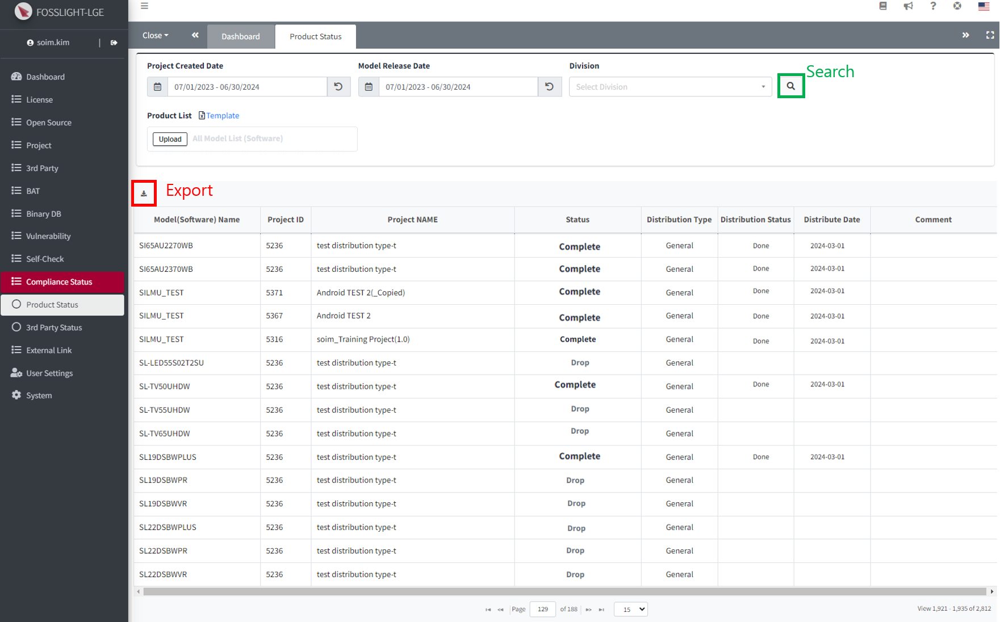

# (LGE Only) Compliance Status 
배포된 Software 또는 Model의 Open Source Compliance 이행 현황을 조화할 수 있습니다. 

## Product Status
{: .left-bar-title}
{: .styled-image} 
- Project 생성 날짜, Model release 날짜, Division으로 검색 가능합니다. 
- (선택) Product List Template: Product List sheet > Product Name을 입력 후 업로드시, Product Name으로 등록된 Project 또는 Model 검색 결과가 추가됩니다.
    - FOSSLight Hub에서 검색되지 않는 product name은 LG Open Source Site에서 검색합니다. 
- 검색 결과 : Project 생성 날짜, Model release 날짜, Division으로 FOSSLight Hub에서 검색한 결과.
    - 단, Product List Template이 첨부된 경우, 해당 파일에 작성된 Product name을 찾은 결과가 추가됩니다.
    - Status : Complete 또는 Drop인 경우만 조회됩니다.

## 3rd Party Satus 
{: .left-bar-title}
{: .styled-image} 
- 3rd Party 생성 날짜와 Division으로 검색 가능합니다.