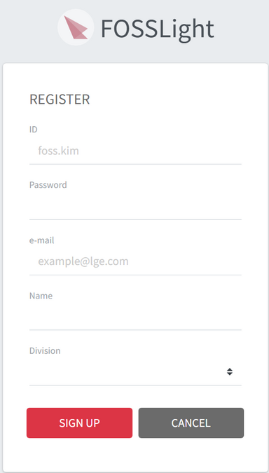

# Sign In & Sign Up
FOSSLight Hub 로그인 및 계정 등록 방법을 설명합니다.
  

## Sign In  
{: .left-bar-title }
- 처음 접속하는 경우, Sign Up 버튼을 클릭하여 계정을 등록합니다.  

   

### (LGE Only)
{: .specific-title} 
   - AD계정으로 로그인 할 수 있습니다.<U>(Sign Up 불필요)</U>
   - 최초 로그인 시, Division 입력 안내 popup 창이 뜹니다.  
   - OK를 선택 시, User Setting 화면으로 이동하여 Division 정보를 설정할 수 있습니다.  
      

   

## Sign Up  
{: .left-bar-title }  
- FOSSLight Hub에 처음 접속하는 경우 계정을 등록합니다.  
  

