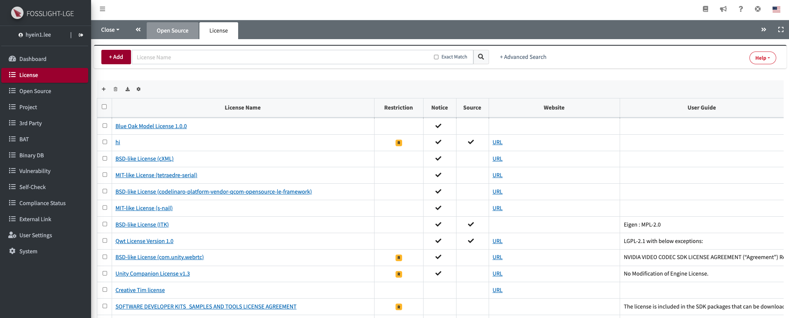
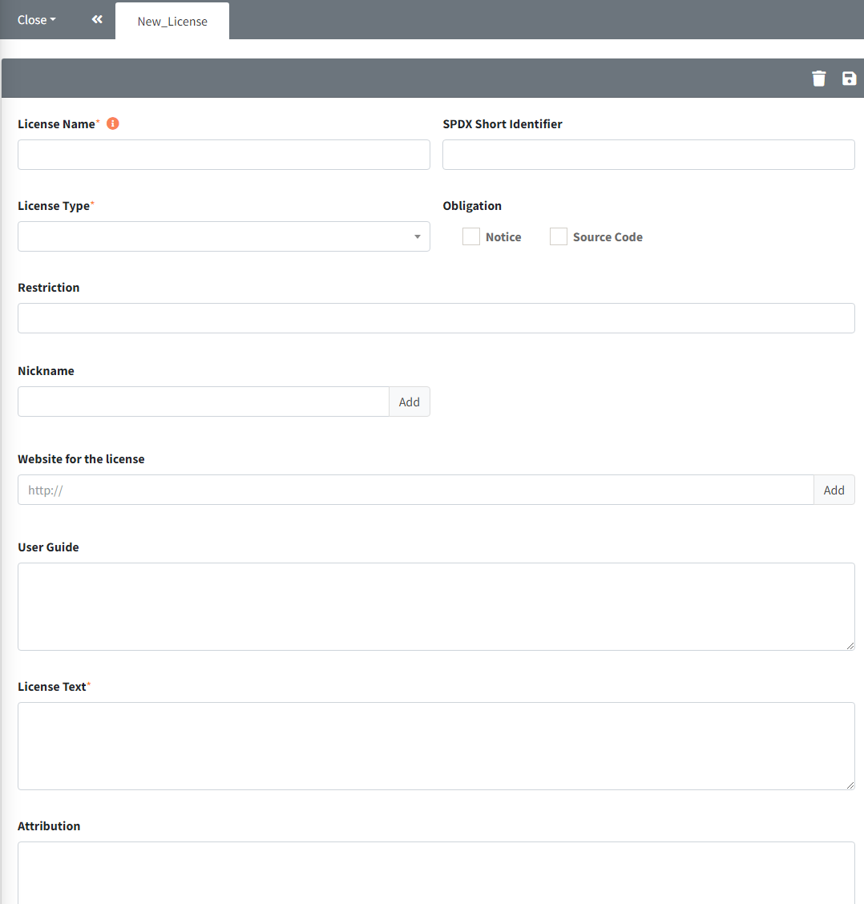

# License

º 등록된 License 정보를 확인하고,License Name을 클릭하면 해당 License의 상세정보를 확인할 수 있습니다. 
º (Admin Only) License를 추가, 수정, 삭제할 수 있습니다. 

## License List
{: .left-bar-title }

### License Name
{: .specific-title} 
- License Full name으로 SPDX (<https://spdx.org/licenses/>) 표기 방식을 따르고 있습니다.
- License Name을 클릭하면, License 별 상세정보를 확인할 수 있습니다.

### Identifier
{: .specific-title} 
- Standardized short identifier로 License를 더욱 쉽게 식별할 수 있으며 SPDX (<https://spdx.org/licenses/>) 표기 방식을 따르고 있습니다.

### License Type 
{: .specific-title} 
- **Permissive**
    - BSD-like 또는 BSD-style License로 불리며 Software 배포시 최소한의 요구사항이 있는 License입니다. 
    - 통상적으로 Copyright Notice와 보증부인 문구를 유지할 것을 요구합니다. 
- **Weak Copyleft**
    - 파생저작물에 동일한 권리가 유지된다는 조건으로 저작물의 복사본과 수정된 버전을 자유롭게 배포할 수 있습니다.
    - 원 저작물과 수정본의 소스 코드를 공개해야 합니다.
- **Copyleft**
    - 파생저작물에 동일한 권리가 유지된다는 조건으로 저작물의 복사본과 수정된 버전을 자유롭게 배포할 수 있습니다.
    - 원 저작물과 수정본뿐만 아니라 이와 link 되거나 함께 동작하는 프로그램 전체 소스 코드를 공개해야 합니다.
- **Proprietary**
    - Software 권리자의 허락 없이 사용이 불가능하므로 반드시 소스 코드 사용 여부에 대한 계약 관계를 확인하고 사용하시기 바랍니다.
- **Proprietary Free**
    - 추가적인 계약이 필요하지는 않지만 제약된 형태, 특정 이용 약관 또는 조건에서 사용할 수 있습니다.

### Restriction 
{: .specific-title} 
Restriction 내용은 [OSORI](https://osori-db.github.io/docs/guide/) 프로젝트를 기반으로 작성되었습니다. 

<table class="centered-table">
    <thead>
        <tr>
            <th scope="col">항목</th>
            <th scope="col">설명</th>
            <th scope="col">&nbsp;LEVEL&nbsp;</th>
            <th scope="col">신호등 제약사항)</th>
        </tr>
    </thead>
    <tbody>
        <tr>
            <td><strong class="highlight_table">Non-Commercial Use</strong></td>
            <td>
                <ul class="list-with-dot">
                    <li>
                        Software의 상업적 사용 및 배포를 금지합니다. (기업에서 제공하는 무료 소프트웨어 사용 불가)
                         
                        예) CC-BY-NC-X.X
                    </li>
                </ul>
            </td>
            <td>5</td>
            <td>🔴</td>
        </tr>
        <tr>
            <td><strong class="highlight_table">Internal Use Only</strong></td>
            <td>
                <ul class="list-with-dot">
                    <li>
                        사내에서 사용하는 경우에만 허용됩니다.
                         
                        예) Additional-Buildcraft-Objects-Mod License
                    </li>
                </ul>
            </td>
            <td>4</td>
            <td>🔴</td>
        </tr>
        <tr>
            <td><strong class="highlight_table">No Charge</strong></td>
            <td>
                <ul class="list-with-dot">
                    <li>
                        자체 판매를 금지하거나 직접적 사용 비용을 청구하지 않습니다. (기업에서 제공하는 무료 소프트웨어 내 탑재 가능)
                         
                        예) Commons Clause License Condition v1.0, SIL Open Font License 1.1
                    </li>
                </ul>
            </td>
            <td>3</td>
            <td>🟡</td>
        </tr>
        <tr>
            <td><strong class="highlight_table">No Modification</strong></td>
            <td>
                <ul class="list-with-dot">
                    <li>
                        Software의 수정된 버전을 배포할 수 없습니다. 즉 Source code를 수정하지 않고 사용해야 합니다.
                         
                        예) CC-BY-ND-X.X
                    </li>
                </ul>
            </td>
            <td>2</td>
            <td>🟡</td>
        </tr>
        <tr>
            <td><strong class="highlight_table">No Change the Name</strong></td>
            <td>
                <ul class="list-with-dot">
                    <li>
                        이름 변경을 할 수 없습니다.
                         
                        예) IPA Font License
                    </li>
                </ul>
            </td>
            <td>1</td>
            <td>🟢</td>
        </tr>
        <tr>
            <td><strong class="highlight_table">Platform Limitation</strong></td>
            <td>
                <ul class="list-with-dot">
                    <li>
                        특정 플랫폼에서만 사용 가능합니다.
                         
                        예) Amazon Software License (Amazon.com 혹은 자회사에서 제공되는 웹서비스, 컴퓨팅 플랫폼 혹은 어플리케이션을 위해 사용해야 함)
                    </li>
                </ul>
            </td>
            <td>2</td>
            <td>🟡</td>
        </tr>
        <tr>
            <td><strong class="highlight_table">Purpose Restriction</strong></td>
            <td>
                <ul class="list-with-dot">
                    <li>
                        Software를 특정 목적(분야)을 위하여 사용할 수 없습니다.
                         
                        예) The Happy Bunny License (군사 목적을 위해서 사용할 수 없음)
                    </li>
                </ul>
            </td>
            <td>2</td>
            <td>🟡</td>
        </tr>
        <tr>
            <td><strong class="highlight_table">Specification Restriction</strong></td>
            <td>
                <ul class="list-with-dot">
                    <li>
                        특정 Specification 또는 Standard와 관련하여 Software를 사용해야 합니다.
                         
                        예) ETCPACK Software License Agreement (Khronos standard specifications 의 compression/decompression을 위한 목적을 위해 사용)
                    </li>
                </ul>
            </td>
            <td>2</td>
            <td>🟡</td>
        </tr>
        <tr>
            <td><strong class="highlight_table">Redistribution Restriction</strong></td>
            <td>
                <ul class="list-with-dot">
                    <li>
                        재배포할 수 있는 Software의 하위 구성 요소(Source Code, Binary file 등)를 제한합니다.
                         
                        예) SOFTWARE LICENSE FOR VIVANTE CORPORATION (TM) USER SPACE GRAPHICS DRIVER BINARY (재배포시 Binary form으로만 가능함)
                    </li>
                </ul>
            </td>
            <td>5</td>
            <td>🟡</td>
        </tr>
        <tr>
            <td><strong class="highlight_table">Contract Required</strong></td>
            <td>
                <ul class="list-with-dot">
                    <li>
                        별도의 계약을 체결해야 합니다.
                         
                        예) QT Commercial License, NVIDIA Commercial License
                    </li>
                </ul>
            </td>
            <td>5</td>
            <td>🔴</td>
        </tr>
        <tr>
            <td><strong class="highlight_table">Provide Installation Information Required</strong></td>
            <td>
                <ul class="list-with-dot">
                    <li>
                        설치 정보를 제공해야 합니다.
                         
                        예) GPL-3.0
                    </li>
                </ul>
            </td>
            <td>4</td>
            <td>🔴</td>
        </tr>
        <tr>
            <td><strong class="highlight_table">Patent Warning</strong></td>
            <td>
                <ul class="list-with-dot">
                    <li>
                        특허분쟁 가능성이 있으므로 사용시 유의해야 합니다.
                         
                        예) Apple Public Source License
                    </li>
                </ul>
            </td>
            <td>4</td>
            <td>🔴</td>
        </tr>
        <tr>
            <td><strong class="highlight_table">Network Triggered</strong></td>
            <td>
                <ul class="list-with-dot">
                    <li>
                        네트워크 서버 형태로 이용하는 경우에도 의무사항을 준수해야 합니다.
                         
                        예) AGPL-3.0, OSL-2.0
                    </li>
                </ul>
            </td>
            <td>3</td>
            <td>🟡</td>
        </tr>
        <tr>
            <td><strong class="highlight_table">Semi-Copyleft</strong></td>
            <td>
                <ul class="list-with-dot">
                    <li>
                        저작권자 요구, 배포형태에 따라 다른 요구사항 요구하지만, 코드 공개하면 해결됩니다.
                         
                        예) Ruby License
                    </li>
                </ul>
            </td>
            <td>3</td>
            <td>🟡</td>
        </tr>
    </tbody>
</table>

### Source Code Disclosure Scope
{: .specific-title}
License 별 배포 시 Source Code 공개 범위를 선택합니다. 
- **NONE** : 공개 의무 없음
- **ORIGINAL** : 원 오픈소스
- **FILE** : 파일 단위 소스 코드
- **MODULE** : 모듈 단위 소스 코드
- **LIBRARY** : 라이브러리 단위 소스 코드
- **DERIVATIVE WORK** : 법적으로 파생 저작물의 범위
- **EXECUTABLE** : 실행 파일을 구성하는 부분의 소스 코드
- **DATA** : 데이터 자체
- **SOFTWARE USING THIS** : 해당 소프트웨어를 사용하는 모든 소프트웨어
- **UNSPECIFIED** : 소스 공개해야 하지만, 공개 범위 정확하지 않은 경우

### Obligation
{: .specific-title} 
License별로 고지와 소스코드 공개 의무사항을 알 수 있습니다.
- **Notice**: 체크() 표시가 되어 있는 경우,
  Copyright나 License (혹은 둘 다)에 대한 고지의 의무가 있음을 의미합니다.
- **Source**: 체크() 표시가 되어 있는 경우,
  Source Code 공개 의무가 있음을 의미합니다.

### Web site for the license
{: .specific-title} 
- License 원문의 web site 정보를 제공합니다. URL 클릭 시 해당 사이트로 이동합니다.

### User Guide 
{: .specific-title} 
- License 사용 시 주의 사항을 알 수 있습니다.

## (Admin Only) License 추가, 수정, 삭제
{: .left-bar-title }
### License 추가
{: .specific-title} 
{: .styled-image width="80%"}
1. License List에서 좌측 상단 Add 버튼을 클릭합니다.
2. "New_License" 탭에서 신규 OSS의 정보를 입력합니다.
    - **License Name, Nick Name**은 중복될 수 없습니다. 
    - **Obligation** : 
        - Notice가 체크된 경우, OSS Notice에 포함됩니다. 
        - Source Code가 체크된 경우, Packaging 탭에서 소스 코드 취합 OSS 목록으로 표시됩니다.
    - **User Guide** : 해당 OSS에 대한 정보를 입력합니다.
    - **Attribution** : OSS Notice 발행시 별도로 포함되어야 하는 문구를 기입합니다.
3. 우측 상단의 Save 버튼()을 클릭합니다.

### License 수정
{: .specific-title} 
1. License List에서 수정할 License Name을 클릭합니다.
2. License 상세정보 탭에서 수정합니다.
3. 우측 상단의 Save 버튼을 클릭합니다.

### License 삭제
{: .specific-title} 
1. License List에서 삭제할 License Name을 클릭합니다.
2. License 상세정보 탭에서 Comment란에 삭제 사유를 기입합니다.
3. 우측 상단의 Delete 버튼을 클릭합니다.
