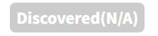

# Project

    Open Source Software를 포함하는 Software의 개발 및 배포를 위해 수행해야 하는 Process를 순차적으로 수행합니다.  
    상세 내용은 <a href="https://fosslight.org/hub-guide/tutorial/1_project"><strong>Project tutorial</strong></a>을 참고하시기 바랍니다. 
    1. <a href="https://fosslight.org/hub-guide/tutorial/1_project/2_Identification"><strong>Identification</strong></a> : Open Source 분석 결과(FOSSLight Report)를 작성하여 OSPO에게 리뷰받습니다. 
    2. <a href="https://fosslight.org/hub-guide/tutorial/1_project/3_packaging"><strong>Packaging</strong></a> : 공개할 Source Code를 취합하여 OSS Package를 생성합니다.  
    3. <a href="https://fosslight.org/hub-guide/tutorial/1_project/4_distribution"><strong>Distribution</strong></a> : OSS Notice와 OSS Package를 배포사이트에 등록합니다. 

## Project List
{: .left-bar-title }
Project를 검색하고, 해당 Project의 전체적인 정보를 확인하고 FOSSLight Report, OSS Notice, OSS Package를 다운로드할 수 있습니다.
{: .styled-image}  

### 1. Project Search
{: .specific-title}  
- Project의 Name으로 검색할 수 있습니다. **Advanced Search** 기능을 이용하여 다양한 조건으로 검색 가능합니다.
    - Advanced Search
        - ID, Creator, Model Name 등 다양한 조건으로 검색 가능합니다.
    {: .styled-image}

### 2. Project ID
{: .specific-title}  
- 프로젝트를 식별하는 고유 숫자입니다.

### 3. Project Name (Version)
{: .specific-title}  
- 더블 클릭하면 Project 상세 화면으로 이동합니다.

### 4. Status
{: .specific-title}  
- Project의 상태 정보를 표시합니다.

|Status|   Description   |
|----|----|
| Progress | · 사용자가 작성하고 있는 상태입니다.|
| Request |· Identification 또는 Packaging 단계에서 사용자가 Review를 요청한 상태입니다.  · Self Reject을 통하여 Progress 상태로 변경할 수 있습니다.|
| Review | · Identification 또는 Packaging 단계에서 리뷰어가 Review 중인 상태입니다. · 사용자는 프로젝트 정보를 수정할 수 없습니다.  · 수정이 필요한 경우, Reviewer에게 [Comment](#comment)를 남겨 Reject 요청해주시기 바랍니다.|
| Final Review | · OSPO 책임자가 최종 리뷰를 진행하고 있는 상태입니다.|
| Complete | · Project Review가 완료된 상태를 의미합니다.  · 사용자는 프로젝트 정보를 수정할 수 없습니다.  · 수정이 필요한 경우 Reviewer에게 Reopen 요청해주시기 바랍니다.|
| Drop | · 더 이상 OSC Process를 진행하지 않는 상태를 의미합니다.  · Complete가 아닌 경우, Status와 무관하게 사용자가 Drop 설정할 수 있으며, 필요시에는 Reopen을 클릭하여 직접 Open할 수 있습니다.|

### 5. OSC Process
{: .specific-title}  
- Project의 OSC 프로세스 진행 단계를 나타냅니다.
    - Identification -> Packaging -> Distribution
- Status에 따라 Process의 진행 단계의 색도 달라집니다.

### 6. Download
{: .specific-title}  
- (): Identification에서 입력한 목록을 **FOSSLight Report**로 다운로드할 수 있습니다.
- (): Packaging에서 공개할 Source Code가 업로드된 경우 아이콘이 표시되며 **OSS Package 파일**을 다운로드할 수 있습니다.
- (): Packaging 단계가 완료된 경우 아이콘이 표시되며 **OSS Notice**를 다운로드할 수 있습니다.

### 7. Security
{: .specific-title}  
Project의 Identification에 포함된 전체 Open Source List의(Exclude 제외) Vulnerability 정보에 대해 나타냅니다.
- () : Vulnerability score가 기준 점수 이상인 경우 
- () : Vulnerability score가 기준 점수 미만인 경우 
