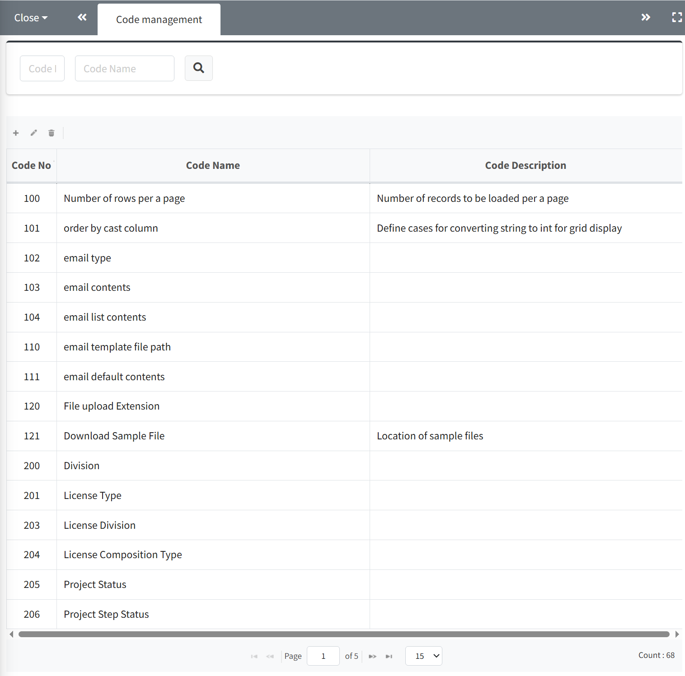
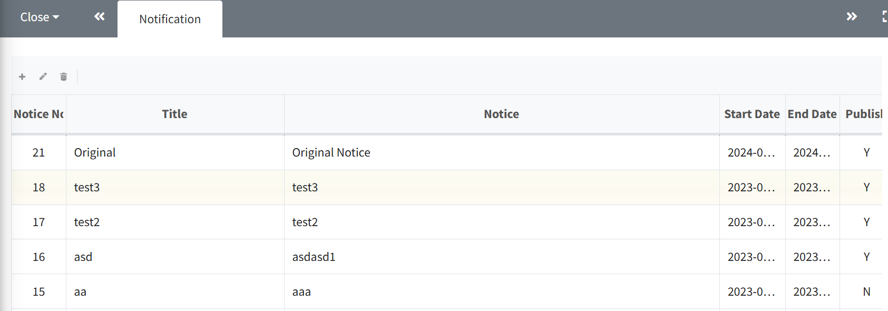

# System (Admin Only)
FOSSLight Hub 운영 Log를 확인하거나 운영 Data를 변경합니다.
  

## Code Management
{: .left-bar-title}  
 

FOSSLight Hub 동작 관련 세팅 값을 설정합니다.     
- Code No 또는 Code Name (부분 일치)로 검색 가능합니다.  
{: .styled-image}       
- 검색 결과 목록이 표시되며 row 클릭 시, 하단에 상세 코드 정보가 표시됩니다.  
    - 상세 코드는 테이블 왼쪽 상단의 + 버튼을 클릭하여 row를 추가할 수 있으며, list에서 row를 더블 클릭하면 전체 row가 편집 모드로 변경됩니다.  
    - 수정 후 save 버튼을 클릭하여 수정한 내용을 적용할 수 있습니다.  
    - 편집 모드를 취소하고자 하는 경우는 상단 Code 검색 결과 영역을 (row) 다시 선택하여, 상세 코드 영역을 초기화할 수 있습니다.  
{: .styled-image}    
   

## User Management  
{: .left-bar-title}
  

등록된 계정 목록을 확인하고 정보를 수정합니다.  
- **Token Proc > Create** 버튼 : [Rest API](https://fosslight.org/hub-guide/advanced/2_rest_api_2.html)에서 사용할 Token을 생성합니다.   
- **Password > reset** 버튼 : 비밀번호를 사용자 ID와 동일한 값으로 초기화합니다.     
- **Use YN** : 휴면 계정을 설정합니다.   
- **Admin** : Admin 권한을 부여합니다.     
{: .styled-image}  

   

## History List  
{: .left-bar-title}  
  

License List, OSS List, Project 기본 정보의 변경 이력을 조회할 수 있습니다.  
- **검색 영역** 
    - **Name** : License Name, OSS Name 또는 Project Name으로 조회할 수 있음     
    - **Modifier** : 사용자로(Action 행위자)  조회할 수 있음    
    - **Modify Type** : License, Open Source, 또는 Project로 선택하여 조회할 수 있음      
    - **Action** : Insert, Update, 또는 Delete로 선택하여 조회할 수 있음      
    - **Modified Date** : 특정 기간 내 변경 이력을 조회할 수 있음    
{: .styled-image}  
- **상세 내용**  
    -  검색 결과의 row를 더블 클릭하여 상세 내용을 확인할 수 있습니다.  
    {: .styled-image}   
   

## Notification  
{: .left-bar-title}
 

FOSSLight Hub 로그인 시 나타나는 공지 팝업을 관리합니다.   
{: .styled-image}    
- **추가**
    - 왼쪽 상단의 + 버튼을 클릭하여 공지를 추가합니다.    
    - Start Date : 공지 시작일  
    - End Date : 공지 종료일  
    - Publish : 체크된 경우, 공지 팝업이 표시됩니다.   
    {: .styled-image}     

- **수정**  
    - 수정하고자 하는 공지의 Row를 클릭 > 왼쪽 상단의 을 클릭 > 내용 수정 > Submit 버튼을 클릭합니다.         
   

## Sent Mail List    
{: .left-bar-title}
     

메일 발송 내역을 확인합니다.    
{: .styled-image}  
   

## Vulnerability Log  
{: .left-bar-title}
     

OSS의 Vulnerability Data 변경 사항을 확인합니다.  
- Vulnerability Log는 OSS의 정보가 변경되거나 (Nick name 추가 등), 해당 OSS의 Vulnerability Score가 신규로 등록되거나 더 높은 Score의 CVE ID가 등록된 경우 업데이트됩니다.  
- 필터 기능을 이용하여, 특정 OSS (Version)의 Vulnerability 정보의 변경 이력을 확인할 수 있습니다.  
- CVE ID를 클릭하면 NVD 사이트의 해당 CVE 상세화면으로 이동합니다.  
{: .styled-image}    
   

## Server Setting  
{: .left-bar-title }
    

{: .styled-image}    
- **Authentication using LDAP**  
    - FOSSLight Hub는 JNDI를 사용하여 Active Directory 등 LDAP을 사용할 수 있는 환경에서는 LDAP을 이용한 사용자 패스워드 인증 처리를 지원합니다.  
        - Provider URL : LDAP 서버 정보를 ldap://&lt;AD_SERVER_IP&gt;:&lt;LDAP_PORT&gt; 형식으로 설정합니다. (javax.naming.Context.PROVIDER_URL)  

- **Notice Setting**   
    - **Notice Type**: 발급 가능한 OSS 고지문 형식을 설정합니다.  

- **SMTP Setting**    
    - **Mail Server** : SMTP Host (ex, smtp.gmail.com )    
    - **Email Address** : 발송자 이메일 주소(ex, no-reply@fosslight.org )  
    - **Port** : SMTP Port 번호 (ex, 25 또는 587)  
    - **Encoding** : Default UTF-8 (필요한 경우에만 변경)  
    - **Username** : SMTP 사용자명 (일반적으로는 발송자 이메일 주소와 동일)  
    - **Password** : SMTP 사용자 패스워드 (패스워드는 암호화되어 저장되며, 공백인 경우 기존 패스워드를 변경하지 않습니다.)  

- **Workspace Path Setting**  
    - **Root Path** : 업/다운로드 파일 저장소의 최상위 workspace 경로를 설정합니다.    
