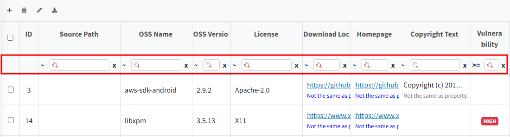

# OSS Table 활용법

## OSS Table Column 내용
{: .left-bar-title }
- **Source Path** : 소스 경로 
- **OSS Name** : 사용한 OSS의 이름
- **OSS Version** : 사용한 OSS의 버전
- **License** : OSS의 License
- **Download Location** : OSS를 다운 받은 website 주소
- **Homepage** : OSS의 대표 website 주소
- **Copyright Text** : Copyright 문구
- **Exclude** : Exclude : 배포하는 Project에 포함되지 않는 경우 체크 (ex- build script와 같이 build시에만 사용되고 제품에 탑재되지 않는 경우)
- **Vulnerability** : 해당 OSS의 CVSS Score  
<th scope="col">※ Open Source Software = OSS</th>
    

## OSS Table 상단 버튼
{: .left-bar-title }
  OSS Table 좌측 상단에는 4가지 버튼이 있습니다.    
  {: .styled-image}

**Row 추가**
  -  버튼을 클릭하여 입력할 Row를 추가합니다. 
  - 노란색으로 추가된 Row의 각 셀마다 정보를 기입합니다. 
  

**Row 삭제** 
  -  버튼을 클릭하여 선택한 Row를 삭제합니다.
  - 선택된 row가 없이 버튼을 클릭하는 경우, 전체가 삭제됩니다.  

**Bulk Edit** 
 -   버튼을 클릭하여 선택된 row에 전체에 대해 동일한 내용으로 업데이트할 수 있습니다.  
    - 수정을 원하는 항목을 체크박스에서 선택한 후, 수정하고자 하는 내용을 작성하고 Change를 눌러줍니다.  
    - 항목을 체크박스에서 선택한 후, Delete 버튼을 누르면 선택된 항목의 내용이 OSS Table에서 모두 삭제됩니다. 
        {: .styled-image}  

**Export**
-  버튼을 클릭하여, OSS Table 내용을 선택한 형식으로 Export 합니다. 
    - BOM Tab : FOSSLight Report 및 SBOM 표준의 여러 가지 형식으로 다운로드 가능합니다.  
    {: .styled-image}    
    - BOM 이외의 Tab : FOSSLight Report 다운로드 가능합니다.  
    {: .styled-image}      

## OSS Table Cell 수정
{: .left-bar-title }
OSS Table에서 수정하고자 하는 row를 더블 클릭 하면 입력 가능한 상태로 전환됩니다.  
{: .styled-image}  

**License 수정 방법**
- **License 추가** 
  - 수정할 Row를 더블 클릭 후, License column 내 cell 안의 edit 박스에 License 기입 후 enter 또는 다른 cell을 클릭합니다.  
  - 복수 개의 License를 기입할 수 있습니다.   

- **License 삭제** 
  - 수정할 Row를 더블 클릭 후, License column 내 cell 안의 License 별 x 버튼 클릭하여 삭제합니다.   
  {: .styled-image}        

## OSS 정보 자동 완성
{: .left-bar-title }
시스템에 등록되어 있는 Open Source의 경우, OSS Name과 OSS Version을 통해 저장된 정보를 자동으로 불러올 수 있습니다.
- OSS Name, OSS Version을 입력합니다.
- Version 입력 후, 자동 완성 여부를 묻는 팝업을 확인할 수 있습니다. 팝업에서 OK를 누르면 자동 완성이 됩니다.
{: .styled-image}    

## OSS Table Search
{: .left-bar-title }
OSS Table의 Header 아래에는 Search를 위한 Filter가 위치하고 있습니다. 이 Filter를 활용하여 Column 내 원하는 값을 검색할 수 있습니다.

- Filter는 다음과 같이 구성됩니다:  
  - 검색어 입력란()  
  - 검색어 입력란 초기화 ()
  - 검색조건 () 
<table style="margin-left: 60px;">
  <thead>
      <tr>
          <th scope="col"><strong>문자</strong></th>
          <th scope="col" style="text-align: center;"><strong>설명</strong></th>
      </tr>
  </thead>
  <tbody>
      <tr>
          <td>~</td>
          <td>Contains</td>
      </tr>
      <tr>
          <td>==</td>
          <td>equal</td>
      </tr>
      <tr>
          <td>!</td>
          <td>not equal</td>
      </tr>
      <tr>
          <td>^</td>
          <td>begin with</td>
      </tr>
      <tr>
          <td>!^</td>
          <td>does not begin with</td>
      </tr>
      <tr>
          <td>|</td>
          <td>end with</td>
      </tr>
      <tr>
          <td>!@</td>
          <td>does not end with</td>
      </tr>
      <tr>
          <td>! z~</td>
          <td>does not contain</td>
      </tr>
  </tbody>
</table>     

## OSS의 버전별 정보 조회 기능
{: .left-bar-title }
검색하고 싶은 OSS의 ID를 클릭하면, 해당 OSS의 버전별 정보를 조회할 수 있습니다.

  
- Open Source 상세 정보 창 
    
