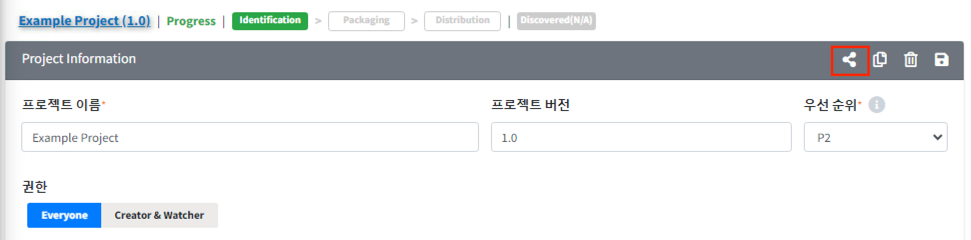
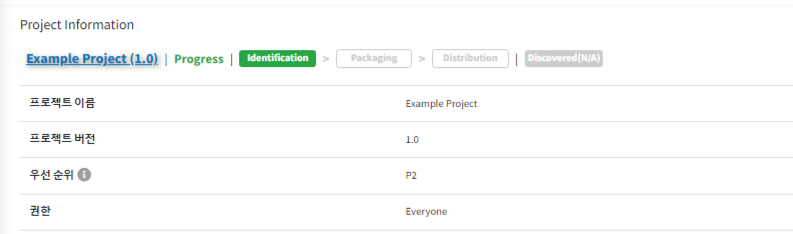
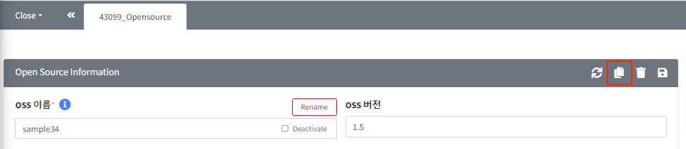
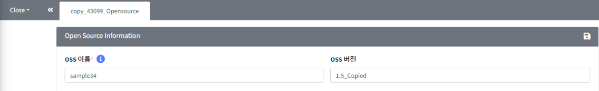

# 상세 화면의 공통 기능  
각 메뉴 상세 화면의 tab bar 오른쪽에 상세 화면을 제어할 수 있는 버튼이() 제공되며, 메뉴별 특성에 따라 제공되는 버튼은 각각 다릅니다.  
- **주요 메뉴** 
    - License (admin only)
    - Open Source (admin only) 
    - Project Information
    - Project Identification
    - 3rd Party Information 
    - 3rd Party Identification 
    - Self-Check 
   
 
## 정보 공유 (Share URL)   
{: .left-bar-title }
- 정보 공유 버튼 :   
- 기능
    - 현재 페이지의 정보를 공유할 수 있습니다. 
    - View 권한이 없을 때, Share URL을 이용하면 해당 항목의 개요를 확인할 수 있습니다.  
    - 로그인을 해야 share url로 공유받은 링크를 확인할 수 있습니다.  

- 공유 예시
    1. Project > Project Information에서 Share 버튼을 클릭합니다.
    {: .styled-image}
    2. 공유된 화면을 확인할 수 있습니다.(수정 권한이 없는 경우에는 View 화면으로 보임)
    {: .styled-image}
   

## 복사   
{: .left-bar-title }
- 복사 버튼 :   
- 기능
    - 현재 페이지를 복사합니다.  
    - 복사 버튼을 누르면, 기존 페이지의 내용이 복사된 채로 새탭이 생성됩니다.  
    - 원하는 세부 내용을 수정한 후 저장하면 복사한 내용이 저장됩니다.  
- 복사 예시  
    1. Open Source 상세화면에서 Copy 버튼을 클릭합니다.  
    {: .styled-image}  
    2. Open Source 가 복사되면서 복사된 내용으로 채워진 copy_[Open_Source_id]_Opensource 탭을 확인할 수 있습니다.  
    {: .styled-image}  
    3. 수정하고자 하는 내용으로 업데이트한 후 저장 버튼을 클릭합니다.  

- **Note**  
    - [Project 복사 Tip](../../2_project/3_reuse_project/1_copy_project.md#프로젝트-재사용하기-프로젝트-복사) : Project는 복사 할 때, Process 단계에 맞춰 복사 할 수 있습니다.  
   

## 삭제   
{: .left-bar-title }  
- 삭제 버튼 :    
- 기능  
    - 현재 페이지를 삭제합니다.  
    - 수정 권한이 없거나, 삭제 할 수 없는 상태인 경우(ex. Project가 Complete 상태 일 때) 삭제 버튼이 보이지 않습니다.  
   

## 저장    
{: .left-bar-title }  
- 저장 버튼 :   
- 기능  
    - 현재 페이지의 내용을 저장합니다.  
    - 수정 권한이 없거나, 변경 불가능한 상태인 경우 저장 버튼이 보이지 않습니다.  
   

## Reset  
{: .left-bar-title }  
- 초기화 버튼 :   
- 기능  
    - 입력된 내용 및 업로드 된 파일이 초기화됩니다.  
    - 초기화 버튼은 분석 정보를 입력하는 화면에서만 보입니다. Project의 Identification, 3rd party SW, Self-Check 에서 확인할 수 있습니다.
   

## 동기화    
{: .left-bar-title }  
- 동기화 버튼 :   
- 기능
    - Open source 화면에서만 제공되는 기능입니다. [Open source sync 방법](../../../menu/3_oss.md#oss-버전별-정보-일괄-변경-기능)을 참고하시기 바랍니다.