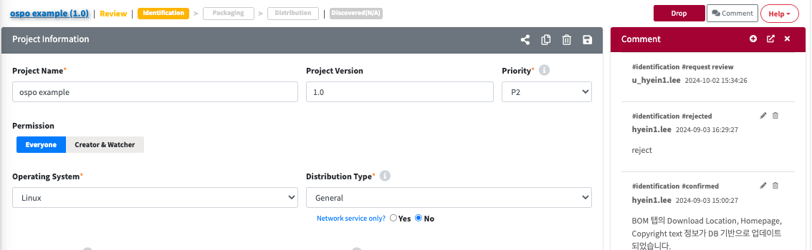
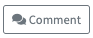
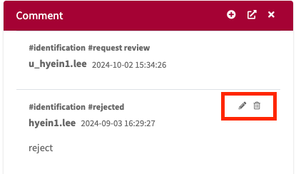
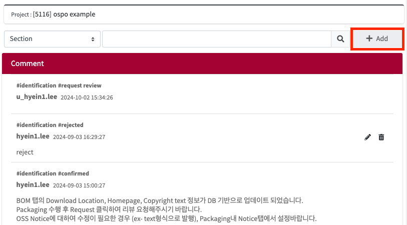

# Comment
각 메뉴의 상세화면 우측에 리뷰어와 사용자간의 커뮤니케이션 및 히스토리 관리를 위한 Comment View를 확인할 수 있습니다.  
{: .styled-image}  
- **주요 메뉴** 
    - License
    - Open Source
    - Project
    - 3rd Party
   

## Comment View
{: .left-bar-title }
- 는 토클 버튼으로, Comment 창을 표시하거나 숨길 수 있습니다. 
    

## Comment 작성
{: .left-bar-title }
1. Add 버튼 을 클릭합니다.
2. Comment 팝업창에 내용을 작성합니다. 
    - **Save & Send Comment** : 작성된 내용이 저장된 후, 리뷰어와 사용자의 메일로 전송됩니다.
    - **Save draft** : 임시로 Comment가 저장됩니다. 다시 Add 버튼을 클릭하면, 이전 작성 내용이 남아 있는 Comment 창이 나타납니다.   
    
    

## Comment 수정/삭제 
{: .left-bar-title }
- 이전에 작성한 Comment를 수정 및 삭제할 수 있습니다. 
    -  버튼을 클릭하면, Comment를 수정할 수 있는 팝업이 나옵니다. 수정 후 'OK' 버튼을 클릭하면 저장됩니다. 
    -  버튼을 클릭하면, Comment를 삭제할 수 있습니다. 
    {: .styled-image}
    

## Comment Window 분리
{: .left-bar-title }
-  버튼을 클릭하여 Comment를 별도의 창으로 분리하여 사용할 수 있습니다. 이 경우 **'+Add'** 버튼을 이용하여 Comment를 추가할 수 있습니다.  
   

