# 목록 화면 공통 기능

## 프로젝트 검색 결과 Export
{: .left-bar-title }
- 리스트 왼쪽 상단의 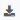 버튼을 클릭하면, 각 메뉴에서 현재 검색된 list를 엑셀 파일로 Export할 수 있습니다. 
- 총 검색 결과 개수는 오른쪽 하단에서 확인할 수 있습니다. 
- 검색 결과 5000개 이상은 Export 되지 않습니다.
- **주요 메뉴**
    - Open Source  
    - License  
    - Project  
    - 3rd party  
    - Self-Check  

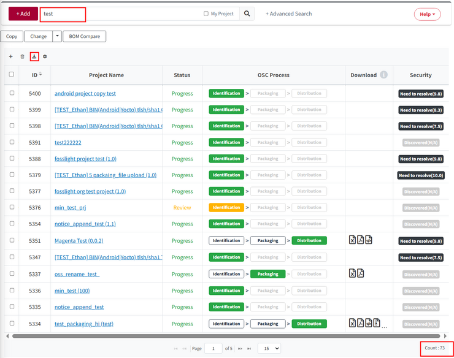  
   

## Division, Edit Permission, Status 변경  
{: .left-bar-title }  
- 메뉴 상단의 Change 버튼을 이용하여 선택된 List의 정보를 변경할 수 있습니다.   
- 선택한 project의 Edit Permission이 있어야 변경이 가능합니다.  
- **주요 메뉴** : Project, 3rd Party(Status 변경 없음)  
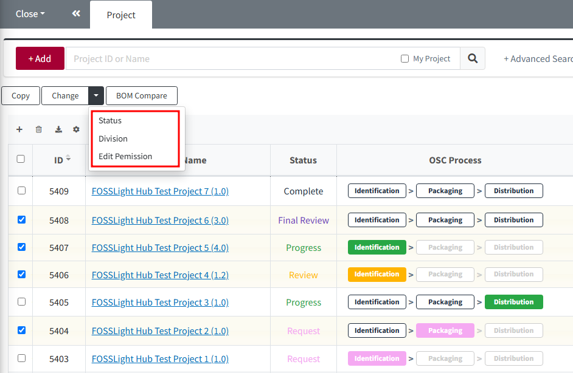   

###  Division 변경    
{: .specific-title }  
- 일괄적으로 project의 Division을 변경할 수 있습니다.  
- **변경 방법**   
  1. Division 변경이 필요한 project들을 선택 > Change 버튼 클릭 > Division을 클릭합니다.  
  2. 변경할 Division을 선택한 후 OK 버튼을 클릭합니다.     
    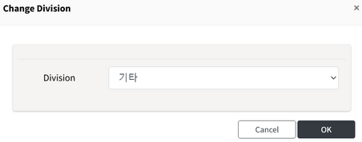  
  3. OK 버튼을 클릭합니다.    
    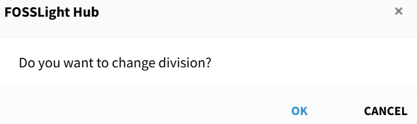   
    만약 Edit Permission이 없는 project가 한 개라도 선택된 경우에는 권한이 없는 project ID를 팝업으로 알려주고, Division이 변경되지 않습니다.  
   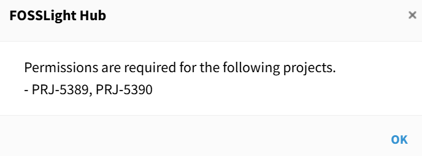     

### Edit Permission 변경
{: .specific-title }
- 일괄적으로 project의 Edit Permission을 추가 또는 삭제할 수 있습니다.   
- **변경 방법**  
  1. Edit Permission을 추가 또는 삭제할 project들을 선택 > Change 버튼 클릭 > Edit Permission을 클릭합니다.    
  2. Edit Permission으로 추가할 대상을 선택한 후  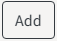 버튼을 클릭합니다.      
   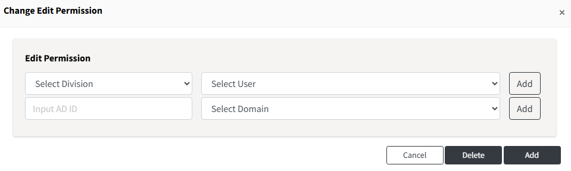     
    - **Select Division** : Division 별로 대상을 선택할 수 있습니다.    
    - **Input AD ID** : AD 계정을 입력하고, 도메인을 선택하여 대상을 선택할 수 있습니다.    
  3.  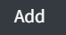 버튼을 클릭한 후 OK 버튼을 클릭합니다.    
  기존 Edit Permission 대상을 삭제하고 싶은 경우, 대상을 선택한 후   버튼을 클릭합니다.   

### Status 변경
{: .specific-title }
- project의 Status를 변경할 수 있습니다.      
  
- **변경 방법:**
  1. 목록에서 변경하고자 하는 project를 선택합니다.   
  2. Change 버튼 클릭 > Status를 클릭합니다.    
  3. 변경하고자 하는 Status를 선택하고, 사유를 입력한 뒤 OK를 클릭한다.    
   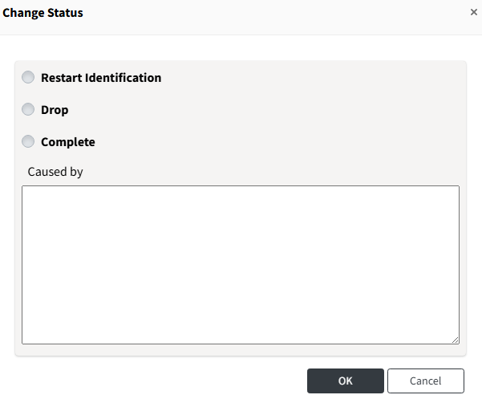      

- **변경 가능한 Status 종류**  
  - Status의 경우 사용자의 권한 별로 변경할 수 있는 Status 종류가 다릅니다.   
    - **일반 사용자** : project를 Drop, Restart Identification 상태로 변경할 수 있습니다.  
    - **Admin** : project를 Drop, Restart Identification, Complete 상태로 변경할 수 있습니다.  
   

## Custom Columns
{: .left-bar-title }  
- 각 메뉴의 List 화면에서 보이는 Column을 개인별로 설정하고 저장할 수 있습니다.  
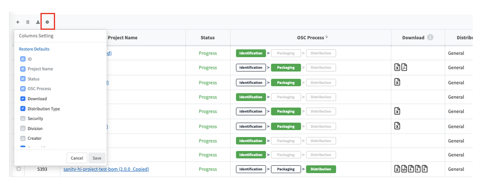{: .styled-image}     

- **해당 메뉴**
  - License  
  - Open Source  
  - Project  
  - 3rd party   
  - Self-Check      
 

- **Default Column 확인**  
  각 메뉴별로 기본적으로 설정된 Column 값은 다음과 같습니다.  
  - **License** : License Name, Restriction, Notice, Source    
  - **Open Source** : ID, OSS Name, OSS Version, License Name, Notice, Source    
  - **Project** : ID, Project Name, Status, OSC Process, Download  
  - **3rd party** : ID, 3rd Party Name, Software Name(Version), Status      
  - **Self-Check** : ID, Project Name(Version)  
 

- **Column 추가 및 삭제 방법**  
  - Grid 왼쪽 상단의  버튼 클릭 > 원하는 Column 선택 or 해제 > Save를 클릭합니다. 
  - 설정된 column은 저장되며, 다음 로그인 시에도 동일한 설정으로 List 화면을 사용할 수 있습니다. 