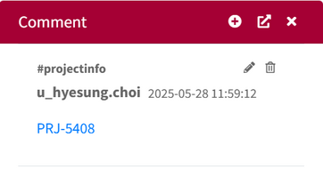
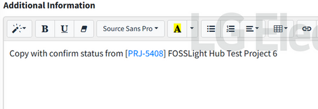
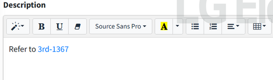
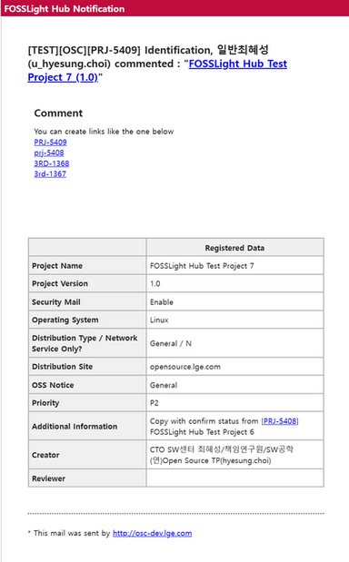

# Project & 3rd Party Link 추가  
- Project와 3rd party로 연결되는 link를 추가할 수 있습니다.  
- Link 클릭 시, 새 창에서 "Share URL" 링크로 연결됩니다.  

## Link 생성 방법  
{: .left-bar-title }  

- Text 패턴 
    - **PRJ-ID** or **prj-ID**
    - **3RD-ID** or **3rd-ID**
- Link가 동작하는 메뉴
    - Comment History 
        - Project, 3rd Party, Open Source(Admin Only), License(Admin Only)  
        {: .styled-image }  
    - Project > Project Information > Additional Information  
    {: .styled-image }  
    - 3rd party > Description  
    {: .styled-image }  
    - E-mail (Enterprise Only)  
    {: .styled-image }     
        