# Project Status  

## Project Status 이동 
{: .left-bar-title }  
- Project List에서 Project Name, OSC Process (Identification, Packaging, Distribution) 각 단계를 클릭하면 해당 단계의 tab으로 이동할 수 있습니다.  
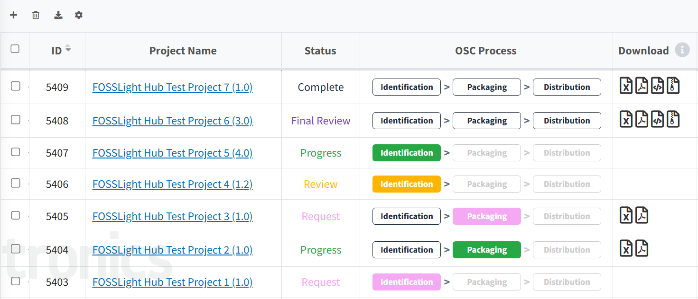  
- 각 단계의 상단 Status bar에서도 Project 상태를 확인할 수 있으며, 각 단계를 클릭하여 해당 단계의 tab으로 이동할 수 있습니다.  
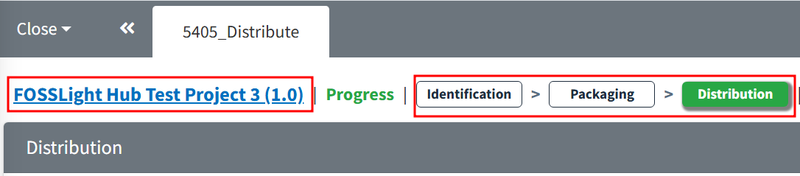  
   

## Self-Reject 
{: .left-bar-title }  
- Project Status가  인 상태에서 Identification과 Packaging 단계의 수정이 필요한 경우, 사용자는 Project Status를 변경할 수 있습니다.   
  1. Identification(SBOM), Packaging 단계에서 우측 상단의  버튼을 클릭합니다.  
  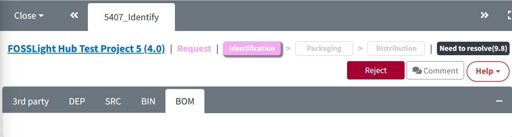  
  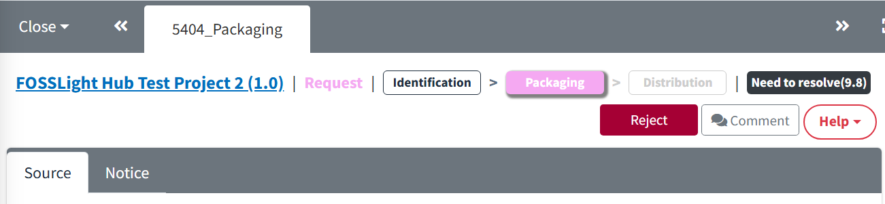  
  2. 변경이 필요한 사유를 입력하고, OK 버튼을 클릭합니다. 이때 Project Status는 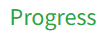 상태로 변경됩니다.  
  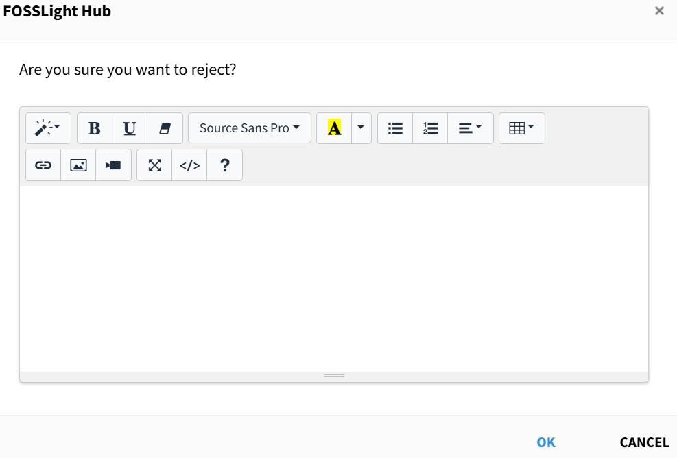  
   

## Reopen 
{: .left-bar-title }  
- Project Status가 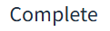 인 경우, Reopen으로 Project Status를 로 변경 요청할 수 있습니다.  
  1. Project List에서 Project Name을 클릭하여 Project Information 탭으로 이동합니다.  
  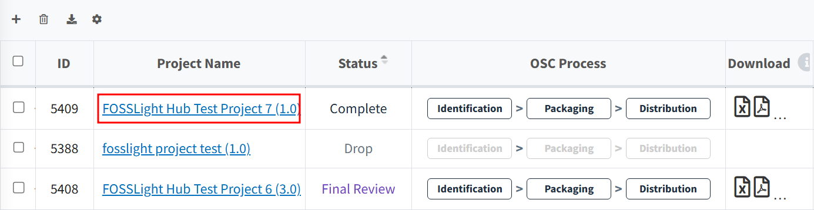  
  2. Project Information tab 우측 상단의  버튼을 클릭합니다.  
  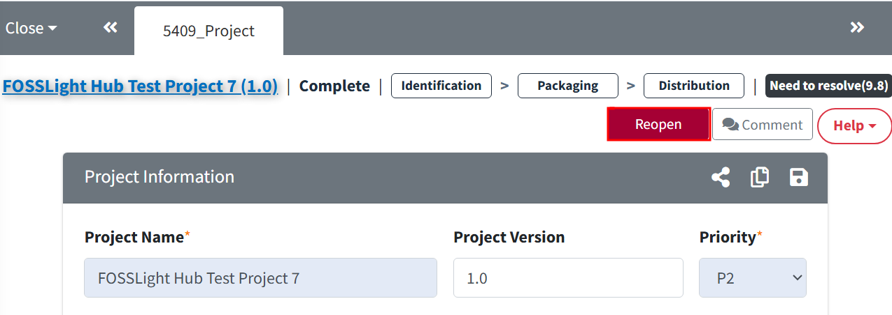  
  3. 변경이 필요한 사유를 입력하고, 재수행이 필요한 단계(Identification 또는 Packaging)를 선택한 후 OK를 클릭합니다.  
  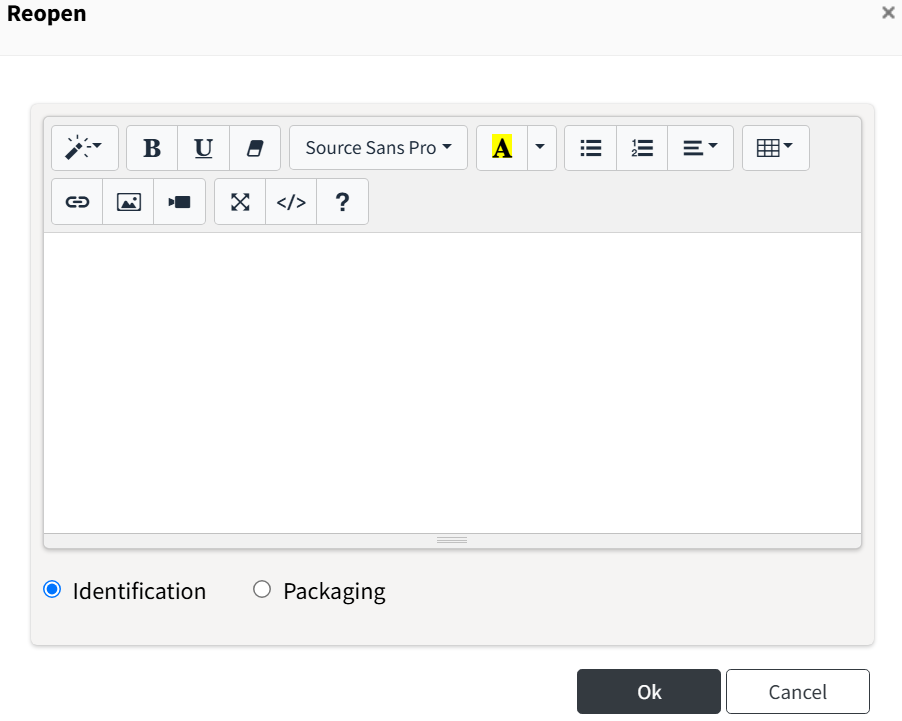  
   

## Drop & Reopen 
{: .left-bar-title }

### Drop
{: .specific-title }  
- 더 이상 Project의 OSC Process를 진행하지 않아도 되는 경우, Project를 중지할 수 있습니다.  
  1. Project Information 탭 우측 상단의  버튼을 클릭합니다. Project Status가  인 경우에는 Drop 기능이 동작하지 않습니다.  
  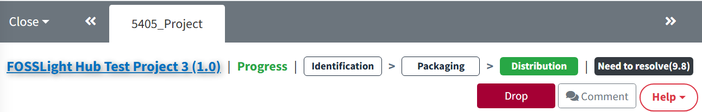  
  2. Drop 사유를 입력하고 OK 버튼을 클릭합니다.  
  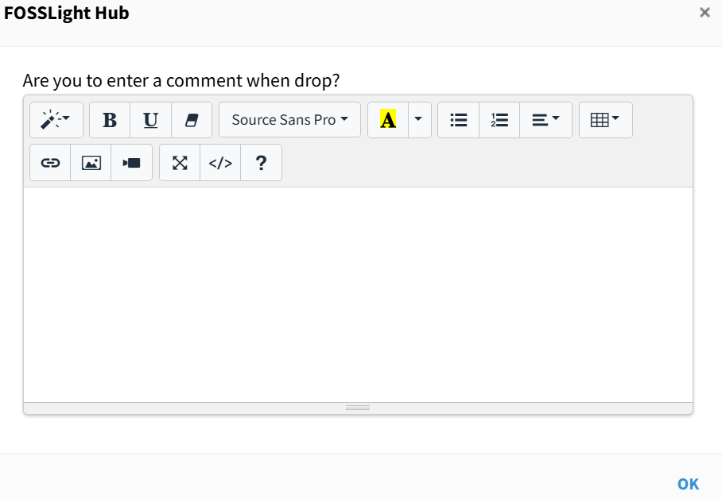  
 

### Reopen
{: .specific-title }  
- Project Status가 Drop인데, 다시 OSC Process를 진행해야 하는 경우 Project를 Open 할 수 있습니다.  
  1. Project Information 탭 우측 상단의 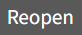 버튼을 클릭합니다.  
  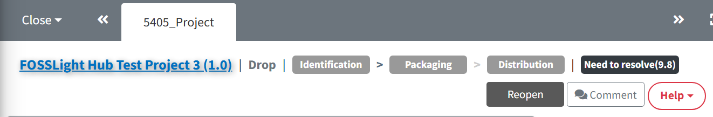
