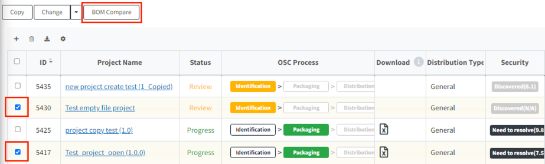
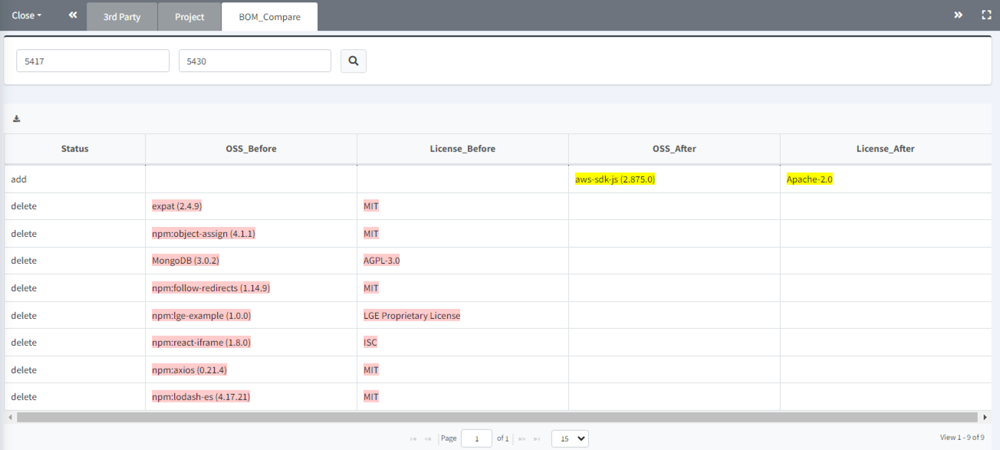
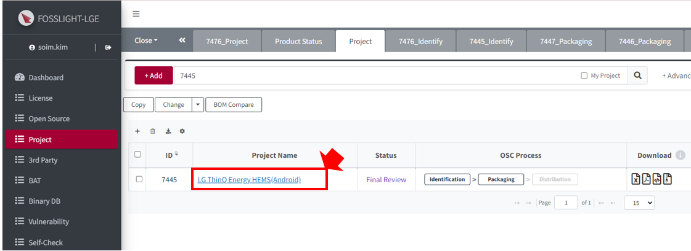
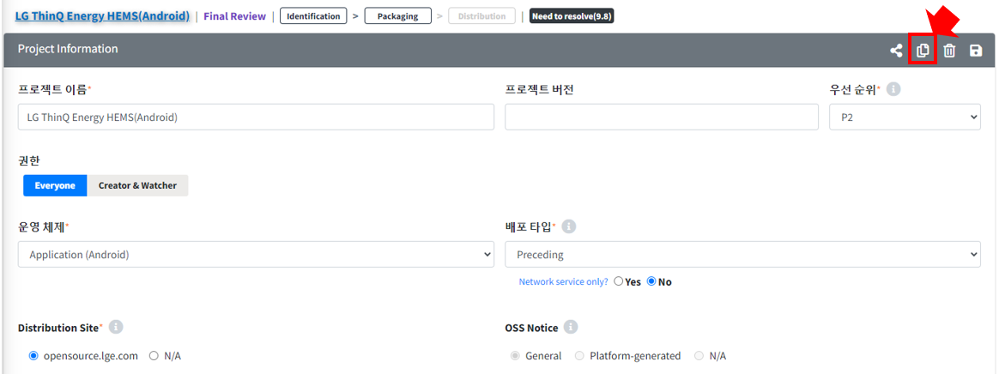
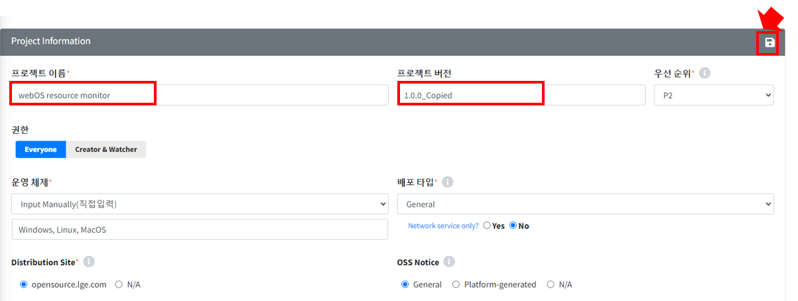
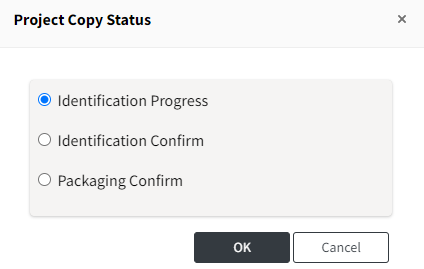
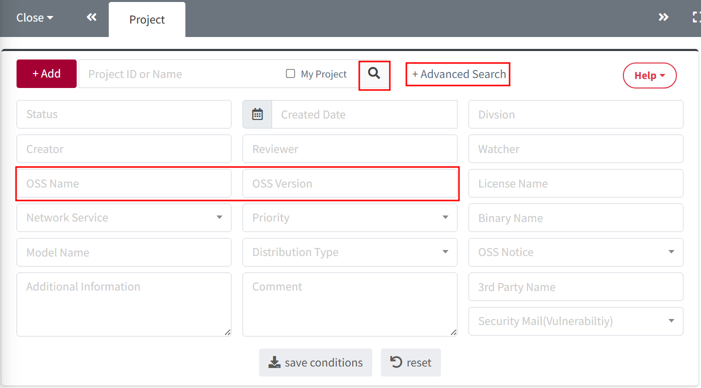

# Project 활용법 

## BOM Compare
{: .left-bar-title }  
- 두 Project의 BOM을 비교하는 기능으로, Project 간 add/change/delete 된 OSS 정보를 확인할 수 있습니다.  
- **BOM Compare 방법**  
    1. Project 목록에서 비교할 Project 2개를 선택합니다.    
    2. 'BOM Compare' 버튼을 클릭합니다.    
     
    3. BOM 목록을 비교하는 탭에서 before, after 프로젝트 간 차이를 확인할 수 있습니다.    
     
   

## Project 복사   
{: .left-bar-title } 
- 기존 모델과 유사한 Software를 사용하는 파생 모델이 있을 경우, 이미 등록되어 있는 Project를 재사용할 수 있습니다.  
- **Project 복사 방법**  
    1. 복사하려는 Project의 이름을 클릭하여 'Project 상세정보' 탭을 엽니다.     
        
    2. 'Project 상세정보' 탭에서 'Copy' 버튼을 클릭하여 Project를 복사합니다.      
        
    3. 복사된 'Project 상세정보' 탭에서 Project 명과 버전을 작성하고 'Save' 버튼을 클릭합니다.     
      
    Save 클릭 시 Identification이 Confirm된 project의 경우, 복사할 'Status'를 선택할 수 있습니다. 
     
    4. Project List에서 복사된 Project를 확인할 수 있습니다.    
   

## 특정 오픈소스가 포함된 project 검색  
{: .left-bar-title }  
- Search 조건을 통해 특정 오픈소스가 포함된 Project를 검색할 수 있습니다.    
    1. Search 창에서 'Advanced Search'를 클릭합니다.    
    2. 오픈소스 정보를 'OSS Name'과 'OSS Version'에 입력합니다.    
    3. 'Search' 버튼을 클릭합니다.    
        
    4. 2번에서 입력한 오픈소스를 포함한 project 목록을 확인할 수 있습니다.    
    
