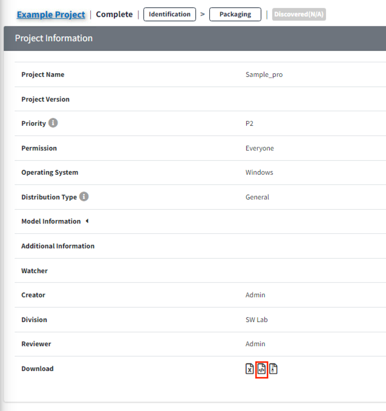

# 오픈소스 고지문 종류와 다운로드 방법

## OSS 고지문이란?
{: .left-bar-title }  
- OSS 고지문은 "사용된 Open Source와 각 License를 나열하고, Source code 수령방법 등에 대해 안내하며,
각 License의 원문 전체를 포함하는 문서" 입니다.  
   

## OSS 고지문 다운로드 방법
{: .left-bar-title }
- Packaging 단계가 confirm 되면 OSS 고지문을 다운로드 받을 수 있습니다.  
    - 단, Project의 Distribution type에 따라 OSS고지문이 발행되지 않을 수 있습니다. (ex. 사내이관, 선행개발 등)  

- **발행된 고지문을 다운받는 방법** 
    - 방법1. Project 목록의 Download column에서 아이콘({: width="10px" height="12px"})을 클릭합니다.  
  {: width="700px" height="100px" .styled-image }  
    - 방법2. Share Url을 통해 Project Information을 확인하는 경우, Download에서 ({: width="10px" height="12px"})을 클릭합니다.  
    {: width="400" height="500" .styled-image }  

   

## OSS 고지문 종류
{: .left-bar-title }
- FOSSLight Hub에서 발급 가능한 OSS 고지문 종류입니다.
    - HTML
        - 일반적인 OSS 고지문 형식으로 사용한 OSS에 대하여 OSS Name, OSS Version, License, Copyright text, License text, Homepage를 출력합니다.
        - Example: [OSS Notice HTML](../../oss_notice_format/OSSNotice-4022_Sample%20Project_2021_20211230211005.html)
    - Text
        - HTML 형식과 contents가 동일하나, 일반 text 파일 형식으로 출력하는 OSS 고지문입니다.
        - Example: [OSS Notice Text](../../oss_notice_format/OSSNotice-4022_Sample%20Project_2021_20211230211007.txt)
    - Simple HTML
        - HTML 형식의 OSS Notice와 동일하나, License 원문 대신 License 원문을 확인할 수 있는 링크로 대체된 OSS 고지문입니다. 
        - Example: [OSS Notice Simple HTML](../../oss_notice_format/simple_OSSNotice-4022_Sample%20Project_2021_20211230211010.html)
    - Simple Text
        - Simple HTML과 동일하나 파일 형식이 text인 OSS 고지문입니다.
        - Example: [OSS Notice Simple Text](../../oss_notice_format/simple_OSSNotice-4022_Sample%20Project_2021_20211230211012.txt)
    - SPDX(SpreadSheet)
        - SPDX(SpreadSheet)형식으로 OSS Notice를 출력하는 OSS 고지문입니다.
        - Example: [OSS Notice SPDX (SpreadSheet)](../../oss_notice_format/SPDXRdf-SampleProject-2021_20211230.xls)
    - SPDX(RDF)
        - SPDX(RDF)형식으로 OSS Notice를 출력하는 OSS 고지문입니다.
        - Example: [OSS Notice SPDX (RDF)](../../oss_notice_format/SPDXRdf-SampleProject-2021_20211230.rdf)
    - SPDX(TAG)
        - SPDX(TAG)형식으로 OSS Notice를 출력하는 OSS 고지문입니다.
        - Example: [OSS Notice SPDX (TAG)](../../oss_notice_format/SPDXRdf-SampleProject-2021_20211230.tag) 
    - SPDX(JSON)
        - SPDX(JSON)형식으로 OSS Notice를 출력하는 OSS 고지문입니다.
        - Example: [OSS Notice SPDX (JSON)](../../oss_notice_format/SPDXRdf-SampleProject-2021_20211230.json)
    - SPDX(YAML)
        - SPDX(YAML)형식으로 OSS Notice를 출력하는 OSS 고지문입니다.
        - Example: [OSS Notice SPDX (YAML)](../../oss_notice_format/SPDXRdf-SampleProject-2021_20211230.yaml)
    - CycloneDX(JSON)
        - CycloneDX(JSON)형식으로 OSS Notice를 출력하는 OSS 고지문입니다.
        - Example: [OSS Notice CycloneDX (JSON)](../../oss_notice_format/CycloneDX-testproject.json)
    - CycloneDX(XML)
        - CycloneDX(XML)형식으로 OSS Notice를 출력하는 OSS 고지문입니다.
        - Example: [OSS Notice CycloneDX (XML)](../../oss_notice_format/CycloneDX-testproject.xml)
   

## 다른 고지문 포맷으로 발급하는 방법
{: .left-bar-title }
- 기본 형식인 HTML 형식 외, 다른 형식의 OSS 고지문 발행이 필요한 경우 Packaging단계의 Notice탭에서 선택하시기 바랍니다.
    - Notice 탭에서 선택하는 법
    {: .styled-image }