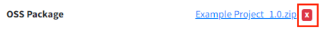

# [Enterprise Only] Distribution 정보 변경
- Distribution은 Enterprise only 기능입니다.  
- [LG 오픈소스 사이트](http://opensource.lge.com/)에 배포된 프로젝트의 정보 수정이 필요한 경우에 사용합니다.  

## Description 수정  
{: .left-bar-title }  
1. Distribution 탭으로 이동합니다.    
2. Description을 원하는 내용으로 수정 후 저장({: width="10px" height="15px"})버튼을 클릭합니다.  
   {: width="600px" height="70px" .styled-image }  
3. Distribution Information(To be Updated)화면에 업데이트 되는 정보를 확인한 후 "Distribute" 버튼을 클릭합니다.  
   {: .styled-image }  
     

## OSS Package 수정
{: .left-bar-title }  
배포가 완료되었으나 minor 변경이 필요하여 Package 파일을 수정하고 싶은 경우 사용합니다. (ex. README 파일 보완)  
1. Distribution 탭으로 이동합니다.
2. 수정하고자 하는 Package File 오른쪽의 'X'버튼을 클릭합니다.  
   {: .styled-image }  
3. Upload 버튼을 클릭하여 변경할 OSS Package 파일을 업로드하고, 'Updated'가 표시되면서 정상적으로 업로드된 것을 확인한 뒤, Start to Verify 버튼을 클릭합니다.  
   {: .styled-image }  
4. 정상적으로 verify 성공한 경우, 다음과 같이 Complete로 버튼이 변경되는 것을 확인합니다.   
   {: .styled-image }  
   - Verify 실패한 경우 재시도 할 것인지 팝업이 나타납니다.  
   - 계속 실패한다면, 업로드한 파일이 기존 Packaging탭에서 작성한 Path 정보와 일치하는지 다시 확인합니다.  
5.  Distribution 탭의 저장({: width="10px" height="15px" })버튼을 클릭합니다.  
   Distribution Information(To be Updated)화면에 업데이트 되는 정보를 확인한 후 "Distribute" 버튼을 클릭합니다.  
   {: width="600px" height="250px" .styled-image }  

     

## Model Information 수정  
{: .left-bar-title }  
1. Distribution 탭으로 이동합니다.  
2. Model Information에 추가/삭제 버튼을 이용하여 변경하고자 하는 모델 정보를 입력합니다.  
   {: width="600px" height="350px" .styled-image }  
3. Distribution 탭의 저장({: width="10px" height="15px" })버튼을 클릭합니다.  
   Distribution Information(To be Updated)화면에 업데이트 되는 정보를 확인한 후 "Distribute" 버튼을 클릭합니다.  
   {: width="600px" height="300px" .styled-image }  
   
     

## OSS Notice 수정  
{: .left-bar-title }  
Notice를 수정하기 위해서는 **Packaging 단계 재수행**이 필요합니다.  
1. Project Information에서 "Reopen" 버튼을 클릭합니다.  
2. Reopen 팝업에서 "Packaging"을 선택한 후, 신청 사유를 적고 OK를 누릅니다.  
   {: width="700px" height="300px" .styled-image }  
3. Reviewer가 확인 후 Reopen을 승인하면, Packaging 탭에 들어가 변경하려는 정보로 notice를 수정한 후 리뷰요청합니다.  
4. Packaging 단계가 완료되면, Distribution을 다시 진행합니다.  

     

## Distribution 취소  
{: .left-bar-title }  
Distribution을 취소하고 싶은 경우 다음과 같이 진행합니다.  
1. Complete된 프로젝트의 Project Information에서 "Reopen" 버튼을 클릭합니다.  
2. Reopen 팝업에서 "Distribution"을 선택한 후, Reject 사유를 적고 OK를 누릅니다.  
   {: width="700px" height="400px" .styled-image }
3. Reviewer가 확인 후 Reopen 합니다. Distribution 단계가 취소됩니다.

