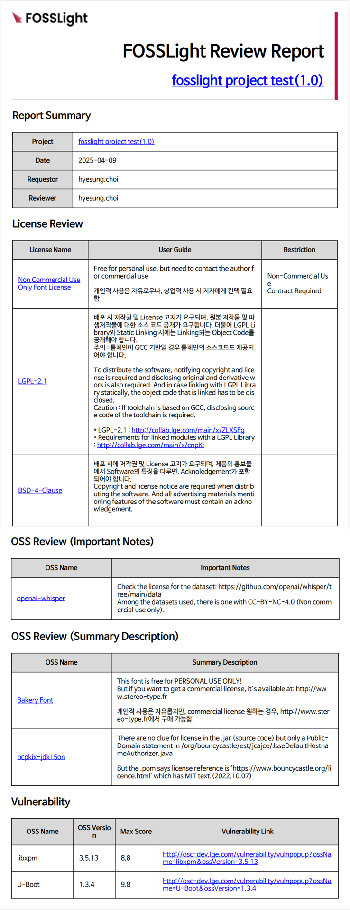
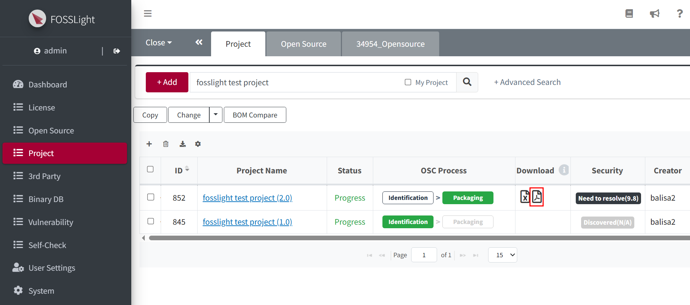

# Review Report 

Review Report는 오픈소스 컴플라이언스(Compliance) 검토 자료로 활용될 수 있으며, 제품 배포 전 OSS 구성 요소의 점검 및 보안 취약점에 대한 사전 대응 등 리스크 기반 관리를 보다 효율적으로 수행하는 데에 유용합니다.  

Review Report는 Project의 Identification Confirm시 BOM 내용을 바탕으로 발급됩니다.
- Review Report는 FOSSLight DB의 데이터를 기반으로 생성됩니다. 따라서 신뢰성 있는 리포트를 제공받기 위해서는 DB에 입력된 OSS 및 License 정보가 반드시 정확해야 합니다

## Review Report Details 
{: .left-bar-title}
{: .styled-image width="70%" }

### Title 
{: .specific-title }
- Project Name(Version)
- 해당 project share url 링크

### Report Summary
{: .specific-title }
- Project Name(Version), Date, Requestor, Reviewer 정보가 표기됩니다

### License Review
{: .specific-title }
- License Name, User Guide, Restriction 정보가 표기됩니다.

### OSS Review (Important Notes)
{: .specific-title }
- OSS Name, Important Notes 정보가 표기됩니다. 

### OSS Review (Summary Description)
{: .specific-title }
- OSS Name, Summary Description 정보가 표기됩니다.  

### Vulnerability Review
{: .specific-title }
- OSS Name, OSS Version, Max Score, Vulnerability Link 정보가 표기됩니다.  

## Review Report 확인 
{: .left-bar-title}
### Project List 
{: .specific-title }
- Projct List에서 다운로드 받을 수 있습니다.  
{: .styled-image width="70%" }

### e-mail 발송 
{: .specific-title }
- Projct의 Identification confirm 시 발송되는 메일에 첨부 파일로 추가됩니다. 

## Review Report 생성 조건 
{: .left-bar-title}
BOM 탭 기준으로, OSS Review(Summary Description), OSS Review (Important Notes), License Review 또는 Vulnerability Review 대상이 1건이라도 있는 경우 생성됩니다.  

- OSS Review (Summary Description) 
    - Summary Description이 있는 OSS
- OSS Review (Important Notes)
    - Important Notes가 있는 OSS
- License Review
    - Project의 **Distribution Type**이 Network service only가 아니고 Source Code 공개 범위가 있으며 User Guide가 있는 경우 
    - Restriction이 있는 경우
- Vulnerability Review
    - Admin에 의해 설정된 Max Score 이상 항목 표기 

