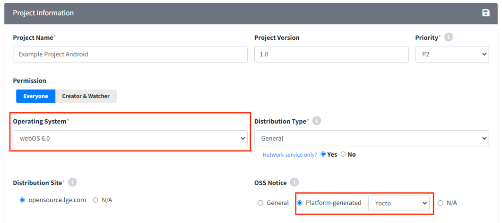

# Tips: Use Case
Use case 별 프로젝트 생성 방법을 확인할 수 있습니다.  
  

## 파생 모델 프로젝트  
{: .left-bar-title }  
기존 모델과 유사한 소프트웨어를 사용하는 파생 모델의 OSC Process는, 
완료된 이전 모델의 [프로젝트를 복사](https://fosslight.org/hub-guide/tips/2_project/2_using_project_info/#project-%EB%B3%B5%EC%82%AC)하여 효율적으로 진행할 수 있습니다.

## 베이스모델에 Open Source 일부 추가  
{: .specific-title }  
- 프로젝트 복사 시 **Identification Progress**를 선택하면 베이스 모델 프로젝트의 Open Source 목록이 복사됩니다. 이후 추가된 Open Source는 Identification 탭에서 입력합니다.  

## OSS 사용 내역이 기존과 동일한 새로운 프로젝트  
{: .specific-title }  
[BOM Compare](https://fosslight.org/hub-guide/tips/2_project/2_using_project_info/#bom-compare)를 활용하면 최종 OSS 목록 동일 여부를 확인할 수 있습니다. 
- **OSS 사용 내역과 공개 대상 소스코드가 동일한 경우**  
  - 기존 프로젝트의 OSS 고지문을 그대로 활용하여 OSC Process를 대체할 수 있습니다.  
- **OSS 사용 내역은 동일하나, 공개 대상 소스코드가 다른 경우**
  - OSS Package의 README 또는 Notice 파일 수정 등과 같이 변경 사항이 minor한 경우입니다.  
  - [프로젝트를 복사](https://fosslight.org/hub-guide/tips/2_project/2_using_project_info/#project-%EB%B3%B5%EC%82%AC) 시 **Packaging Confirm** 단계를 선택합니다.    
  - [Distribution 탭에서 OSS Package 파일 변경](https://fosslight.org/hub-guide/tips/2_project/5_distribution/#oss-package-%EC%88%98%EC%A0%95) 후 배포를 진행합니다.  
     

## B2B 모델 프로젝트  
{: .left-bar-title }  
- B2B 프로젝트는 Project > Project Information > Distribution Type을 **'B2B'**로 선택합니다.  
- 고객사에서 요구하는 고지문 형태에 따라 Distribution Site를 다르게 선택해야 합니다. 
  {: .styled-image } 
   
### 고객사 납품 시 자사명으로 제품이 배포되는 경우    
{: .specific-title }  
고객사에 OSS Package 및 OSS 고지문 전달 후, 고객사 요청에 따라 해당 파일을 자사 LG Open Source 사이트에 게시하는 경우입니다.  
- OSC Process 수행 단계 
    - 일반적인 프로젝트와 동일하게 Distribution 단계까지 진행하여 LG Open Source 사이트에 고지합니다.
- 프로젝트 생성 시 옵션  
    - Distribution Type : B2B   
    - Distribution Site : opensource.lge.com  

## 고객사 납품 시 고객사명으로 제품이 배포되는 경우  
{: .specific-title }      
고객사에 OSS Package 및 OSS 고지문 전달 후, 고객사 요청으로 LG Open Source 사이트에 해당 파일이 게시되지 않아야 하는 경우입니다.  
- OSC Process 수행 단계  
    - Distribution 단계는 진행하지 않고 Packaging 단계에서 OSC Process를 종료합니다.  
    - Packaging 단계(Notice)에서 수정되어야 할 내용  
        {: .styled-image }  
        - Modified OSS Notice 발급 요청 선택    
        - Company Name, OSS Distribution Site, Email(Written Offer) 선택 해제 ( LG전자 관련 내용 삭제 )      
- 프로젝트 생성 시 옵션    
  - Distribution Type : B2B
  - Distribution Site : N/A  
   

## 사내이관 / 선행개발 / 사내사용 프로젝트  
{: .left-bar-title }  
사내이관 / 선행개발 / 사내사용의 경우, 배포 및 고지문 발급 없이 OSC Process가 종료됩니다.
- OSC Process 수행 단계
    - 소스코드 공개 의무가 있는 오픈소스 사용 시  
        - **Packaging 단계**까지 진행합니다.  
    - 소스코드 공개 의무 없는 오픈소스 사용 시  
        - **Identification 단계**까지 진행합니다.  
- 프로젝트 생성 시 옵션  
    - Distribution Type  
    {: .styled-image }  
        - Transfer-in-house (사내이관): 타 사업부에 오픈소스 목록 및 OSS Package를 전달해야 하는 경우  
        - Preceding (선행개발) : 선행개발이지만 추후 프로젝트 배포 가능성이 있는 경우  
        - In-house only (사내사용) : 사내에서만 사용하는 경우   
   

## Network 서비스로 배포되는 프로젝트  
{: .left-bar-title }  
Network Server에 의해 자사/타사 제품(Device) 및 제품 연동 앱 등을 통해 다양한 서비스를 제공하는 Software 개발을 의미합니다.  
- OSC Process 수행 단계   
    - **Network 상의 서비스 제공을 배포로 간주하는 License**의 오픈소스가 사용된 경우 : **Distribution 단계**까지 진행   
    - **Network 상의 서비스 제공을 배포로 간주하는 License**의 오픈소스가 사용되지 않은 경우 : **Identification 단계**까지 진행   
- 프로젝트 생성 시 옵션  
    - Distribution Type : 현재 프로젝트의 배포 대상에 맞춰 선택합니다.  
    - Network service only? : Yes  
    {: .styled-image } 

- License 제약 사항 확인 방법 
    - Identification > BOM의 Restriction 컬럼 또는 License 메뉴에서 검색하여 Restriction(Network Triggered)을 확인할 수 있습니다.  
    **ex) AGPL-3.0:**  
    {: .styled-image } 

   

## (LGE Only) Android & Yocto 플랫폼 프로젝트  
{: .left-bar-title }  
플랫폼에서 자체적으로 고지문을 생성하는 경우, 플랫폼 고지문을 리뷰하기 위한 프로젝트를 생성해야 합니다.
- Fosslight Hub 지원 플랫폼 : Android, Yocto  
- 프로젝트 생성 시 옵션  
    - **Android 모델**  
        - Operating System : Android (platform version) 선택  
        - OSS Notice : Platform-generated (Android) 선택  
        {: .styled-image }
    - **Yocto 모델**  
        - Operating System : webOS (platform version) 선택  
        - OSS Notice : Platform-generated (Yocto) 선택  
        {: .styled-image }  

      

## 3rd party 단독 프로젝트     
{: .left-bar-title }     
3rd party로부터 받은 소프트웨어로만 구성된 프로젝트의 경우, Project에서 3rd party 탭만 로드하여 OSC Process를 진행할 수 있습니다.    
1. 3rd Party Software 생성 및 리뷰 완료 (참고: [3rd Party Software 생성 가이드](../../menu/5_third-party.md))  
2. OSS 고지문용 프로젝트 생성  
    - 리뷰 완료된 3rd Party Software에서 Create Project for OSS Notice 버튼을 클릭합니다.  
    {: .styled-image }   
3. 프로젝트 정보를 입력  
    - New Project 창에 현재 프로젝트에 해당하는 정보로 입력한 후 Save합니다.  
    - Additional Information에서 3rd party SW 정보를 가져왔다는 메시지를 확인할 수 있습니다.  
    {: .styled-image } 
4. 생성된 프로젝트 확인  
    - 새로 생성된 프로젝트의 3rd party 탭을 확인합니다.  
    - 1단계에서 3rd Party Software가 로드된 상태임을 확인할 수 있습니다.  
    - 프로젝트는 Identification 단계가 Confirm 상태로 생성됩니다.  
    {: .styled-image } 

