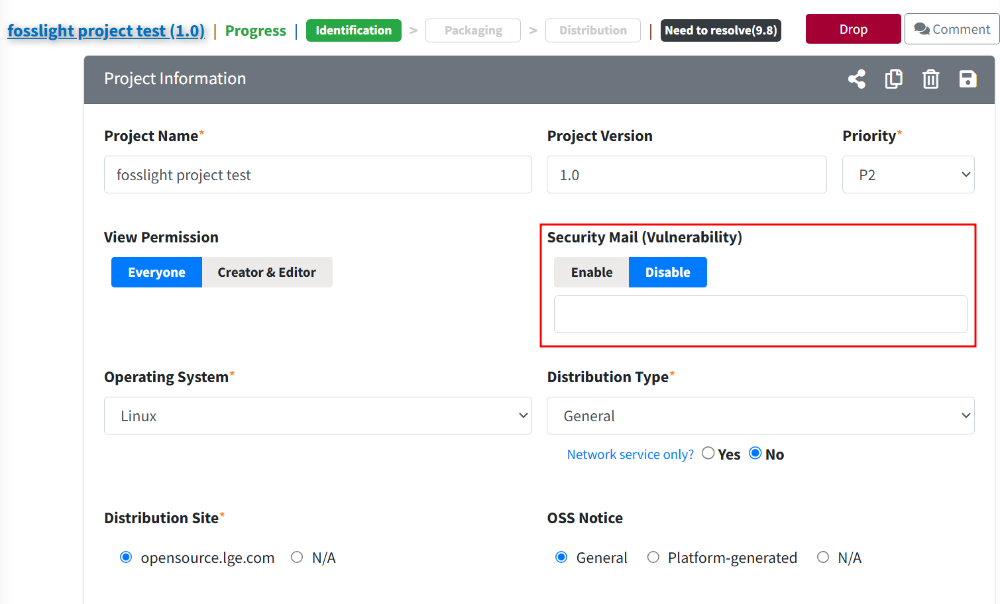
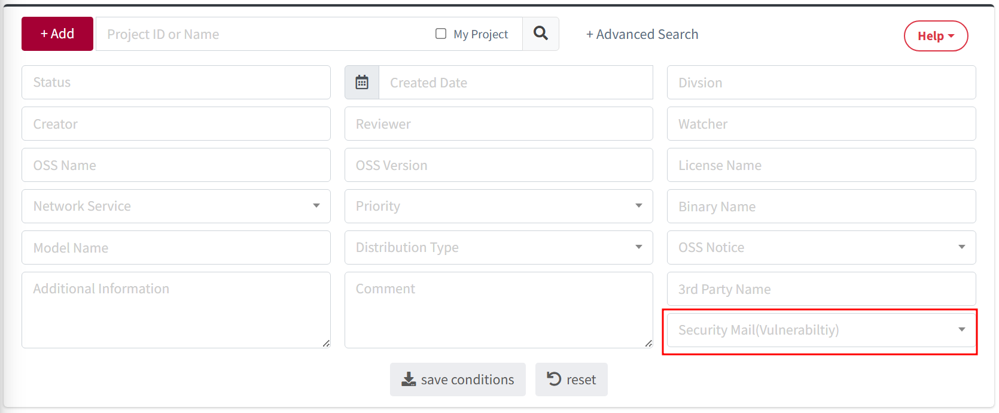

# Security Mail(Vulnerability)

Security Mail (Vulnerability) 수신을 Enable / Disable 할 수 있습니다.

### Security Mail(Vulnerability) 설정
{: .specific-title}
- Project Information >  Security Mail (Vulnerability)를 **Disable**로 설정하면 해당 Project의 Vulnerability 메일이 더 이상 발송되지 않습니다.
- Disable로 설정 시 사유가 반드시 입력되어야 합니다.  
{: .styled-image} 

### Security Mail(Vulnerability)설정 검색 
{: .specific-title}
 - Project List에서 Security Mail(Vulnerability)의 Setting 값(Enable or Disable)으로 검색할 수 있습니다.  
{: .styled-image} 

