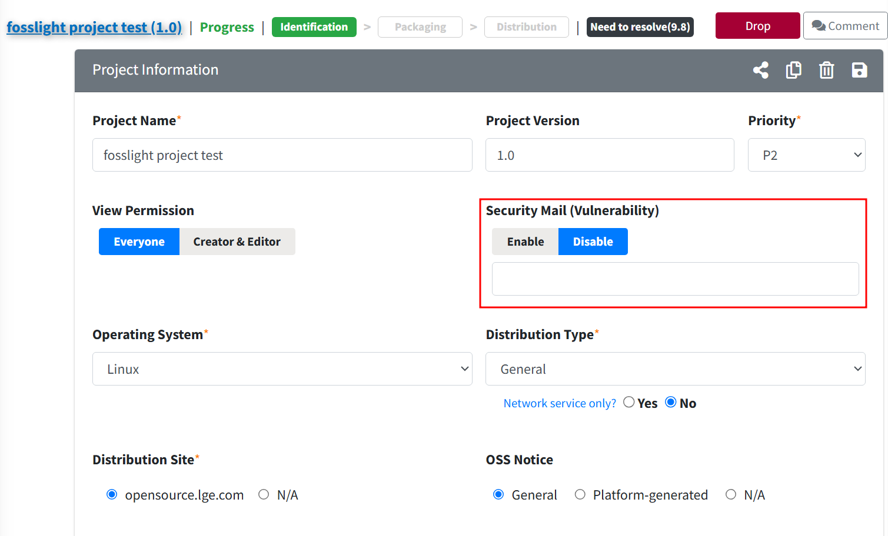

# Tips: Vulnerability 
Vulnerability 정보 수집, 알림, Score 표시 방법에 대한 내용입니다.
    

## Vulnerability 정보 수집  
{: .left-bar-title }  
- Vulnerability 정보는 매일 [NVD Data Feed](https://nvd.nist.gov/vuln/data-feeds) 에서 다운로드되어 FOSSLight Hub에 저장됩니다.
- FOSSLight Hub의 Vulnerability Score는 기본적으로 CVSS v4.0 Base Score를 기준으로 표기합니다.  다음의 우선순위를 적용하여 수집합니다.  
    1. CVSS v4.0
    2. CVSS v3.1
    3. CVSS v3.0
    4. CVSS v2.0 
     

## Project Vulnerability 정보 알림  
{: .left-bar-title #project-vul-notice }  
- Project의 Identification 단계가 Confirm된 상태에서 BOM에 포함된 OSS 중 CVSS Score 7.0 이상인 CVE ID가 발견되거나 OSS의 Max CVSS Score가 7.0 이상에서 7.0 미만으로 변경될 경우 Vulnerability Score 변경 알림 메일이 발송됩니다.  
    - 알림 메일 대상자 : Creator, Edit 권한이 있는 사용자, Reviewer
    - 알림 메일을 더 이상 받고 싶지 않은 경우, [Project Information에서 Security Mail (Vulnerability) 항목을 Disable로 변경](#security-mail)할 수 있습니다.  
     

## Vulnerability Score 표시 방법  
{: .left-bar-title }  
- Project, 3rd Party, Self-Check에서 사용자가 입력한 OSS Name/Nick name, Version이 동일한 Vulnerability가 존재하는 경우, 해당 OSS의 Max Score를 표시합니다.
    - 사용자가 입력한 OSS Version의 Vulnerability가 존재하는 경우, Vulnerability의 Max Score를 표시합니다.
    - 사용자가 입력한 OSS Version의 Vulnerability가 존재하지 않는 경우에는, 값이 존재하지 않으므로 표시하지 않습니다.
    - 사용자가 OSS Version을 공란으로 입력한 경우, 해당 OSS의 모든 Version 중 Max Score를 표시합니다.
    - OSS Name이 '-'인 경우, Vulnerability를 표시하지 않습니다.
   

## Security Mail(Vulnerability)  
{: .left-bar-title #security-mail }
[Project Vulnerability 정보 알림](#project-vul-notice) 메일 수신을 Enable / Disable 할 수 있습니다.  

### Security Mail(Vulnerability) 설정
{: .specific-title}
- Project Information >  Security Mail (Vulnerability)를 **Disable**로 설정하면 해당 Project의 Vulnerability 메일이 더 이상 발송되지 않습니다.
- Disable로 설정할 경우, 반드시 사유가 입력되어야 합니다.  
{: .styled-image} 

### Security Mail(Vulnerability) 설정 검색 
{: .specific-title}
 - Project List에서 Security Mail(Vulnerability)의 Setting 값(Enable or Disable)으로 검색할 수 있습니다.  
{: .styled-image} 
