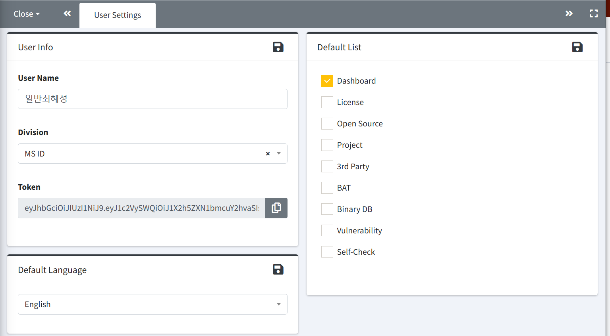

# User Settings
로그인 후 개인 설정을 확인하고 변경할 수 있습니다.  
 

1. **User Info**
    - User Name과 Division은 변경할 수 있으며, 설정된 Division은 Project 및 3rd Party 메뉴에서 프로젝트 생성 시 기본값으로 사용됩니다.  
    - Password : 새로운 비밀번호로 변경할 수 있습니다.   
    - Token : 발급받은 Token 정보를 확인할 수 있습니다.  
2. **Default Language**
    - 한국어와 영어 중에서 기본 언어를 선택할 수 있습니다.
3. **Default List**
    - 로그인 시, 왼쪽 navigator 영역에 기본으로 표시될 메뉴를 선택할 수 있습니다.