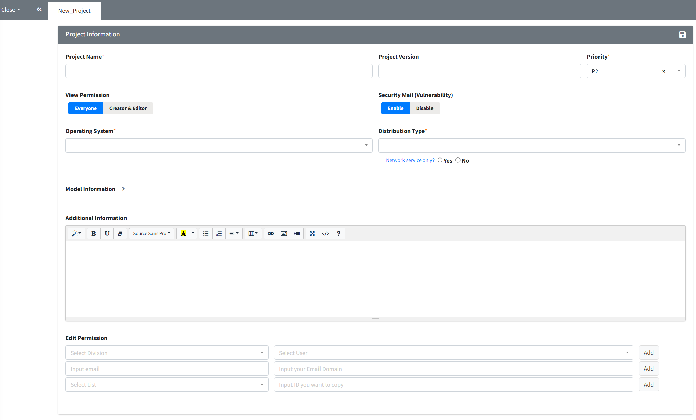
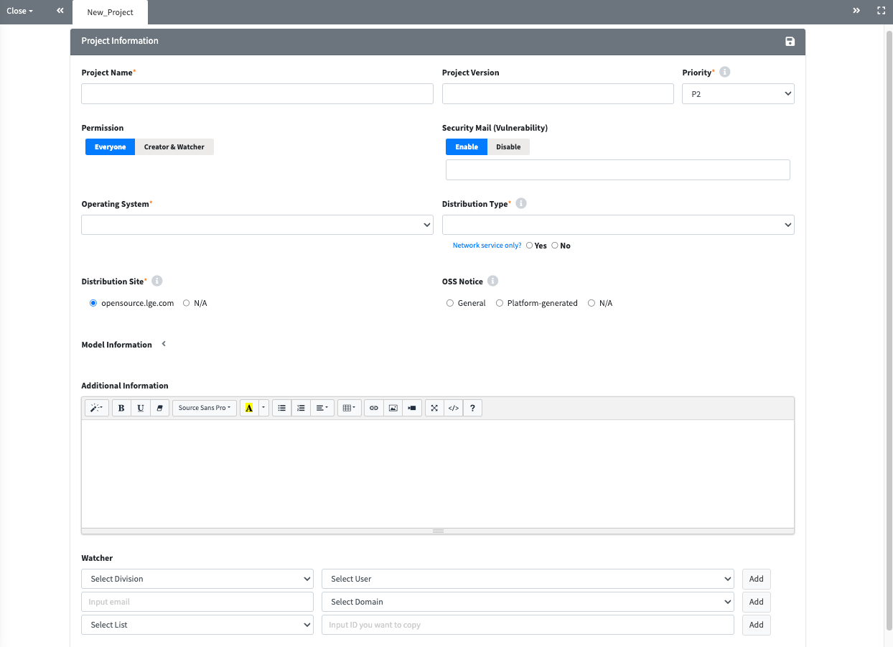

# Create a project
배포하는 Software에 대하여 Project를 생성합니다.

## YouTube 영상 가이드
{: .left-bar-title}  

<iframe src="https://www.youtube.com/embed/IUrQyj3s-Ps" title="FOSSLight Hub - 프로젝트 생성" frameborder="0" allow="accelerometer; autoplay; clipboard-write; encrypted-media; gyroscope; picture-in-picture" allowfullscreen></iframe>

   

## Project 생성
{: .left-bar-title }

1. **Project List**에서 **Add** 버튼을 클릭합니다.  

2. **New_Project** 탭에서 Project 관련 정보를 입력합니다.
{: .styled-image}

3. 입력이 끝나면 우측 상단의 **Save**(  ) 버튼을 클릭합니다.
  

### Project Information
{: .specific-title}
Project에 대한 기본 정보를 입력하는 페이지입니다.    

<table>
    <thead>
        <tr>
            <th scope="col">항목</th>
            <th scope="col">설명</th>
        </tr>
    </thead>
    <tbody>
        <tr>
            <td><strong class="highlight_table">Project Name</strong></td>
            <td>Project의 이름을 입력합니다.  
                <ul class="description-list">
                    <li>모델명과 Project명이 동일할 경우, 모델명을 입력합니다. (Project Name은 영문 작성이 권장됩니다.)</li>
                </ul>
            </td>   
        </tr>
        <tr>
            <td><strong class="highlight_table">Project Version</strong></td>
            <td>Project의 Version을 입력합니다. 
                <ul class="description-list">
                    <li>Version 구분이 없다면 공란으로 둡니다.</li>
                </ul>
            </td>
        </tr>
        <tr>
            <td><strong class="highlight_table">Priority</strong></td>
            <td>OSS 고지문 발급 요청 우선 순위를 선택합니다. 
                <ul class="description-list">
                    <li>기본값으로는 P2가 선택되며, 급한 요청 순위에 따라 우선순위(P0 > P1 > P2)를 선택합니다.</li>
                    <li>P0를 자주 선택하는 경우, 해당 조직이 OSC 프로세스 점검 대상이 될 수 있으니 참고하시기 바랍니다.</li>
                </ul>
            </td>
        </tr>
        <tr>
            <td><strong class="highlight_table">View Permission</strong></td>
            <td>Project의 보기 권한을 설정합니다. 
                <ul class="description-list">
                    <li>Creator와 Editor에게만 Project 보기 권한을 줄 경우, 'Creator & Editor'를 선택합니다.</li>
                    <li>(Everyone 체크시 누구나 볼 수 있음.)</li>
                </ul>
            </td>
        </tr>
        <tr>
            <td><strong class="highlight_table">Security Mail (Vulnerability)</strong></td>
            <td>해당 프로젝트에 대한 Vulnerability 메일 수신 여부를 표시합니다. 
                <ul class="description-list">
                    <li>기본값으로 Enable이 선택되어 있습니다.</li>
                    <li>Disable로 선택하는 경우, 해당 프로젝트에 대해 Vulnerability 메일을 더 이상 수신하지 않습니다.</li>
                    <li>Disable로 변경 시, Disable 사유를 필수로 입력해야 합니다.</li>
                </ul>
            </td>
        </tr>
        <tr>
            <td><strong class="highlight_table">Security Responsible Person</strong></td>
            <td>보안 담당자를 별도로 지정할 수 있습니다. 
                <ul class="description-list">
                    <li>지정 가능한 대상은 FOSSLight Hub에 등록된 사용자에 한합니다.</li>
                    <li>지정된 보안 담당자는 보안 관련 Jira 이슈의 Assignee로 설정되며, FOSSLight Hub에서 발송되는 보안 관련 이메일도 함께 수신하게 됩니다.</li>
                    <li>별도로 보안 담당자를 지정하지 않을 경우, 해당 이슈의 Creator가 보안 담당자로 지정됩니다.</li>
                </ul>
            </td>
        </tr>
        <tr>
            <td><strong class="highlight_table">Operating System</strong></td>
            <td>Operating System을 선택합니다. 
                <ul class="description-list">
                    <li>(선택 가능한 OS가 없을 경우 '직접입력'을 선택하여 직접 입력.)</li>
                </ul>
            </td>
        </tr>
        <tr>
            <td><strong class="highlight_table">Distribution Type</strong></td>
            <td>Project의 배포 유형을 다음 중 하나로 선택합니다. 
                <ul class="description-list">
                    <li><strong>General Model</strong>: 일반적인 Model / Software / Application이 배포되는 경우</li>
                    <li><strong>Transfer in-house</strong>: 사내 이관하는 경우</li>
                    <li><strong>B2B</strong>: 타사로 제공하는 경우</li>
                    <li><strong>Preceding Software / In-house only</strong>: 선행 개발 또는 사내용 Software로 배포가 예정되지 않은 경우</li>
                    <li><strong>Self-Check</strong>: 외부 배포 목적이 아닌 내부 검토 및 사전 점검하는 경우</li>
                </ul>
            </td>
        </tr>
        <tr>
            <td><strong class="highlight_table">Network Service only?</strong></td>
            <td>Network Service 형태(ex, Web Service)의 프로젝트인 경우 'Yes' 선택</td>
        </tr>
        <tr>
            <td><strong class="highlight_table">Distribution Site</strong></td>
            <td>OSS 고지문을 등록할 OSS 배포 사이트를 선택합니다. 
                <ul class="description-list">
                    <li><strong>[opensource.lge.com](http://opensource.lge.com/)</strong>: 일반적인 경우의 배포사이트</li>
                    <li>Network Service 형태의 프로젝트인 경우에도 "opensource.lge.com"을 선택하시기 바랍니다.</li>
                    <li><strong>N/A</strong>: 배포사이트에 등록 불가한 특별한 사유가 있는 경우 선택 (ex, 3rd Party에 직접 소스 코드 전달 등)</li>
                </ul>
            </td>
        </tr>
        <tr>
            <td><strong class="highlight_table">OSS Notice</strong></td>
            <td>OSS Notice 양식을 선택합니다. 
                <ul class="description-list">
                    <li><strong>General</strong>: 일반적인 고지문 발급이 필요한 경우</li>
                    <li><strong>Platform-generated</strong>: Platform에서 자체 생성된 OSS Notice를 제품에 탑재하는 경우, 해당 Platform(ex, Android, Yocto)을 선택</li>
                    <li><strong>N/A</strong>: 고지문 발급이 필요하지 않는 경우</li>
                </ul>
            </td>
        </tr>
        <tr>
            <td><strong class="highlight_table">Model Information</strong></td>
            <td>Project에 해당하는 Model 정보 및 양산 일자를 입력합니다.</td>
        </tr>
        <tr>
            <td><strong class="highlight_table">Additional Information</strong></td>
            <td>Compliance에 필요한 부가정보가 있을 경우, 입력합니다.</td>
        </tr>
        <tr>
            <td><strong class="highlight_table">Edit Permission</strong></td>
            <td>해당 Project 정보 및 현황을 공유하고자 하는 사용자를 등록합니다. 
                <ul class="description-list">
                    <li>Editor로 등록된 사용자는 해당 Project에 대하여 Creator와 동일한 조회, 편집 권한을 가지고, 시스템에서 프로젝트 관련된 메일이 발송됩니다.</li>
                    <li>단, AD ID로 추가한 계정 중 FOSSLight Hub에 가입되지 않은 사용자는 최초 FOSSLight Hub 계정 등록 안내 메일 외 프로젝트 관련 메일이 발송되지 않습니다.</li>
                </ul>
            </td>
        </tr>
        <tr>
            <td><strong class="highlight_table">Comment</strong></td>
            <td>해당 Project 관련하여 Comment로 남기고 싶은 사항을 입력합니다.</td>
        </tr>
    </tbody>
</table>

### Project의 Share, Copy, Delete, Save 등
{: .specific-title}
자세한 내용은 [상세 화면의 공통 기능](https://fosslight.org/hub-guide/tips/1_common/3_project_tab_bar/)을 참고하시기 바랍니다.  
- **Share**(  ): 생성되는 URL을 통해 Project를 공유할 수 있습니다.  
- **Copy**(  ): Project를 복사하여 새로운 Project를 생성합니다.  
- **Delete**(  ): Project를 삭제합니다.  
- **Save**(  ): 기본 정보를 수정한 후에는 클릭해야 저장됩니다.  
- **Drop**: Project의 Status를 Drop으로 변경합니다. 다시 Process를 진행하기 위해서는 Reopen 버튼을 클릭해야 합니다.  
- **Reopen**: Status가 Drop 또는 Complete인 Project인 경우 표시되며 Status를 Progress로 변경하여 Process를 재수행할 수 있습니다.  
- **(Admin Only)**
    - Complete: 모든 Process가 완료된 Project에 대하여 Status를 변경합니다.  
    - Reopen: Status가 Complete 또는 Drop인 경우 표시되며 Status를 Progress로 변경합니다.  
