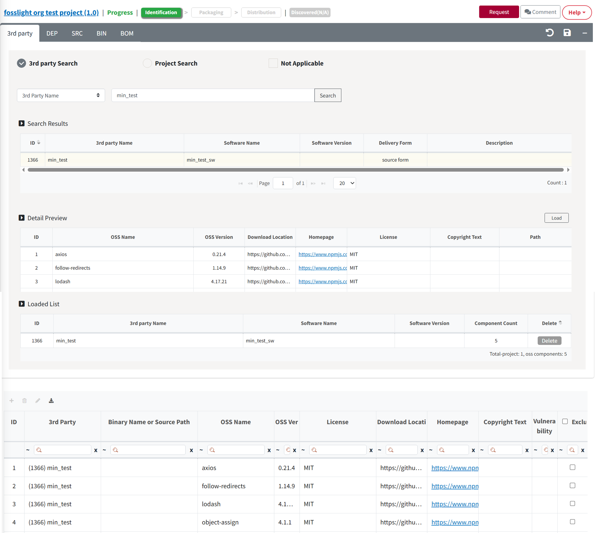

# 3rd Party Tab

3rd Party 메뉴에서 Confirm된 3rd Party Project를 Load합니다.

  

## 3rd Party 탭 작성 Process
{: .left-bar-title }
- 3rd Party Software가 포함된 경우: 사전에 리뷰 완료된 3rd Party를 Load → Save
- 3rd Party Software가 포함되지 않은 경우: Not Applicable 체크 → Save

## 리뷰 완료된 3rd Party를 Load하는 방법**
{: .left-bar-title }

<iframe src="https://www.youtube.com/embed/KKcI48nCAqA" title="3rd Party SW 불러오기" frameborder="0" allow="accelerometer; autoplay; clipboard-write; encrypted-media; gyroscope; picture-in-picture" allowfullscreen></iframe>  

하기 방법 중 선택하여 3rd Party Software 정보를 불러올 수 있습니다. (💁 3rd Party는 여러 개 불러올 수 있음)

### 3rd Party Search
{: .specific-title} 
Status가 Confirm 상태인 3rd Party를 Load합니다.  
{: .styled-image}

1. 3rd Party List 메뉴에서 리뷰받은 3rd Party Software를 검색합니다.
2. 검색된 3rd Party Software 목록에서 불러오기할 3rd Party를 선택합니다.
3. Load 버튼을 클릭하여, 조회한 3rd Party의 OSS 목록을 추가합니다.
4. Load한 3rd Party가 Loaded List에 추가됩니다.
5. 추가한 OSS 목록을 확인합니다.
6. Save 버튼을 클릭하여 Load된 사항을 저장합니다.

### Project Search
{: .specific-title} 

1. Project Name, Project Version으로 load할 Project를 검색합니다.
2. 검색 결과 (Result)에서 load 할 Project를 선택합니다.
3. Load 버튼을 클릭하여 해당 Project의 3rd Party탭의 OSS 목록을 불러옵니다.
4. Load한 3rd Party가 Loaded List에 추가됩니다.
5. 추가한 OSS 목록을 확인합니다.
6. Save 버튼을 클릭하여 load된 사항을 저장합니다.
