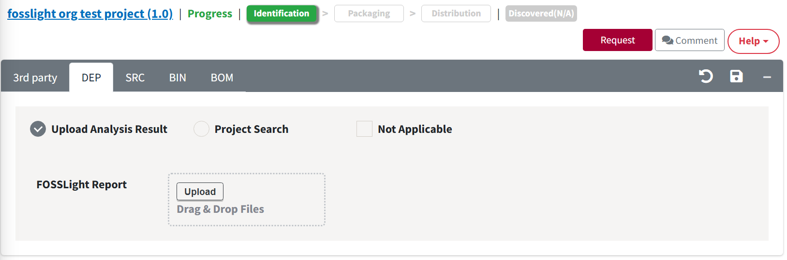
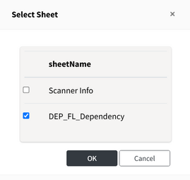
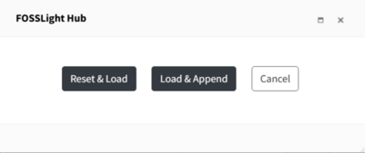
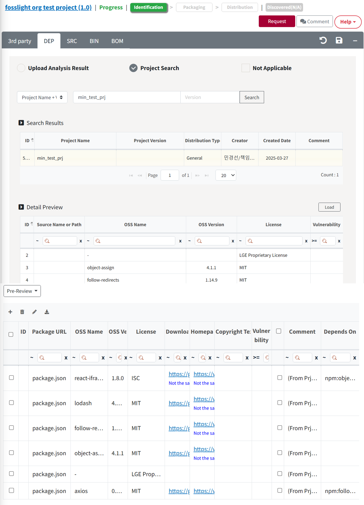

# DEP Tab

Dependency 분석 결과를 작성합니다.

## DEP 탭 작성 Process
{: .left-bar-title }
- Dependency 분석 대상 경우 : Dependency 분석 결과 작성 → [**Warning message 검토**](https://fosslight.org/hub-guide/tutorial/1_project.html#-oss-tables-warning-message) → Save
- Dependency 분석 대상이 아닌 경우 (Ex. Package manager를 통해 개발하지 않은 프로젝트) : Not Applicable 체크 → Save

## Dependency 분석 결과 작성 방법
{: .left-bar-title }  
다음 방법으로 dependency의 OSS 정보를 작성할 수 있습니다.  

### OSS Table에 수기로 작성
{: .specific-title}  
- OSS Table의 좌측 상단 + 버튼을 클릭하여 OSS 정보를 기입합니다.  

### Upload Analysis Result (일괄 Load)
{: .specific-title}
1. Upload Analysis Result를 선택합니다.
2. Upload 버튼 클릭하여 OSS Report 파일을 업로드합니다.  

3. Select Sheet 팝업에서 Dependency 분석 결과의 OSS List가 쓰여진 Sheet를 선택합니다.  

### Project Search (일괄 Load)
{: .specific-title}  
1. Project Search 선택합니다.
2. Project Name, Project Version으로 불러올 Project를 검색합니다.
3. 검색 결과 (Result)에서 load할 Project 선택 후, Load 버튼 클릭합니다.
4. 하기 버튼 중 선택합니다.  

    - Reset & Load : DEP탭을 모두 초기화한 후 불러오는 Project의 DEP탭 작성된 사항을 OSS Table에 추가합니다.
    - Load & Append : DEP탭 작성된 사항 유지한 상태로 불러오는 Project의 DEP탭 작성된 사항을 OSS Table에 추가합니다.
    - Cancel : 취소합니다.
5. 불러온 Project는 Loaded List에 추가됩니다.
  
