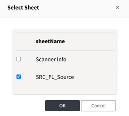

# SRC Tab

Source Code 분석 결과를 작성합니다.

## SRC 탭 작성 Process
{: .left-bar-title }
- Source Code 분석 대상 경우 : Source Code 분석 결과 작성([FOSSLight Source Scanner 사용](https://fosslight.org/fosslight-guide/scanner/2_source.html)) → [**Warning message 검토**](https://fosslight.org/hub-guide/tips/1_common/5_warning_message) → Save
- Source Code 분석 대상이 아닌 경우 : Not Applicable 체크 → Save
    - Source code 분석을 하지 않는 Project인 경우 선택합니다. (ex - 3rd Party로부터 전달 받은 Binary만 제품에 탑재하여 배포하는 경우)

## Source Code 분석 결과 작성 방법
{: .left-bar-title }  
다음 방법으로 Source Code 분석 결과를 작성할 수 있고, 작성된 분석 결과는 [OSS Table 활용법](https://fosslight.org/hub-guide/tips/1_common/1_oss_table)을 참고하여 편집할 수 있습니다. 

### OSS Table에 수기로 작성
{: .specific-title}  
- OSS Table의 좌측 상단 + 버튼을 클릭하여 OSS 정보를 기입합니다. 

### Upload Analysis Result (일괄 Load)
{: .specific-title}
1. Upload Analysis Result를 선택합니다.
2. Upload 버튼 클릭하여 FOSSLight Report 파일을 업로드합니다.

3. Select Sheet 팝업에서 SRC 분석 결과의 OSS List가 쓰여진 Sheet를 선택합니다. (여러 Sheet를 선택 가능합니다.)

### Project Search (일괄 Load)
{: .specific-title} 
1. Project Search 선택합니다.
2. Project Name, Project Version으로 불러올 Project를 검색합니다.
3. 검색 결과 (Result)에서 load할 Project 선택 후, Load 버튼 클릭합니다.
4. 하기 버튼 중 선택합니다.  

    - Reset & Load : SRC탭을 모두 초기화한 후 불러오는 Project의 SRC탭 작성된 사항을 OSS Table에 추가합니다.
    - Load & Append : SRC탭 작성된 사항 유지한 상태로 불러오는 Project의 SRC탭 작성된 사항을 OSS Table에 추가합니다.
    - Cancel : 취소합니다.
5. 불러온 Project는 Loaded List에 추가됩니다.
