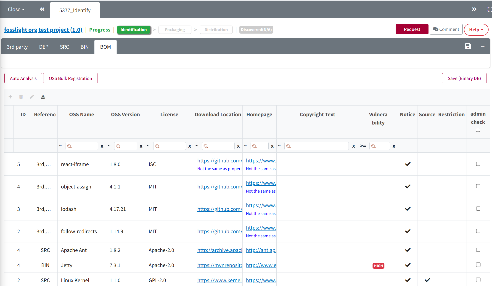

# BOM Tab

3rd Party, SRC, BIN 탭에 작성된 OSS 목록을 취합하고 리뷰 요청을 합니다.

## Review 요청 방법
{: .left-bar-title }

    <iframe src="https://www.youtube.com/embed/ErqmgN-YgD0" title="BOM 탭(SBOM 다운로드)" frameborder="0" allow="accelerometer; autoplay; clipboard-write; encrypted-media; gyroscope; picture-in-picture" allowfullscreen></iframe>

{: .styled-image}
1. Merge And Save 버튼을 클릭합니다.
    - 3rd Party, SRC, BIN 탭에 작성한 OSS List를 취합합니다.
2. [**Warning message 검토**](https://fosslight.org/hub-guide/tips/1_common/5_warning_message)을 확인합니다.
3. Request Review 버튼을 클릭하여 리뷰 요청을 합니다.
    - 단, 빨간색 Warning Message가 있을 경우 리뷰 요청이 불가합니다.

### (Admin only) Review 방법
{: .specific-title} 
1. BOM 탭 우측 상단 Review Start 버튼을 클릭합니다.
2. Warning message별 검토 사항을 확인합니다.
3. **Save** 클릭 후 Confirm을 클릭하면 Packaging 탭이 활성화됩니다. 
    - Creator에게 재확인이 필요한 경우 **Reject**을 클릭하여 Status를 Progress로 변경합니다.

## OSS Table 설명
{: .left-bar-title }
각 탭(3rd Party, SRC, BIN) 의 OSS Name, OSS Version별로 Row를 Merge하여 보여줍니다. 단, OSS Name 이 - 인 경우는 Merge되지 않습니다.
- **Reference** : 해당 OSS Name, OSS Version이 작성된 탭을 표시합니다.
- **Obligation**: 배포시 의무사항
    - **Notify** : 저작권 및 License를 고지 의무가 있습니다.
    - **Source** : 소스코드 공개 의무가 있습니다.
- **Restriction**: R 아이콘이 표시되어 있는 경우, 해당 License에 제약사항이 존재합니다.
- **admin check**: admin check 된 항목은 하기와 같은 예외사항이 적용됩니다.
    - 해당 Row의 License에 해당하는 Obligation 대신, admin이 변경한 Obligation이 적용됩니다.
    - OSS Name, OSS Version에 포함되지 않은 License도 표기 가능합니다. 
    - OSS Name을 nickname으로 작성할 수 있습니다.
    - OSS Name, OSS Version에 대하여 OSC system에 저장된 Copyright text, Download location, Homepage 의 정보 대신 해당 Row에 작성된 정보로 OSS Notice에 포함됩니다.

## Confirm 시점 BOM data 변경 
{: .left-bar-title }
Identification 단계가 confirm되고 나면, bom tab의 download location, homepage, copyright의 정보가 OSS DB에 저장된 값으로 변경되며, 이를 기반으로 생성된 report를 다운로드 할 수 있습니다.

## Export
{: .left-bar-title }
Export 버튼을 통해 모든 탭의 내용을 추출할 수 있습니다.
- FOSSLight Report (Spreadsheet) 추출시, 각 Row의 Warning message가 추가로 출력됩니다. 
- Warning message 앞에는 어떤 Column에 표기된 Warning message인지 표시됩니다. ex. (L) This field is required. (ON) Unconfirmed open source

| Column Name                     | Warning Message 표시하는 column name 표기 |
|----------------------------------|-----------------------|
| OSS Name                         | ON                    |
| OSS version                      | OV                    |
| License                          | L                     |
| Download location                | D                     |
| Homepage                         | H                     |
| Source Name or Path             | S                     |
| Binary Name                      | B                     |
| Source Code Path                 | S                     |
| Binary Name or Source Path       | B                     |