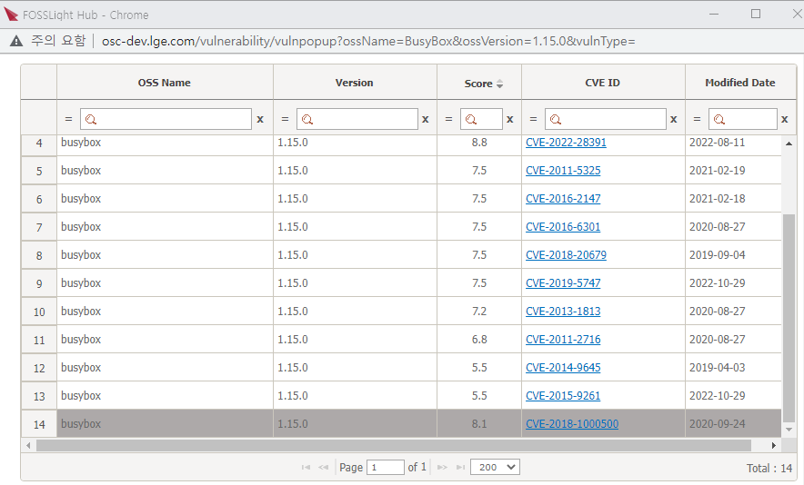

# Security Tab

Security 탭에서는 Identification 단계의 BOM 탭 기준 Vulnerability score가 기준 점수 이상인 OSS에 대하여 CVE ID별로 확인 및 조치 상태를 관리할 수 있습니다.  
    •  Vulnerability score 기준 점수는 Code Management > 760 (Security Vulnerability Score)에서 설정하실 수 있습니다.   

{: .styled-image}  

## Column 정보
{: .left-bar-title }
- **OSS Name, OSS version**
    - Identification 단계의 BOM 탭에 작성된 OSS 정보가 자동 출력됩니다.
- **CVE ID, CVSS Score, Published Date**
    - CVE ID 및 해당 CVE ID의 CVSS Score, 발행일 정보가 자동 출력됩니다. 
- **Vulnerability Resolution**
    - 기본값으로 Unresolved로 설정되며, 보안취약점 해결 시 Fixed로 변경할 수 있습니다. 

### OSS version 미 입력시
{: .specific-title}
- Security 탭에서는 OSS version 미기입된 CVE ID에 대해 정확한 vulnerability 확인이 어렵기에 전체 CVE ID 리스트를 보여주고 있지 않습니다.
- 탭 진입 시 다음 팝업 화면이 뜨는 경우, Identification 탭에서 해당 Open Source의 정확한 version을 입력한 후 BOM 탭 Save하면 
Security 탭에서 정확한 보안취약점 CVE ID 목록을 확인할 수 있습니다.  
{: .styled-image}  

### Vulnerability Resolution 여부 Identification 단계 반영
{: .specific-title}
- Identification 단계 탭에서 Vulnerability score 확인 시, Security 탭에서 vulnerability resolution 값을 'Fixed'로 변경한 CVE ID에 대해서는 제외된 Max score를 확인할 수 있습니다.
- Identification 단계 탭에서 Vulnerability Icon 클릭 시, 해당 OSS name 및 version에 대한 전체 CVE ID 리스트 창에서 'Fixed'된 CVE ID는 아래와 같이 비활성화 처리된 것을 확인할 수 있습니다.  
{: .styled-image}  

