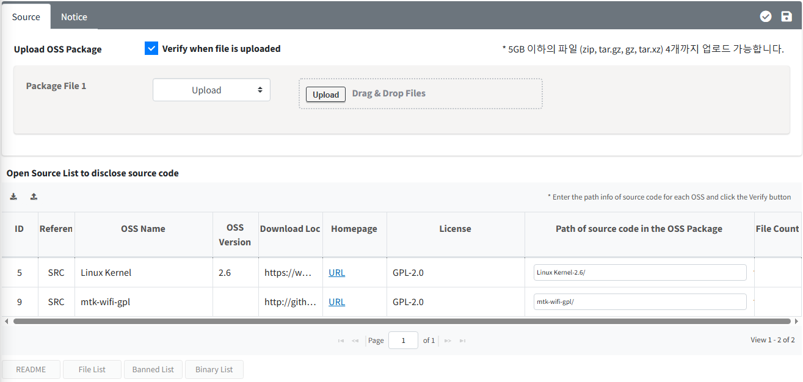
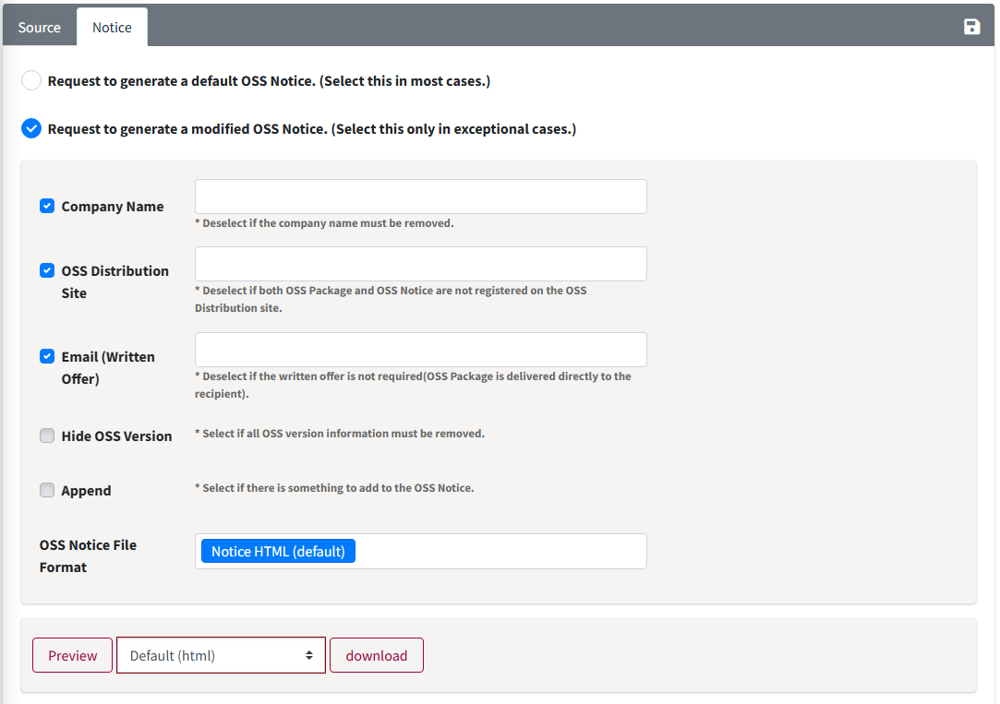
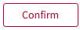

# Packaging

• Packaging 단계에서는 Source Code 공개 의무가 있는 Open Source를 사용한 경우 공개할 Source Code를 취합(OSS Package)하고 이를 FOSSLight Hub에 등록합니다. 
• OSS 고지문은 Packaging 단계가 Confirm되면 자동으로 생성됩니다. 만약, OSS 고지문 내용을 변경해야 할 경우, Notice tab에서 수정할 수 있습니다. 
• Project List의 Packaging column 내 버튼을 클릭하여 진입합니다. 

  

<iframe src="https://www.youtube.com/embed/H4CPBzUOn7M" title="OSS Package & OSS Notice 생성" frameborder="0" allow="accelerometer; autoplay; clipboard-write; encrypted-media; gyroscope; picture-in-picture" allowfullscreen></iframe>

## Packaging tab
{: .left-bar-title }
{: .styled-image}
Packaging tab에서는 OSS Package 파일을 Upload하고 이를 Verify합니다. 
(단, Source Code 공개를 필요로하는 License하의 Open Source를 사용하지 않았다면 이 탭은 비활성화됩니다.)
1. **OSS Package Upload**
    - Source code를 취합한 Packaging 파일(압축 파일)을 Upload합니다.
2. **"Path of source code in the OSS Package" column을 기입합니다.**
    - 공개해야 할 Open Source 종류가 많아 Path 기입을 일일이 하기 어려운 경우, 'Export Path'()버튼으로 Packaging OSS List 파일을 다운로드 한 후 Path를 기입하고 'Upload Path'()버튼으로 upload 하면 Path 정보가 등록됩니다.
    - 'Save' 버튼으로 입력한 Path정보를 저장할 수 있습니다.
    - Path정보는 대소문자를 구분하니 입력 시 주의하시기 바랍니다.
3. **'Verify'버튼()을 클릭하여 확인 과정을 수행합니다.**
    - Verify 후 OSS Package 내에서 찾은 File은 File Count란에 개수가 표시됩니다. 찾지 못한 Open Source가 있다면 "path not found"라고 표시됩니다.
    - OSS Package 내에서 찾은 README, File List, Banned List를 확인할 수 있습니다.
        - **README**: OSS Package 내 포함된 README 파일
        - **File List**: OSS Package 내의 파일 목록
        - **Banned List**: "Proprietary", "Commercial" 등 공개되지 말아야 할 파일 목록
        - **Binary List** : OSS Package 내 포함된 Binary 파일 

## Notice tab
{: .left-bar-title }
OSS Notice는 Identification > BOM 탭을 기준으로 자동 생성됩니다.
{: .styled-image}

- Request to generate a default OSS Notice. (Select this in most cases.)
    - 수정 없이 OSS Notice를 발행하는 경우 선택합니다. 
- Request to generate a modified OSS Notice. (Select this only in exceptional cases.)
    - OSS Notice의 포맷이나 Contents를 수정할 수 있습니다.
        - Append : OSS Notice에 내용을 추가할 수 있습니다.
            - Editor : 추가될 내용을 직접 기입합니다. 
            - File Upload : 추가될 내용을 파일로 업로드 합니다. 
        - OSS Notice File Format은 [OSS 고지문 종류](../../../tips/2_project/4_oss_notice/)에서 확인할 수 있습니다. 

## Review 요청
{: .left-bar-title } 
- Packaging 탭 우측 상단 **Request**() 버튼을 클릭하여 리뷰 요청을 합니다.

## (Admin only) Review 방법
{: .left-bar-title } 
- 우측 상단 **Review Start**() 버튼을 클릭합니다.
- 우측 상단 **Bypass**() 버튼을 클릭하면 Packaging 수행 없이 Confirm 할 수 있습니다. 
- 우측 상단의 **Confirm**() 버튼을 클릭하면 Packaging이 Confirm되고 OSC Process가 완료됩니다. 
- Packaging이 Confirm된 Project에 대해서 Project List에서 발행된 OSS Notice를 다운로드 받을 수 있습니다.
    - Creator에게 재확인이 필요한 경우 Reject을 클릭하여 Status를 Progress로 변경합니다.