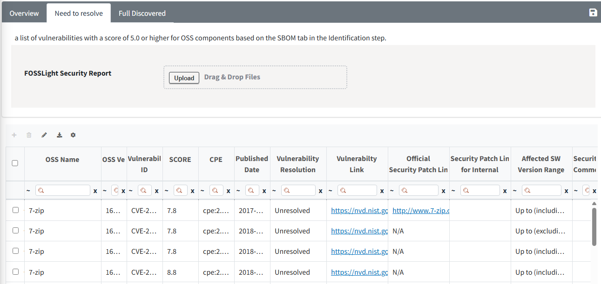
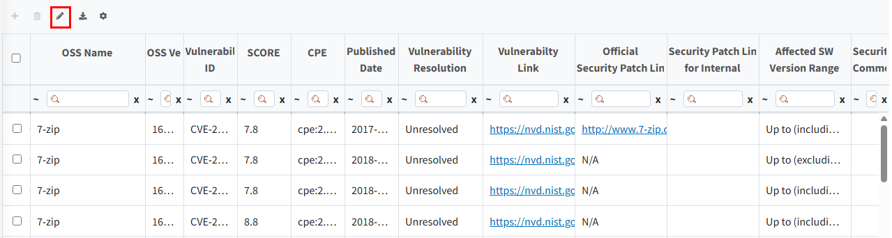
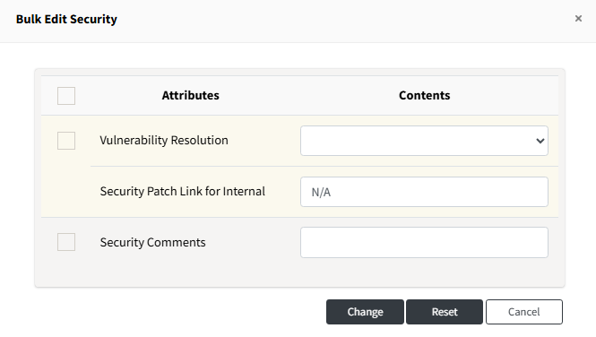
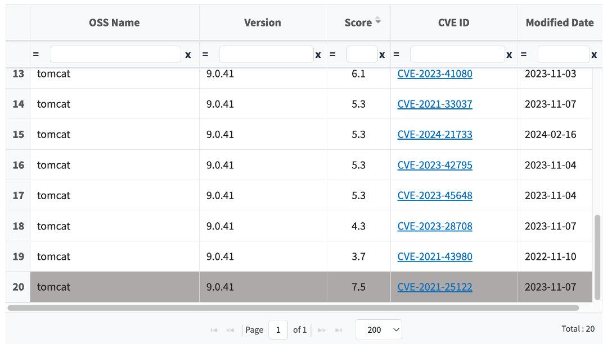

# Security Tab

Security 탭에서는 Identification 단계의 SBOM 탭 기준 Vulnerability score가 기준 점수 이상인 OSS에 대하여 Vulnerability ID별로 확인 및 조치 상태를 관리할 수 있습니다.  
    •  Vulnerability score 기준 점수는 Code Management > 760 (Security Vulnerability Score)에서 설정하실 수 있습니다.   

## Overview 탭
{: .left-bar-title }
Security탭 진입 시 처음 뜨는 탭으로, Identification 단계의 SBOM 탭 기준 취합된 OSS에 대해 검출된 vulnerability의 통계 및 차트를 확인할 수 있습니다.
{: .styled-image}  
- Security 탭에서는 OSS 버전이 입력되지 않은 OSS는 정확한 취약점 확인이 어려우므로 Vulnerability ID별 취약점 목록을 표시하지 않습니다. 단, **Need to resolve** 및 **Full discovered** 탭에서는 해당 OSS의 **OSS Name**과 FOSSLight에서 Vulnerability 목록을 확인할 수 있는 **Vulnerability Link**를 제공합니다.
  - Overview탭 상단에서 OSS version 입력되지 않은 OSS 목록을 확인 후, Identification 탭에서 OSS Version을 입력하고 SBOM 탭에서 Save를 수행하면 Security 탭에서 입력된 OSS version에 대한 vulnerability 확인할 수 있습니다.

### Vulnerability Score
{: .specific-title}
- 전체 Vulnerability ID의 취약점 점수 구간 별 vulnerability 수를 확인할 수 있습니다.
  - Critical : 9.0 <= CVSS <= 10.0
  - High : 7.0 <= CVSS < 9.0
  - Medium : 4.0 <= CVSS < 7.0
  - Low : 0 < CVSS < 4.0
  - ?는 해당 Score가 CVSS Score에 해당하지 않아 어떤 구간에도 포함되지 않는 경우를 의미합니다.

### Vulnerability Resolution
{: .specific-title}
- Need to Resolve탭에서 업데이트한 Vulnerability resoltion 별 count를 확인할 수 있습니다.

### Vulnerability score by OSS version
{: .specific-title}
- OSS 버전 별 vulnerability 점수 구간 별 vulnerability 수를 확인할 수 있습니다.
- Vulnerability 각 Score 구간 클릭 시, 해당 점수 구간에 해당하는 취약점만 Vulnerability 상세 팝업에서 확인할 수 있습니다.

 
## Need to resolve / Full Discovered 탭
{: .left-bar-title }
{: .styled-image}  
- **Need to resolve 탭** : Identification 단계의 SBOM 탭 기준, Vulnerability score가 기준 점수 이상인 OSS에 대해 검출된 모든 취약점 목록을 확인할 수 있습니다.
- **Full Discovered 탭** : Identification 단계의 SBOM 탭 기준, 전체 OSS에 대해 검출된 모든 취약점 목록을 확인할 수 있습니다.

### Column 정보
{: .specific-title}
- **OSS Name, OSS version**
  - Identification 단계의 SBOM 탭에 작성된 OSS 정보입니다.
- **Vulnerability ID, Score, Published Date**
  - Vulnerability ID 및 해당 취약점의 Score, 발행일 정보입니다. 
- **CPE**
  - NVD 데이터베이스로 매칭된 경우 CPE값입니다.
- **Vulnerability Resolution**
  - 발견된 Vulnerability에 대한 처리 상태를 의미합니다. 기본값으로 Unresolved로 설정되며, 보안취약점 조치에 따라 Resolution을 변경할 수 있습니다. 
- **Vulnerability Link**
  - NVD 또는 OSV 데이터베이스의 사이트 Link 값입니다.
- **Official Security Patch Link**
  - NVD 또는 OSV 데이터베이스에서 제공하는 공식 Patch Link 값입니다.
- **Security Patch Link for internal**
  - 사내 repository를 통해 패치를 적용한 경우, 해당 URL 값을 입력할 수 있습니다.
  - 초기값은 'N/A'이며 입력 불가능한 상태입니다. Vulnerability Resolution 값이 'Fixed'로 변경되면, 해당 항목은 공백으로 전환되어 입력할 수 있는 상태로 변경됩니다.  
- **Affected SW Version Range**
  - 해당 취약점의 영향을 받는 SW version 범위입니다.

### 결과 파일 출력
{: .specific-title}
{: .styled-image} 
- Export 아이콘을 클릭하면, 전체 테이블 목록을 엑셀 파일로 다운로드할 수 있습니다.

### Bulk Edit 기능
{: .specific-title}
Bulk Edit 기능을 통해 여러 Row를 한 번에 수정할 수 있습니다.
1. 수정할 Row를 체크한 후, 테이블 좌측 상단의 Bulk Edit 아이콘을 클릭합니다.
   {: .styled-image} 
2. 변경할 Attributes을 선택하고 Contents를 변경한 뒤 Change 버튼을 클릭합니다.
   - Security Patch Link for Internal은 Vulnerability Resolution이 'Fixed'일 경우에만 작성할 수 있습니다.
     {: .styled-image } 

### Excel 파일을 통한 Upload 기능
{: .specific-title}
{: .styled-image } 
- Need to resolve탭에서 Export한 결과 파일을 수정한 후 Upload하여 사용하는 것을 권장합니다.
- 업로드된 Excel 파일 내 OSS Name, OSS Version, Vulnerability ID 값이 동일한 row가 Security 탭에 존재할 경우, 해당 row에 업로드된 Vulnerability Resolution, Security Patch Link for Internal, Security Comments 값이 반영됩니다. 
- Vulnerability Resolution이 Fixed가 아닌 경우, Security Patch Link for Internal 값은 항상 N/A로 설정됩니다. 

 
## Vulnerability Resolution 여부 Identification 단계 반영
{: .left-bar-title }
- Identification 단계 탭에서 Vulnerability score 확인 시, Security 탭에서 vulnerability resolution 값을 'Fixed'로 변경한 Vulnerability ID에 대해서는 제외된 Max score를 확인할 수 있습니다.
- Identification 단계 탭에서 Vulnerability Icon 클릭 시, 해당 OSS name 및 version에 대한 전체 Vulnerability ID 리스트 창에서 'Fixed'된 Vulnerability ID는 아래와 같이 비활성화 처리된 것을 확인할 수 있습니다.  
{: .styled-image}  

