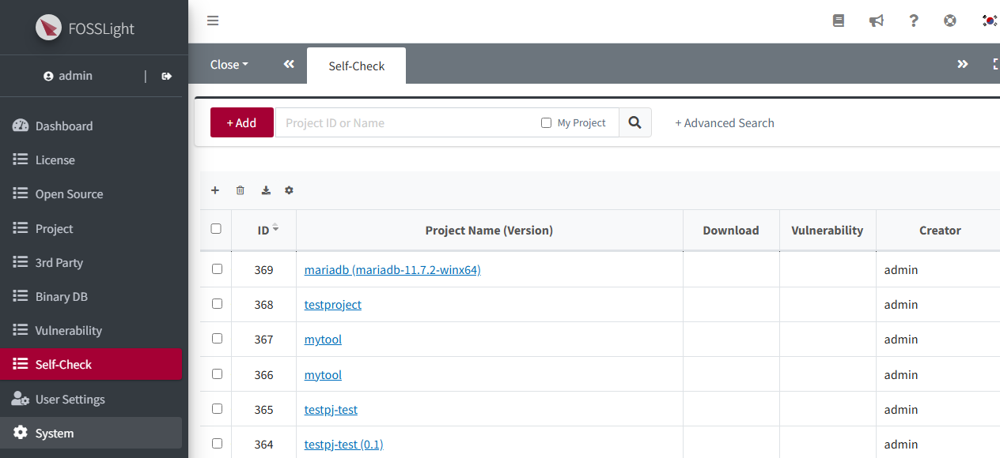
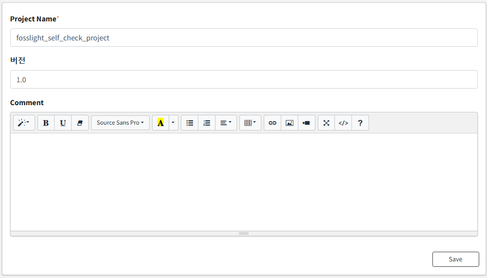
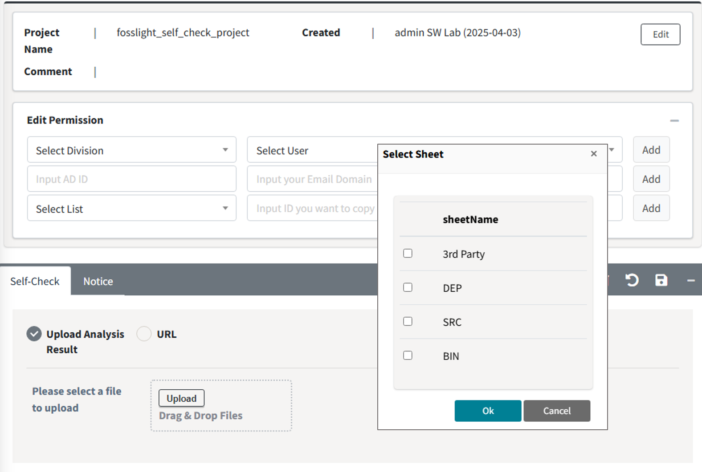
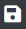
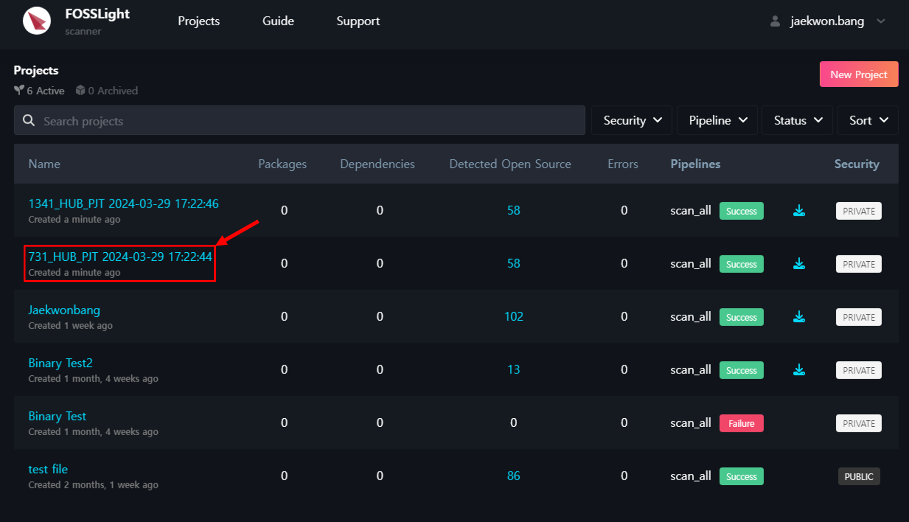

# Create Self-Check Project

Self-Check 프로젝트를 생성하고, 검토할 OSS 목록을 OSS 보고서를 이용하여 일괄 추가하거나 UI 상에서 하나씩 추가할 수 있습니다.  

## Self-Check Project 생성 
{: .left-bar-title }
1. Self-Check list 좌측 상단의 Add 버튼을 클릭합니다. 
{: .styled-image}    
2. Self-Check 정보를 기입하고, Save 합니다.
{: .styled-image}  
3. Self-Check List에서 새로 생성한 Self-Check Project를 확인할 수 있고, List에서 클릭 시 상세 내용을 확인할 수 있습니다.

## OSS 정보 입력 
{: .left-bar-title }

### OSS Table에 수기로 작성
{: .specific-title}  
1. OSS Table의 좌측 상단 + 버튼을 클릭하여 OSS 정보를 기입합니다.
2. 추가된 Row에 정보(OSS Name, OSS Version, License)를 입력합니다.
    - OSS Name, OSS Version을 입력하면 FOSSLight Hub에 저장된 정보인 경우 [**OSS 정보 자동 완성**](https://fosslight.org/hub-guide/tips/1_common/1_oss_table/3_autofill_oss_info.html)으로 정보를 불러옵니다. 

### Upload Analysis Result 
{: .specific-title}
1. Upload Analysis Result란에 OSS 리스트가 기재된 FOSSLight Report를 업로드합니다. 
  업로드 가능한 FOSSLight Report 양식은 Export 버튼을 클릭하여 다운로드 받을 수 있습니다.
  {: .styled-image}
2. OSS List가 작성된 Sheet를 선택하고 OK 클릭합니다.  
3. Save 버튼()을 클릭합니다. 

### (Enterprise Only) URL을 입력하여 FOSSLight Scanner Service 분석 결과 Load 
{: .specific-title}
**FOSSLight Hub의 Self-check와 [FOSSLight Scanner Service](http://fs.lge.com/)는 연동되어 있습니다.**
1. Self-Check project를 생성합니다.
2. URL을 선택하여 분석할 소스 링크 (wget 또는 git clone 하여 받을 수 있는 링크)를 입력하고 Send를 클릭합니다.
   {: .styled-image}
3. [FOSSLight Scanner Service](http://fs.lge.com/)에 접속하면 Project가 생성되어 있음을 확인할 수 있습니다.
   {: .styled-image}
