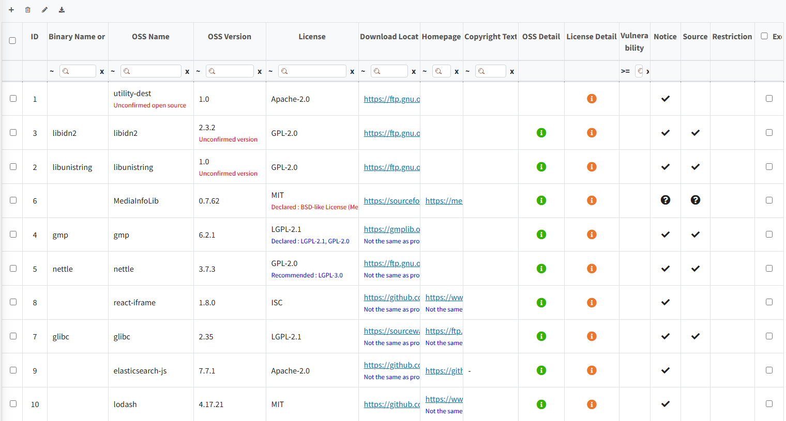
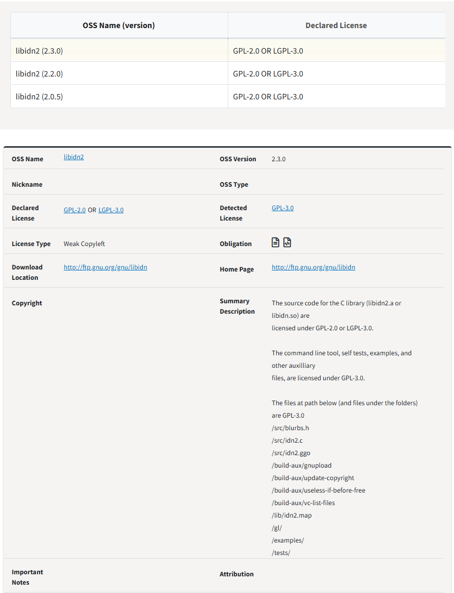
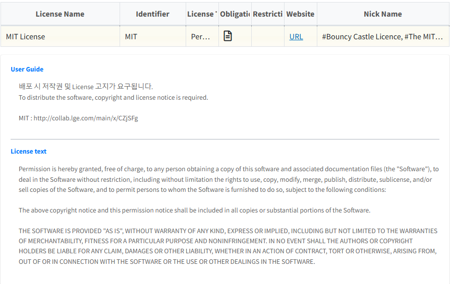

# OSS 및 License 정보 확인  
{: .styled-image} 

## Warning Messages
{: .left-bar-title }
기술된 OSS, Version, License 와 OSC 시스템에 등록된 정보를 비교하여 관련 알림이 표시됩니다.  

| Message | Meaning |
|------|-----|
| Unconfirmed open source | FOSSLight Hub에 동일한 OSS Name이 등록되어 있지 않은 경우 표시됩니다. |
| Unconfirmed version | FOSSLight Hub에 동일한 OSS Name은 있으나, 동일 Version이 등록되어 있지 않은 경우 표시됩니다. |
| This field is required | License 정보가 기입되어있지 않을 경우에 표시됩니다.  (Self-Check에서는 필수 항목이 아닙니다.) |
| Non-included license | FOSSLight Hub에 동일 OSS Name, OSS Version이 등록되어 있으나, 기존 등록된 License와 다를 경우 표시됩니다. |

## OSS 및 License 정보
{: .left-bar-title }
- 등록된 OSS, License Info가 있을 경우 OSS Detail, License Detail 컬럼에 아이콘이 표시됩니다.   
- 아이콘을 클릭하면 OSS의 상세정보, License에 대한 상세정보, 그리고 해당 License에 대한 Guide가 제공됩니다. 단, 등록된 OSS라 할지라도 User Guide가 제공되지 않을 수 있습니다.
    - **OSS Detail** : 등록된 OSS의 여러 Version, 각각의 License, Copyright 등 세부정보가 팝업창으로 제공됩니다.  
      {: .styled-image}    
    - **License Detail** : 해당 OSS가 사용하는 License의 상세 정보와, License Text가 팝업창으로 제공됩니다.
      {: .styled-image}   
        - **User Guide** : 해당 License 사용 시 참고할 수 있는 정보들에 대한 링크가 제공됩니다.

## OSS 사용에 따른 의무/제한 사항
{: .left-bar-title }
상세 내용은 [**License List**](2_license.md)에서 확인 가능합니다.  
- **Notice Column**: 체크() 표시가 되어 있는 경우, 
  Copyright나 License (혹은 둘 다)에 대한 고지의 의무가 있음을 의미합니다.
- **Source Column**: 체크() 표시가 되어 있는 경우,
  Source Code 공개 의무가 있음을 의미합니다.
  - Notice/Source Column의 **물음표 아이콘**(): 
    등록되지 않은 Open Source/License로 의무 사항을 알 수 없습니다.
- **Restriction Column** :  표시가 되어있는 경우, 
  해당 OSS를 사용하는데 제약사항이 존재함을 의미합니다. (예 : 수정 제한, 상업적 사용 제한 등)