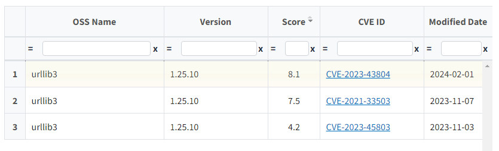

# Vulnerability 정보 확인

 º Vulnerability 열에서 확인 : NIST에서 제공하는 CVE DB에서 해당 OSS가 검색되면 Vulnerability 아이콘이 CVSS Score에 따라 색깔로 구분되어 표시됩니다. 
 º Export 파일 (.xlsx)로 확인 : 기술된 전체 OSS의 리스트와 취약점 정보가 포함된 엑셀 파일이 다운로드 됩니다.  
 º Vulnerability 관련 상세 정보는 [Vulnerability](../../menu/7_vulnerability.md) 에서 확인 가능합니다.  

## 1. FOSSLight Hub UI에서 확인  
{: .left-bar-title }
Vulnerability 아이콘을 클릭하면 해당 OSS Name, OSS Version의 취약점 정보가 팝업창으로 제공됩니다.  
  

## 2. Export 파일로 확인
{: .left-bar-title }
### Self-Check Sheet
{: .specific-title}  
  
- 사용자가 입력한 OSS 리스트가 OSS 보고서 양식에 준하여 기술됩니다.  
- 이 탭의 정보는 추후 [Project](../../menu/4_project.md)의 Identification 탭에 업로드할 수 있습니다.  
     

### Vulnerability Sheet
{: .specific-title}  
 
- 취약점 정보가 발견된 OSS의 입력한 버전과 상위 버전의 정보들이 기술됩니다.  
    - OSS Name : OSS Table에 작성한 OSS Name.
    - Nick Name : OSS Table에 작성한 OSS의 nickname으로 Vulnerability가 조회된 경우, 매칭된 nickname이 표시됩니다. (매칭된 nickname이 없는 경우 -로 표시)
    - OSS Version : Vulnerability 조회된 version.
    - Max Score : 해당 OSS, Version에 대한 Vulnerability Max Score.
    - Vulnerability Link : 해당 OSS Name, OSS Version으로 조회된 Vulnerability 목록을 확인할 수 있는 팝업 링크를 출력합니다.

   
