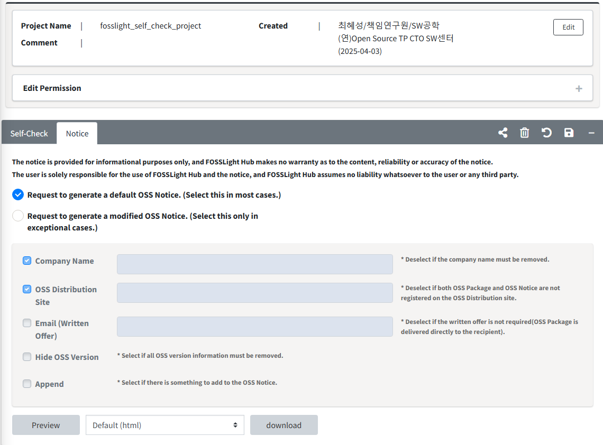

# Self-Check Notice 

Self-Check의 Notice 탭을 이용하여 자체적으로 OSS Notice를 발행할 수 있습니다.     

## OSS Notice 발행 방법  
{: .left-bar-title }
- Self-Check 내 OSS Table에 작성된 사항을 기반으로 OSS Notice가 발행됩니다.(License가 미 등록된 경우를 제외)
  
    - Request to generate a default OSS Notice. (Select this in most cases.)
        - 수정 없이 OSS Notice를 발행하는 경우 선택합니다. 
    - Request to generate a modified OSS Notice. (Select this only in exceptional cases.)
        - OSS Notice의 포맷이나 Contents를 수정할 수 있습니다.
        - OSS Notice에 File을 append 하여 내용을 추가할 수 있습니다. 
    -  **download** 버튼을 클릭하여 선택한 format으로 OSS Notice를 다운로드할 수 있습니다. 
